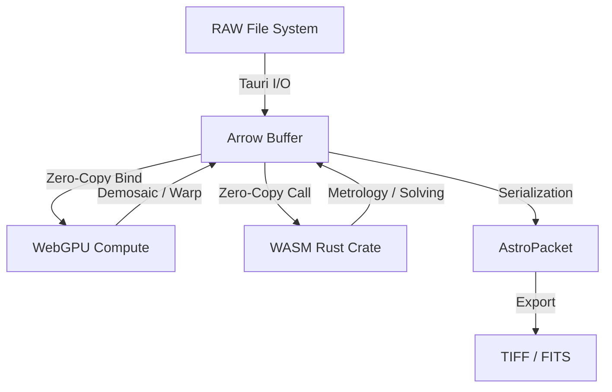

<!-- CANONICAL · update at milestones / when the built system changes · owner: ahogan -->
# SkyCruncher: System Architecture & Scientific Manifest
**Version 4.7 (RAW Decoder Cutover: rawler is the DEFAULT decode arm, LibRaw retained as the cold path · Receipt schema `2.13.0` as of 2026-07-12 (cite `RECEIPT_SCHEMA_VERSION` in `stages/schema_versions.ts`, never a bare number) [spcc-fidelity → spcc-gains → confirm-status → solve-provenance → user-annotations → pipeline-provenance] · Community Solve-Push [content-addressed, two-level dedup, proven live] · Cross-Session Heavy-Lane Advisory Lock · CSL Thesis Framework schema 0.2.0 + AI-Thesis Pipeline · Atlas G<15 Gaia extract verified on D: · docs/ reorganized into numbered category folders — all atop the v4.6 Dashboard Total-Vision base)** — see Appendix O for the v4.6→v4.7 delta, Appendix N for the v4.5→v4.6 delta, Appendix M for the v4.4→v4.5 delta, Appendix L for v4.3→v4.4, Appendix K for v4.2→v4.3, Appendix J for v4.1→v4.2, Appendix I for v4.0→v4.1. Forward plan lives in [`docs/ROADMAP.md`](../ROADMAP.md); canonical regression numbers in [`docs/GATES.md`](../GATES.md) (single source of truth — do not hand-copy); robustness analysis in [`docs/archive/SEESTAR_ROBUSTNESS.md`](../archive/SEESTAR_ROBUSTNESS.md). **NOTE:** the per-session `docs/SESSION_HANDOFF.md` referenced by the older delta appendices below is **RETIRED** — its role is now split across `docs/GATES.md`, [`docs/NEXT_MOVES.md`](../NEXT_MOVES.md) (executable specs), [`docs/AGENT_TIMING_LOG.md`](../AGENT_TIMING_LOG.md) (run ledger), and the dated delta appendices themselves.

---

# PART 0: STRATEGIC VISION & TECHNOLOGY STACK

## §0.1 Strategic Positioning

SkyCruncher is positioned as a **Scientific Pre-Processor and Optical Workbench**. It occupies the specialized niche between lightweight tools (like Sequator) and complex laboratory environments (like PixInsight).

The core thesis is that landscape astrophotography requires **instant, interactive feedback** backed by the same mathematical rigor used in deep-sky metrology. SkyCruncher bridges this gap by delivering sub-600ms forensic processing for 24MP-60MP RAW images.

## §0.2 Technology Stack & Rationale

SkyCruncher utilizes a modern, hybrid compute stack to solve the traditional bottleneck of astronomical data processing.

| Tier | Technology | Role | Rationale |
| :--- | :--- | :--- | :--- |
| **Ingestion / UI** | Tauri + React | OS-level I/O & Reactive Interface | Modern typography, WebGPU-accelerated canvas, native file system access. |
| **Data Backbone** | Apache Arrow | Zero-Copy Memory Management | Prevents the "Serialization Wall." JS, Rust, and GPU share memory without copies. |
| **Parallelism** | WebGPU (WGSL) | Per-Pixel Compute Shaders | Offloads O(N) pixel tasks (demosaic, warp) to GPU. 30s CPU tasks → 30ms GPU. |
| **Metrology** | Rust (native crate, CLI-first) for blind plate solving; Rust/WASM for PSF/photometry math | O(N³) Math & Plate Solving | Blind plate solving runs in the native `crates/` Rust solver core (CLI-first; browser/WASM solving is a later migrate stage — see `docs/local/GREENFIELD_SOLVER_CORE_BRIEF_2026-07-20.md`). PSF fitting and photometry math stay Rust/WASM, dual-target (Browser + CLI), zero Garbage Collection. |

## §0.3 System Architecture Overview

SkyCruncher is a tiered pipeline where data moves logically across memory boundaries without incurring I/O overhead.



## §0.4 Data Provenance Manifest (Finite State Machine)

The SkyCruncher pipeline tracks the "life cycle" of every measurement through 17 distinct provenance domains. This ensures that every scientific claim is backed by a verifiable chain of mathematical and physical transitions.

### I. Data, Stars & Coordinates

| Category | States (Increasing Maturity) |
| :--- | :--- |
| **1. Memory Residency** | `JS Heap` → `Arrow Shared Buffer` → `WebGPU VRAM` → `Rust/WASM Memory` |
| **2. Photography Data** | `RAW` → `Bayer Array` → `JPEG` → `Compressed JPEG` → `DNG` → `FITS` → `TIFF` |
| **3. Coordinate System** | `Sensor Pixels` → `Pixel Array` → `WCS` → `RA/Dec` → `Radians` → `Degrees` → `Feet` → `AUs` |
| **4. Star Representation** | `Undetected` → `Centroid` → `Gaussian Blur` → `PSF` → `Array` |
| **11. Star Count** | `Undetected` → `First Pass` → `Second Pass` → `Deep Sky Pass` |

### II. Environment, Hardware & Localization

| Category | States (Increasing Maturity) |
| :--- | :--- |
| **5. Hardware Profile** | `Agnostic (Blind)` → `EXIF-Inferred` → `User-Overridden` → `Fully Calibrated (Database Matched)` |
| **6. Temporal State** | `EXIF Local` → `UTC Correlated` → `User Corrected` → `Precise Julian Date Validated` |
| **7. Segmentation** | `Unsegmented` → `Horizon Masked` → `Sky Isolated` → `Fore/Aft Independent` |
| **8. Terrestrial Loc** | `Seed GPS` → `User Input` → `Validated` → `DEM/DTM Mapped` |
| **9. Planetary Detection** | `Undetected` → `Hypothesis` → `Confirmed` → `Located` |
| **10. Astronomical Loc** | `Blind` → `Planet Targeted` → `Initial Quad Matched` → `Finalized` |

### III. Calibration & Correction

| Category | States (Increasing Maturity) |
| :--- | :--- |
| **12. Verification** | `Bayer Data Detection` → `Circularity Confirmation` → `B-V Confirmed` → `Terrestrial Discard` → `Pixel Error Discard` → `Satellite/Plane Discard` → `Anomaly Confirmation` |
| **13. Signal State** | `Raw Signal` → `Gradient Modeled` → `Light Pollution Subtracted` → `Background Neutralized` |
| **14. Location Correction** | `Undetected` → `Bounded` → `Initial Flattening` → `Custom Flattening` → `TPS` |
| **15. Shape Correction** | `Undetected` → `Coma Corrected` → `Sidereal Corrected` → `Pointified` |
| **16. Color Correction** | `Undetected` → `B-V Defined` → `Filter Corrected` → `Ephemeris and Atmospheric Corrected` → `Planckian Locus Verified` |
| **17. Distortion Corr** | `Uncorrected` → `Stars Only` → `Entire Capture Correction` |

### §0.4.1 Master Provenance FSM Mapping

The following tables summarize the terminal state of each domain after the completion of each module.

#### A. Data, Stars & Coordinates
| Module | 1. Memory | 2. Data Source | 3. Coordinates | 4. Star Rep | 11. Star Count |
| :--- | :--- | :--- | :--- | :--- | :--- |
| **M1** | `Arrow Buffer` | `EXIF-Inferred` | `Blind` | `Raw Signal` | `Uncorrected` |
| **M2** | `Arrow Buffer` | `Profile Indexed` | `Blind` | `Raw Signal` | `Uncorrected` |
| **M3** | `WebGPU VRAM` | `Profile Indexed` | `Blind` | `Raw Signal` | `Uncorrected` |
| **M4** | `WASM Memory` | `Bayer Array` | `Pixel Array` | `Centroid` | `Deep Sky Pass` |
| **M5** | `WASM Memory` | `Bayer Array` | `Radians` | `Centroid` | `Deep Sky Pass` |
| **M6** | `WASM Memory` | `Bayer Array` | `RA/Dec` | `Centroid` | `Deep Sky Pass` |
| **M7** | `WASM Memory` | `Bayer Array` | `RA/Dec` | `Centroid` | `Deep Sky Pass` |
| **M8** | `WASM Memory` | `Bayer Array` | `RA/Dec` | `PSF` | `Deep Sky Pass` |
| **M9** | `JS Heap` | `FITS/TIFF` | `Degrees/AUs` | `Array` | `Deep Sky Pass` |

#### B. Hardware, Environment & Localization
| Module | 5. Hardware | 6. Temporal | 7. Segmentation | 8. Terr. Loc | 9. Planet | 10. Astro Loc |
| :--- | :--- | :--- | :--- | :--- | :--- | :--- |
| **M0/1** | `EXIF-Inferred` | `EXIF Local` | `Unsegmented` | `Seed GPS` | `Undetected` | `Blind` |
| **M2** | `Calibrated` | `UTC Correl.` | `Unsegmented` | `Seed GPS` | `Undetected` | `Blind` |
| **M3** | `Calibrated` | `UTC Correl.` | `Horizon Mask` | `Seed GPS` | `Hypothesis` | `Blind` |
| **M4** | `Calibrated` | `UTC Correl.` | `Sky Isolated` | `Seed GPS` | `Hypothesis` | `Blind` |
| **M5** | `Calibrated` | `JD Validated` | `Sky Isolated` | `Validated` | `Confirmed` | `Blind` |
| **M6** | `Calibrated` | `JD Validated` | `Sky Isolated` | `Validated` | `Located` | `Quad Matched` |
| **M7** | `Calibrated` | `JD Validated` | `Fore/Aft Ind` | `DEM Mapped` | `Located` | `Finalized` |
| **M8** | `Calibrated` | `JD Validated` | `Fore/Aft Ind` | `DEM Mapped` | `Located` | `Finalized` |
| **M9** | `Calibrated` | `JD Validated` | `Fore/Aft Ind` | `DEM Mapped` | `Located` | `Finalized` |

#### C. Calibration & Correction
| Module | 12. Verify | 13. Signal | 14. Loc Corr | 15. Shape Corr | 16. Color Corr | 17. Dist. Corr |
| :--- | :--- | :--- | :--- | :--- | :--- | :--- |
| **M0/1** | `Bayer Detect` | `Raw Signal` | `Undetected` | `Undetected` | `Undetected` | `Uncorrected` |
| **M2** | `Bayer Detect` | `Raw Signal` | `Bounded` | `Undetected` | `Undetected` | `Uncorrected` |
| **M3** | `Bayer Detect` | `Raw Signal` | `Bounded` | `Undetected` | `Undetected` | `Uncorrected` |
| **M4** | `Circ. Confirm` | `Raw Signal` | `Bounded` | `Undetected` | `B-V Defined` | `Uncorrected` |
| **M5** | `Circ. Confirm` | `Grad. Model` | `Initial Flat` | `Undetected` | `B-V Defined` | `Uncorrected` |
| **M6** | `Satellite Disc`| `Grad. Model` | `Initial Flat` | `Coma Corr` | `B-V Defined` | `Stars Only` |
| **M7** | `Satellite Disc`| `LP Subtract` | `Custom Flat` | `Sidereal Corr`| `Filter Corr` | `Stars Only` |
| **M8** | `B-V Confirm` | `BG Neutral` | `TPS` | `Pointified` | `Planckian Ver`| `Stars Only` |
| **M9** | `Anomaly Conf` | `BG Neutral` | `TPS` | `Pointified` | `Planckian Ver`| `Capture Corr` |

---

---

---

## PART I: THE LAW (PHYSICS & MATH)

Before any code executes, we must define the universe in which SkyCruncher operates. These are the immutable standards of time, space, and color that govern every transaction.

## §1.1 Time Logic (Chronos)

The engine does not use "Local Time". All scientific calculations happen in **Julian difference** time.

*   **Unix Timestamp ($t_{unix}$)**: Milliseconds since `1970-01-01T00:00:00Z`. Used for UI only.
*   **Julian Date ($JD$)**: Continuous count of days since noon, `January 1, 4713 BC`.
    $$JD = \frac{t_{unix}}{86400000} + 2440587.5$$
*   **J2000 Epoch ($J_{2000}$)**: The fundamental epoch for celestial coordinates.
    $$J_{2000} = 2451545.0 \text{ (Jan 1, 2000, 12:00 TT)}$$
*   **Julian Centuries ($T$)**: Integration step for precession/nutation.
    $$T = \frac{JD - 2451545.0}{36525.0}$$
*   **GMST (Greenwich Mean Sidereal Time)**: IAU 1982 formula in degrees.
    $$\theta_{GMST} = 280.46061837 + 360.98564736629 \cdot (JD - 2451545.0) + 0.000387933 \cdot T^2 - \frac{T^3}{38710000}$$

## §1.2 Coordinate Systems (Spatial Manifolds)

We operate across four distinct spatial manifolds. The pipeline is effectively a state machine ensuring safe transitions between them.

1.  **Sensor Manifold ($x, y$)**
    *   **Domain**: $[0, 0]$ to $[Width, Height]$
    *   **Unit**: Pixels (origin top-left).
    *   **Basis**: Hardware-dependent, distorted by optics.

2.  **Tangent Plane / Standard Coordinates ($\xi, \eta$)**
    *   **Domain**: Approx $[-1, 1]$
    *   **Unit**: Degrees (Standard FITS/WCS convention).
    *   **Projection**: Gnomonic (TAN).
    *   **Relation**: Ideal rectilinear projection tangent at $(RA_0, Dec_0)$.

3.  **Equatorial Manifold ($\alpha, \delta$)**
    *   **Domain**: $\alpha \in [0, 24^h)$, $\delta \in [-90^\circ, +90^\circ]$
    *   **Unit**: Hours (RA), Degrees (Dec).
    *   **Epoch**: ICRS (J2000.0).

4.  **Horizontal Manifold ($A, h$)**
    *   **Domain**: $A \in [0^\circ, 360^\circ)$ (North=0, East=90), $h \in [-90^\circ, +90^\circ]$
    *   **Unit**: Degrees.
    *   **Basis**: Topocentric (GPS-dependent).

### 🌌 The Great Transformation (WCS)

The World Coordinate System (WCS) matrix transforms Sensor Pixels directly to Equatorial Coordinates via the **CD Matrix**.

$$
\begin{bmatrix} CD_{1,1} & CD_{1,2} \\ CD_{2,1} & CD_{2,2} \end{bmatrix} = s \begin{bmatrix} \cos(\theta) & -\sin(\theta) \\ -\sin(\theta) \cdot p & -\cos(\theta) \cdot p \end{bmatrix}
$$
*Where $s$ is scale in deg/px, $\theta$ is rotation, and $p$ is parity ($1/-1$).*

## §1.3 Color Spaces (Spectral Manifolds)

### sRGB ↔ XYZ (CIE 1931)

Standard D65 transformation used for physical light-scattering models.

**Linearization**:
$$C_{linear} = \begin{cases} \frac{C_{srgb}}{12.92} & C_{srgb} \leq 0.04045 \\ \left(\frac{C_{srgb} + 0.055}{1.055}\right)^{2.4} & C_{srgb} > 0.04045 \end{cases}$$

**Matrix Transform**:
$$\begin{bmatrix} X \\ Y \\ Z \end{bmatrix} = \begin{bmatrix} 0.4124 & 0.3576 & 0.1805 \\ 0.2126 & 0.7152 & 0.0722 \\ 0.0193 & 0.1192 & 0.9505 \end{bmatrix} \begin{bmatrix} R \\ G \\ B \end{bmatrix}$$

### Planckian Locus (Blackbody Chromaticity)

Used for Spectral Photometric Color Calibration (SPCC). The locus is approximated via segmented polynomials in the CIE 1931 chromaticity diagram ($x, y$).

**Range: $1667K \leq T \leq 4000K$**
$x = -0.2661 \cdot (\frac{10^3}{T})^3 - 0.2344 \cdot (\frac{10^3}{T})^2 + 0.8777 \cdot (\frac{10^3}{T}) + 0.1799$

**Range: $4000K < T \leq 25000K$**
$x = -3.0258 \cdot (\frac{10^3}{T})^3 + 2.1070 \cdot (\frac{10^3}{T})^2 + 0.2226 \cdot (\frac{10^3}{T}) + 0.2404$

$$
\begin{aligned}
\tan(\alpha - \alpha_0) &= \frac{\xi}{\cos(\delta_0) - \eta \sin(\delta_0)} \\
\tan(\delta) &= \frac{(\sin(\delta_0) + \eta \cos(\delta_0)) \cos(\alpha - \alpha_0)}{\cos(\delta_0) - \eta \sin(\delta_0)}
\end{aligned}
$$

### Color Spaces (Spectral Manifolds)

1.  **Bayer Raw ($RGGB_{raw}$)**
    *   **Bit Depth**: 12/14/16-bit Integer.
    *   **Topology**: Mosaic (Checkerboard).
    *   **Meaning**: Photon counts (ADU). Device-Specific.

2.  **Linear sRGB ($RGB_{lin}$)**
    *   **Bit Depth**: 32-bit Float.
    *   **Topology**: 3-Channel Plane.
    *   **Meaning**: Radiometric energy.
    *   **Gamma**: 1.0 (None).

3.  **CIE XYZ ($XYZ_{1931}$)**
    *   **Bit Depth**: 32-bit Float.
    *   **Meaning**: Human-perceptual absolute color space.
    *   **Use**: Used for **Zenith Normalization** (Rayleigh coefficients applied here).

4.  **Johnson-Cousins ($B, V, R$)**
    *   **Domain**: Astrometric Magnitudes.
    *   **Use**: Scientific classification of stars.
    *   **Calibration**: $ColorIndex = B - V$.

5.  **Quad Bayer Raw ($QRGGB_{raw}$)**
    *   **Technology**: 4x Binning Sensors (e.g., Sony IMX800 series).
    *   **Topology**: 2x2 blocks of identical color pixels.
    *   **Behavior**: High Dynamic Range (HDR) capture via staggered exposure or SNR-optimized binning.

6.  **Oklab ($Oklab$)**
    *   **Meaning**: Perceptually uniform color space.
    *   **Use**: Used for **UI Gradients** and **Signal visualization** (Heatmaps).
    *   **Basis**: Designed to fix the "blue shift" (purple) in CIELAB when changing lightness.

---

## 🟧 PART II: THE PIPELINE

The SkyCruncher pipeline is a multi-tier, zero-copy architecture designed for maximum performance (600ms execution for 24MP RAW) and physical accuracy. It is divided into 10 core modules (plus the env-gated `m11_stack` multi-frame drizzle/stacking module — `VITE_STACK_ENABLED`, default-OFF and byte-identical off — merged 2026-07-12).

---

## Module 6: Plate Solving (Pattern Recognition)

**Forensic Question**: *"Where was the camera pointed in the universe?"*  
**Compute Tier**: Rust/WASM (Hashing) & JS/TS (Control)  
**Primary Source**: `plate_solver.ts`, `quad_hasher.ts`, `lib.rs` (`solve_plate_wasm`)

### Overview

Module 6 determines the absolute orientation of the sensor by matching the observed star patterns against a catalog. It uses a hybrid approach: "Blind" Quad-Hashing for unknown fields and "Directed" Ridge Scanning when planetary anchors are present. *(Status 2026-07-12: the `ridge_directed` anchored path is currently **DORMANT** — it is filtered out of the active solver chain (`solver_entry.ts` RIDGE PARK) pending a CD-convention sign fix + `directedAnchor` plumbing; blind quad-hashing is the live solve path.)* **Cold path after cutover:** the above — the TS/WASM blind quad-hashing solver (`solver_entry.ts`, `solve_plate_wasm`) and its dormant `ridge_directed` sibling — describes the legacy "active solver chain." Once the greenfield Rust solver core clears its migrate criteria (`docs/local/GREENFIELD_SOLVER_CORE_BRIEF_2026-07-20.md`), that native core becomes the live solver and everything above, `ridge_directed` included, moves to cold path.

**Provenance Transition**:
> **Metrol [10]**: `Blind` → `Initial Quad Matched` → `Finalized`
> **Correction [14]**: `Initial Flattening` → `Custom Flattening`
> **Distortion [17]**: `Uncorrected` → `Stars Only`

### Steps & Functions

1. **Geometric Quad Descriptor (Invariant Hashing)**  
   For every group of 4 stars, the engine generates a scale/rotation-invariant descriptor.
   - **Math**: 
     - Stars $A$ and $B$ (the most distant) are mapped to coordinates $(0,0)$ and $(1,1)$.
     - Stars $C$ and $D$ are transformed into this new basis, yielding coordinates $(x_C, y_C, x_D, y_D)$.
     - These 4 values form the hash key.
   - **Cold path after cutover:** this whole-frame A/B-basis quad coding is the legacy scheme. The greenfield Rust solver core codes each quad in its own local gnomonic-tangent frame instead — measured only a 34.1% fractional-tolerance code-match ceiling against this whole-frame scheme on an 86° field (`docs/local/GREENFIELD_SOLVER_CORE_BRIEF_2026-07-20.md` §0).
   - **Function**: `AstrometryEngine.generateQuads()`

2. **WASM Consensus Matcher (`solve_plate_wasm`)**  
   The engine passes the detected quad list and catalog quad list to WASM.
   - **Logic**: WASM iterates through the hash buckets, identifying "Consensus Clusters" where multiple quads suggest the same $(RA, Dec, Rot, Scale)$ transformation.
   - **tolerance Expansion**: The solver attempts a tight match ($0.01$), expanding to $0.05$ only if no clusters are found.
   - **Cold path after cutover:** this WASM tolerance-expansion matcher is the legacy mechanism. The greenfield Rust solver core retires it in favor of one canonical verify-step verifier (log-odds acceptance, bailout, seed exclusion) — see `docs/local/GREENFIELD_SOLVER_CORE_BRIEF_2026-07-20.md`.

3. **Ridge Scan (Polar Consensus Sweep)**  
   When a planetary anchor (e.g., Jupiter) is identified via Module 2 EXIF data, the engine performs a brute-force polar sweep around that anchor to find the rotation peak.
   - **Rotation Formula**:
     $$x' = x \cos \theta - y \sin \theta, \quad y' = x \sin \theta + y \cos \theta$$
   - **Consensus Function**: A histogram of "Catalog Hits" across $360^\circ$ at $0.01^\circ$ increments. A peak exceeding $30\%$ of the catalog density indicates a geometric lock.

4. **WCS Matrix Fitting (CD Matrix)**  
   Once a lock is found, the engine fits a $2 \times 2$ Coordinate Description (CD) matrix using a least-squares fit between the matched pixel pairs $(x,y)$ and sky pairs $(\xi, \eta)$.
   - **Function**: `SkyTransform.fitWCS()` — **cold path after cutover**: this is a legacy TS function; the greenfield Rust solver core performs its own WCS fit natively (see `docs/local/GREENFIELD_SOLVER_CORE_BRIEF_2026-07-20.md`).

---

## Module 5: Coordinate Flattening (Brown-Conrady Inverse)

**Forensic Question**: *"Where would these stars be if the lens was perfect?"*  
**Compute Tier**: Rust/WASM  
**Primary Source**: `GenericFlattener.ts`, `lib.rs` (`flatten_coordinates`), `DifferentialRefractionCorrector.ts`

### Overview

Module 5 removes the optical and atmospheric distortions from the detected star list. This step is critical for plate solving (Module 6), as it transforms the curved "Sensor Space" into a rectilinear "Standard Coordinate" plane where stars follow a linear geometry.

**Provenance Transition**:
> **Correction [14]**: `Undetected` → `Bounded` → `Initial Flattening`
> **Coord Sys [3]**: `Pixel Array` → `Radians`

### Steps & Functions

1. **Newton-Raphson Distortion Inversion**  
   The Brown-Conrady lens model is a forward model ($Ideal \rightarrow Distorted$). To solve for the ideal position, the engine inverts the model using Newton-Raphson iteration in WASM.
   - **Radial Model**: $R_d = R_u(1 + k_1 R_u^2 + k_2 R_u^4 + k_3 R_u^6)$
   - **Iteration Logic**:
     - **Function**: $f(R_u) = R_u(1 + k_1 R_u^2 + k_2 R_u^4 + k_3 R_u^6) - R_d$
     - **Derivative**: $f'(R_u) = 1 + 3k_1 R_u^2 + 5k_2 R_u^4 + 7k_3 R_u^6$
     - **Update**: $R_u \leftarrow R_u - \frac{f(R_u)}{f'(R_u)}$
   - **convergence**: Usually achieved within 10 iterations at a threshold of $10^{-7}$.

2. **Tangential Component Application**  
   After radial convergence, the Brown-Conrady tangential components ($p_1, p_2$) are applied to handle decentering of the lens elements.
   - **Formulas**:
     $$\Delta x_t = 2p_1 x_d y_d + p_2(r_u^2 + 2x_d^2)$$
     $$\Delta y_t = p_1(r_u^2 + 2y_d^2) + 2p_2 x_d y_d$$

3. **Atmospheric Refraction Correction** *(IMPLEMENTED BUT UNWIRED — see Appendix I errata)*  
   The atmosphere acts as a gradient lens, shifting stars vertically towards the Zenith.
   - **Bennett (1982) Approximation**:
     $$R_{arcmin} = 1.02 \cdot \cot\left(h_a + \frac{10.3}{h_a + 5.11}\right)$$
   - **Logic**: Every star coordinate is nudged opposite the Zenith vector based on its apparent altitude ($h_a$).
   - **Status (updated 2026-07-12)**: `DifferentialRefractionCorrector` was **REVIVED** — it now has a call site in the post-solve `stages/psf_attribution.ts` (`computeDifferential`, gated on `timestampTrusted` + GPS present), emitting a reported **APPROXIMATE** field-level differential-refraction block. It remains **predictor-only — never wired back into the solve**. *(The original v4.1 wording named "both the runPipeline and wizard paths"; the `runPipeline` auto path was deleted in v4.5 — see Appendix M.)* The impact is negligible for narrow-FOV inputs (e.g. SeeStar ~2°); wiring it would be a new call site in M5.

- [x] Module 7: Astrometric Refinement (SIP polynomial fit, Gaussian elimination)
- [x] Module 8: Photometric Calibration (MAD background, barycentric centroiding, covariance eigenvalues, aperture photometry, LM 2D Gaussian with Jacobians, Kasten-Young air mass, Rayleigh extinction, zenith multipliers, SPCC, B-V index)
- [x] Module 9: Serialization & Export (AstroPacket JSON + shared-TS ASDF writer + **FITS writer, shipped v4.5** with WCS+SIP headers — the "no FITS writer" note in Appendix I is now superseded; see Appendix M)

---

## Module 4: Signal Detection (Morphological Extraction)

**Forensic Question**: *"Where are the stars, and what is noise?"*  
**Compute Tier**: Rust/WASM (Extraction) & JS/TS (Logic)  
**Primary Source**: `signal_processor.ts`, `lib.rs` (`extract_blobs`)

### Overview

Module 4 converts the monochrome luminance map into a categorized list of "Signal Points." This module uses a 3-pass masking strategy to handle varying noise floors and optical distortions across the frame.

**Provenance Transition**:
> **Star Rep [4]**: `Undetected` → `Centroid`
> **Star Count [11]**: `Undetected` → `First Pass` → `Deep Sky Pass`
> **Calibration [13]**: `Raw Signal`
> **Verification [12]**: `Bayer Data Detection` → `Circularity Confirmation`

### Steps & Functions

1. **3×3 Gaussian Blur (Pre-Filter)**  
   The engine applies a subtle noise suppression kernel to the binned luminance map. This suppresses the "6-pixel lattice" artifacts from the Bayer binning stage and enables fluid sub-pixel centroiding.
   - **Kernel**: `[1/16, 2/16, 1/16, 2/16, 4/16, 2/16, 1/16, 2/16, 1/16]`

2. **Phase 1: Vanguard Detection**  
   A high-confidence pass identifies the brightest, most obvious sources using a focal-length-adjusted threshold.
   - **Threshold**: $T_{vanguard} = \mu + \sigma_{FL} \cdot \sigma$
   - **Focal Length Boost**: $\sigma_{FL}$ scales logarithmically from $1.0\times$ (at 50mm) to $1.8\times$ (at 1000mm) to account for atmospheric bloat.

3. **WASM Blob Extraction (`extract_blobs`)**  
   The binned buffer is passed to Rust/WASM for high-speed flood-fill extraction.
   - **Algorithm**: 4-way adjacency connected component labeling.
   - **Amortized Memory**: Uses a persistent `VISITED_CACHE` in WASM to avoid per-frame allocations.
   - **Moment Statistics**: For every detected blob, WASM computes:
     - **Flux-Weighted Centroid**: $c_x = \frac{\sum x_i f_i}{\sum f_i}, \quad c_y = \frac{\sum y_i f_i}{\sum f_i}$
     - **Circularity**: The ratio of the eigenvalues of the pixel covariance matrix.
     - **SNR**: Standard Source-extractor approximation.

4. **Morphological Filtering (The bouncer)**  
   Every candidate is passed through a multi-factor "bouncer" to determine if it is a Star, an Anomaly, or Noise.
   - **REJECT**: `fwhm < 0.40` (hot pixels) or `flux < 0.05 && SNR < 5` (read noise).
   - **ANOMALY**: `circularity < 0.08 && fwhm > 15` (satellite streaks) or `fwhm > 250` (nebular clouds).
   - **Spectral Check**: For candidates with color data, `isOnPlanckianLocus()` rejects Magenta/Cyan noise spikes or Green LEDs.

5. **Phase 2: Dynamic Sky Mask**  
   Using only high-confidence Vanguard stars (Circularity > 0.65, SNR > 35), the engine traces the "Ridgeline" of the image to define a `sky_polygon`.
   - **Function**: `carveVoids()`

6. **Phase 3: Deep Scan**  
   A final extraction pass at a lower threshold ($\mu + 2.0\sigma$) captures faint targets missed by the Vanguard pass.
   - **Deduplication**: Deep candidates within 4px of a Vanguard star are discarded to prevent double-counting.

7. **Coordinate Restoration**  
   Centroids are scaled from the binned "science Space" back to the native "Sensor Space" and cached as `rawX, rawY`.

---

## Module 3: GPU Pre-Processing (Demosaic & Linearization)

**Forensic Question**: *"Can we reconstruct the color image from the Bayer mosaic?"*  
**Compute Tier**: WebGPU (Primary) / JS CPU (Fallback)  
**Primary Source**: `WebGPUContext.ts`, `DemosaicEngine.ts`, `demosaic.ts`, `demosaic_bayer.wgsl`

### Overview

Module 3 transforms the single-channel Bayer mosaic into an interleaved RGB color image. This is the first "Massive Parallelism" stage. By offloading this to the GPU, SkyCruncher achieves sub-100ms processing for 24MP frames, a task that typically takes 5–10 seconds on the CPU.

**Provenance Transition**:
> **Memory [1]**: `Arrow Shared Buffer` → `WebGPU VRAM`
> **Data Src [2]**: `RAW` → `Bayer Array`
> **Coord Sys [3]**: `Sensor Pixels` → `Pixel Array`

### Steps & Functions

1. **GPU Cluster Initialization**  
   The engine initializes the WebGPU context as a singleton, requesting a `high-performance` power preference.
   - **Function**: `WebGPUContext.init()`
   - **Fallback**: If `navigator.gpu` is unavailable (e.g., older hardware or insecure context), the engine automatically falls back to the CPU demosaic engine.

2. **Parallel Bilinear Demosaic (WebGPU)**  
   The engine dispatches a WGSL compute shader to perform bilinear interpolation across the RGGB bayer grid.
   - **Shader**: `demosaic_bayer.wgsl` (Workgroup: $16 \times 16$).
   - **Data Flow**: `Uint16` CFA → `u32` Packed Buffer → `Float32` RGB Storage Buffer.
   - **Math**:
     - **At Red pixel $(i,j)$**: 
       $$R = p_{i,j}, \quad G = \frac{p_{i-1,j} + p_{i+1,j} + p_{i,j-1} + p_{i,j+1}}{4}, \quad B = \frac{p_{i-1,j-1} + p_{i-1,j+1} + p_{i+1,j-1} + p_{i+1,j+1}}{4}$$
     - **At Blue pixel $(i,j)$**: 
       $$B = p_{i,j}, \quad G = \frac{p_{i-1,j} + p_{i+1,j} + p_{i,j-1} + p_{i,j+1}}{4}, \quad R = \frac{p_{i-1,j-1} + p_{i-1,j+1} + p_{i+1,j-1} + p_{i+1,j+1}}{4}$$

3. **CPU Fallback Path**  
   An identical bilinear algorithm implemented in TypeScript for environments where WebGPU is blocked.
   - **Function**: `DemosaicEngine.demosaicBilinear()`

4. **luminance Binning (SNR enhancement)**  
   For scientific metrology (Module 4), the engine collapses $2 \times 2$ CFA quads into a single "High-SNR" luminance pixel. This eliminates striping artifacts caused by pixel sensitivity differences.
   - **Function**: `DemosaicEngine.binBayerToluminance()`
   - **Formula**:
     $$L_{norm} = \frac{\sum_{k=1}^4 (p_k - BL)}{4 \cdot (WL - BL)}$$
     *Where $BL$ is black level and $WL$ is white level (saturation).*
    - **CD Matrix (Least Squares)**: 
      $CD_{11} = \frac{\sum dy^2 \sum dx\xi - \sum dxdy \sum dy\xi}{\text{det}(M)}$
      Where $M$ is the covariance matrix of pixel offsets from `CRPIX`.

---

## Module 7: Astrometric Refinement (Precision Calibration)

**Forensic Question**: *"How does the specific lens slightly warp the stars?"*
**Compute Tier**: TypeScript/JS (Linear Algebra)
**Primary Source**: `ResidualAnalyzer.ts`

### Overview

Module 7 moves beyond the linear approximation of Module 6 to model optical distortion (radial/tangential) using the **Simple Imaging Polynomial (SIP)** convention. This ensures that coordinates are accurate across the entire frame, not just the center.

**Provenance Transition**:
> **Correction [14]**: `Custom Flattening` → `TPS`
> **Verification [12]**: `Satellite/Plane Discard`

### Residual Analysis

The engine first calculates the "residual" error for every matched star:
- **Projected Linear Position**: $\begin{pmatrix} x_{lin} \\ y_{lin} \end{pmatrix} = CD^{-1} \begin{pmatrix} \xi \\ \eta \end{pmatrix} + \begin{pmatrix} x_0 \\ y_0 \end{pmatrix}$
- **Residual Vector**: $(dx, dy) = (x_{detected} - x_{lin}, y_{detected} - y_{lin})$
- **RMS Calculation**: $RMS = \sqrt{\frac{\sum (dx^2 + dy^2) \cdot \text{scale}^2}{N}}$

### SIP Polynomial Fitting

If systematic distortion is detected ($RMS > 1.2"$), the engine fits an $N^{th}$ order polynomial (typically 3rd order) to the residuals:
- **Correction Formulas**:
  $u = x - x_0, \quad v = y - y_0$
  $f(u,v) = \sum_{p+q=2}^N A_{pq} u^p v^q$
  $g(u,v) = \sum_{p+q=2}^N B_{pq} u^p v^q$

### Normal Equations & Matrix Solving

The coefficients $A_{pq}$ and $B_{pq}$ are found by solving the **Normal Equations** via a lightweight **Gaussian Elimination** solver with partial pivoting:
1. **Matrix Construction**: Build a covariance matrix of the polynomial terms $(u^p v^q)$.
2. **Pivoting**: Perform row swaps to maintain numerical stability.
3. **Back-Substitution**: Solve the upper-triangular matrix for the final coefficients.

These coefficients are stored in the FITS-compliant `SIPCoefficients` structure, allowing perfect sub-arcsecond mapping during the reconstruction phase.

---

## Module 8: Photometric Calibration (Signal Analysis)

**Forensic Question**: *"How much energy did these stars actually emit?"*
**Compute Tier**: Rust/WASM (Fitting) & TS/JS (Physics)
**Primary Source**: `photometry.rs`, `StarPhotometrist.ts`, `AtmosphericManager.ts`

### Overview

Module 8 transforms the raw pixel values (ADUs) into calibrated astronomical magnitudes. This involves modeling the detector's electrical response, the star's morphological profile, and Earth's atmospheric filter.

**Provenance Transition**:
> **Star Rep [4]**: `Centroid` → `PSF`
> **Calibration [13]**: `Background Neutralized`
> **Verification [12]**: `B-V Confirmed`
> **Color Corr [16]**: `Planckian Locus Verified`

### Background & Morphology

The engine first isolates the star signal using statistical robust estimators:
- **Background Floor**: Calculated using **Sigma-Clipped Median** and **MAD** ($1.4826 \cdot \text{MAD}$).
- **Barycentric Centroiding**: Finds the flux-weighted center of mass $(x_c, y_c)$.
- **Moment Analysis**: Computes the covariance matrix eigenvalues to derive:
  - **FWHM**: $2.355 \cdot \sqrt{\text{MajorAxisvariance}}$
  - **Ellipticity**: $\sigma_{minor} / \sigma_{major}$
  - **Theta**: Coma/Rotation angle via $0.5 \cdot \arctan2(2M_{xy}, M_{xx} - M_{yy})$.

### WASM Levenberg-Marquardt Fit

For precision science, high-SNR stars are fitted with an elliptical 2D Gaussian profile:
$$f(x,y) = A \cdot \exp\left(-[a(x-x_c)^2 + b(x-x_c)(y-y_c) + c(y-y_c)^2]\right)$$
The **Rust solver** performs non-linear least squares using **Analytical Jacobians** for all 6 parameters ($A, x_c, y_c, \sigma_x, \sigma_y, \theta$). The damping factor $\lambda$ is adjusted dynamically to ensure convergence within 20 iterations.

### Atmospheric Restitution

The observed flux is restored to its "At-Zenith" state using the **Kasten & Young (1989)** air mass model:
- **Air Mass (X)**: 
  $$X = \frac{1}{\sin(h) + 0.50572(h + 6.07995)^{-1.6364}}$$
- **Rayleigh Extinction**: Models per-channel magnitude loss $\Delta m = \tau_{channel} \cdot X$.
- **Zenith Multiplier**: Linear restoration factor $10^{0.4 \Delta m}$.

### Photometric Normalization

The final instrumental magnitude is calculated by:
1. Converting ADU to **Electrons** ($Flux_{e^-} = \text{ADU} \cdot \text{Gain}$).
2. Scaling by **Exposure Time**.
3. Applying the formula: $m = -2.5 \cdot \log_{10}(Flux / t_{exp})$.

This allows the engine to cross-reference with catalog magnitudes (e.g. Gaia/Tycho) for zero-point calibration and spectral color analysis.

---

## Module 9: Serialization & Export (Finalization)

**Forensic Question**: *"How do we store the physics for future generations?"*
**Compute Tier**: WebGPU (Reconstruction) & TS/JS (Packaging)
**Primary Source**: `serializer.ts`, `reconstruct.ts`, `reconstruct.wgsl`

### Overview

Module 9 is the terminus of the pipeline. It handles the "Big Data to Smart Data" transition, compressing multi-megabyte RAW files into scientific containers and rendering final corrected images for human consumption.

**Provenance Transition**:
> **Memory [1]**: `WASM Memory` → `JS Heap`
> **Data Src [2]**: `Bayer Array` → `FITS/TIFF`
> **Correction [14]**: `TPS`
> **Distortion [17]**: `Stars Only` → `Entire Capture Correction`

### The AstroPacket Container

The engine serializes the observation into a compact scientific packet (<100KB):
- **Core Metrics**: Platesolve (WCS/SIP), hardware fingerprint, and environmentals (sky quality).
- **The Star List**: High-precision photometry for every detected object, including calibrated magnitudes and B-V color indices.
- **ROI Thumbnails**: Base64-encoded crops of anomalies (e.g. potential satellites or asteroids).

### WebGPU Reconstruction Shader

The final "Perfected" image is generated using the `reconstruct.wgsl` compute shader. This reverses optical distortion in a single pass:
- **Brown-Conrady Application**: 
  $$r = \sqrt{x_n^2 + y_n^2}$$
  $$L(r) = 1 + k_1 r^2 + k_2 r^4 + k_3 r^6$$
  $$dx = x_n L(r) + [2p_1 x_n y_n + p_2(r^2 + 2x_n^2)]$$
- **Bilinear Sampling**: The shader samples the debayered source texture using a hardware-accelerated sampler to ensure sub-pixel smoothness during coordinate remapping.

### Export Endpoints

1.  **Endpoint A (Display)**: Generates a high-bitrate TIFF or JPEG with baked-in distortion correction and white balance.
2.  **Endpoint B (science)**: Exports the `AstroPacket` JSON manifest (with WCS block), an **ASDF** file (shared TS serializer `src/engine/pipeline/export/asdf_writer.ts` — the earlier Rust writer `asdf_writer.rs` was retired), and — **as of v4.5** — a WCS+SIP **FITS** file (`src/engine/pipeline/export/fits_writer.ts`, astropy-conformant, NaN-preserving). The v4.1 "no FITS writer exists" note is **superseded**; see Appendix M. (SIP coefficients are negated to FITS convention at the export boundary — Appendix M.)


---

## Module 1: RAW Decoding & Metadata Extraction

**Forensic Question**: *"What device captured this, and what are the photon counts?"*  
**Compute Tier**: JS/TS + Rust/WASM  
**Primary Source**: `metadata_reaper.ts`, `m1_ingestion/rawler_decoder.ts`

### Overview

Module 1 performs the "Optical Autopsy." It extracts the physical parameters of the observation (EXIF) and isolates the raw, untouched photon counts from the sensor (Bayer CFA). It ensures that downstream modules work with linear scientific data rather than "cooked" camera JPEGs.

**Provenance Transition**:
> **Memory [1]**: `JS Heap` → `Arrow Shared Buffer`
> **Data Src [2]**: `RAW`
> **Hardware [5]**: `Agnostic` → `EXIF-Inferred`
> **Temporal [6]**: `EXIF Local`

### Steps & Functions

1. **EXIF Forensic Capture**  
   The engine extracts `HardMetadata` (immutable physical truths) and `rawTags` (diagnostic metadata).
   - **Function**: `parseExif(buffer)`
   - **Fields**: Camera/Lens models, ISO, Aperture ($N$), Exposure Time ($t$), and the fundamental **GPS-Time vector**.
   - **Safety Logic**: Detects "Zero-Vector GPS" (0.0, 0.0) common in camera defaults and flags it as `GPS_SOURCE: DEFAULT`.

2. **RAW "Document Mode" Extraction (two decode arms behind one seam)**  
   To preserve scientific integrity, RAW files are decoded without interpolation (Demosaic), white balance, or gamma curves. Since the 2026-07-11 decoder cutover (Appendix O) the decode step has two arms selected by a single flag, `isRawlerDecoderEnabled()` (`m1_ingestion/rawler_decoder.ts`), so downstream modules see one identical `Uint16Array` contract regardless of arm:
   - **DEFAULT arm — rawler (Rust → WASM)**: `decodeRawlerForPipeline(buffer)`, backed by the `wasm_decode` crate (`src/engine/wasm_decode/pkg`, gitignored — built with `wasm-pack build --target web`). `isRawlerDecoderEnabled()` defaults **true**, so this is the shipping path.
   - **COLD PATH — LibRaw WASM**: selected by setting `VITE_DECODER_RAWLER=0` (owner-ruled retained, never deleted). `extractRawSensorData(buffer)` via LibRaw, same no-interpolation / 16-bit / no-auto-bright discipline.
   - **Shared execution discipline (both arms)**:
     - `noInterpolation` → Returns the native Bayer mosaic (CFA), no demosaic.
     - 16-bit output → Full dynamic range preserved.
     - No auto-bright → No histogram stretching (preserves photometry).
   - The two arms are calibrated against separate pinned reference solves (rawler = default CR2 pins; LibRaw cold path = the pre-cutover CR2 pins) — see [`docs/GATES.md`](../GATES.md).

3. **Active-Area Validation**  
   Cameras often include "Dark reference" pixels (masked areas) at the sensor edges.
   - **Logic**: Use `meta.width/height` (active area) instead of `raw_width/height` to prevent a 2.6° "diagonal shear" and solve-time misalignments.
   - **Stride-Element Mapping**:
     $$Stride_{elements} = \frac{Pitch_{bytes}}{2}$$

4. **Arrow Encapsulation**  
   The resulting `Uint16Array` is passed to [Module 0](#module-0-zero-copy-ingestion) for zero-copy wrapping.

---

## Module 2: Hardware Profiling

**Forensic Question**: *"What glass are we looking through?"*  
**Compute Tier**: JS/TS  
**Primary Source**: `LensfunIngestor.ts`, `hardware_profiler.ts` *(`HardwareProfileAdapter.ts` was deleted in v4.5 — see Appendix M.1)*

### Overview

Module 2 looks up the optical characteristics of the specific Camera/Lens combination. It utilizes the global **Lensfun** database for baseline distortion coefficients and performs spectral forensics to identify applied filters.

**Provenance Transition**:
> **Hardware [5]**: `EXIF-Inferred` → `User-Overridden` → `Fully Calibrated`
> **Temporal [6]**: `EXIF Local` → `UTC Correlated`

### Steps & Functions

1. **Lensfun DB Ingestion**  
   The engine fetches XML profiles directly from the Lensfun repository for major brands (Canon, Nikon, Sony, Samyang).
   - **Function**: `LensfunIngestor.ingest()`
   - **Alias Resolution**: Maps Samyang ↔ Rokinon ↔ Bower to ensure third-party glass is correctly profiled.

2. **Optical Train Fingerprinting**  
   The engine creates a unique persistent key for the hardware stack.
   - **Logic**: `fingerprint = SHA256(camera + lens + filter)`
   - **Status (v4.5)**: The `HardwareProfileAdapter.loadCustomProfile(fingerprint)` path — loading a previously "refined" lens model (Module 7) from `localStorage` to skip generic database lookups — was **deleted in v4.5** with the auto path (see Appendix M.1). Per-rig calibrated profiles now live in the Optical Workbench store ([`docs/OPTICAL_WORKBENCH_SCHEMA.md`](../OPTICAL_WORKBENCH_SCHEMA.md)).

3. **Focal Length inference (Physics vs. Metadata)**  
   EXIF focal length is often rounded or incorrect for older lenses. The engine computes a "Physics-Estimated" focal length using the plate solution scale.
   - **Formula**:
     $$FL_{mm} = \frac{206265 \cdot (Pitch_{\mu m} / 1000)}{Scale_{"/px}}$$

4. **Spectral & Spatial Forensics**  
   The engine analyzes star color distributions (B-V Index) and PSF shapes to infer hardware modifications.
   - **Function**: `HardwareProfiler.generateReport()`
   - **Criteria Table**:

| Detection | Indicator | Rationale |
| :--- | :--- | :--- |
| **Astro-Mod** | $R_{bias} > 1.8$ | IR/UV cut filter removal enhances $H\alpha$ sensitivity. |
| **Narrowband** | $G_{bias} < 0.5$ | Extreme isolation of Red/Teal lines. |
| **Diffusion** | $FWHM_{bright} > 5 \cdot FWHM_{faint}$ | Black mist/diffusion filters bloat highlights while preserving faint stars. |
| **GND Filter** | $BG_{top} < 0.4 \cdot BG_{bottom}$ | Sudden vertical background drop suggests Graduated ND filter. |

---

### 🧬 Phase 1: Hardware Profile Lookup (The Generic Hint)
**Forensic Question**: "What glass are we looking through?"

* **Input**: EXIF Data or User Input (e.g., "Rokinon 14mm").
* **Action**: Loads the generic distortion profile ($k_1, k_2, p_1, p_2$ polynomials).
* **Goal**: To provide the Quad-Hasher with a "cheat sheet".

---

### 📏 Phase 2: Generic Coordinate Flattening (First Pass)
**Forensic Question**: "Where would these stars be if the lens was perfect?"

* **Action**: Applies the generic distortion inverse to extracted $(x,y)$ coordinates.
* **Result**: Stars are mapped to a relatively flat geometric plane.
* **Refraction Correction**: ~~Differential Atmospheric Refraction is mathematically un-compressed here~~ **Not applied in the solve** — `DifferentialRefractionCorrector` was REVIVED 2026-07 as an APPROXIMATE Bennett predictor in `stages/psf_attribution.ts` (`computeDifferential`), but it is reported only and never wired back into coordinate flattening or the solve (see Appendix I errata).

#### 2.5 The Alpha Mask / SNR Filter
* **Action**: Builds a mask using high-confidence stars. Runs a deep-scan (lower sigma threshold) *only* inside that mask.
* **Win**: Eliminates false positives from terrestrial foregrounds (mountains, trees), saving the solver from thousands of fake quads.

---

### 🪐 Phase 3 & 4: Planetary Lock & Fuzzy Match
**Forensic Question**: "Is that Jupiter?"

* **Action**: Identifies planets based on generic flat coordinates.
* **Use**: Uses the planet to grab a tight RA/Dec hint.
* **Fuzzy Match**: Fallback to blind star plate mapping if no planets are visible.

---

### 🧩 Phase 5: Quad-Mapping (The Rigid Lock)
**Forensic Question**: "Where exactly is this camera pointing?"

* **Action**: Runs the **Quad-Hasher** using the "First Pass" flattened stars and the Planetary Hint.
* **Result**: A successful **Plate Solve**. A 1:1 match between image stars and catalog stars is established.

---

### 🎯 Phase 6: Astrometric Residual Fitting (The Custom Profiler)
**Forensic Question**: "How does this specific lens deviate from the factory content?"

*   **Action**: Projects the catalog stars onto the image using a perfectly flat model.
*   **Measurement**: Calculates the **Residual Delta** (sub-pixel distance) between the star's actual position and its ideal position.
*   **Fitting**: Runs a **Least-Squares Polynomial Fit** across all matched stars to generate a custom **SIP (Simple Imaging Polynomial)** distortion matrix.
*   **Output**: Custom user profile saved for future acceleration (100x speedup).

---

### 🕯️ Phase 7: Photometric Calibration & Serialization (The "science")
**Forensic Question**: "What are the physical properties of these stars?"

* **Input**: The raw pixel stamps stored in RAM (from Phase 0).
* **Action**: Runs a **2D Gaussian Fit** on the raw pixels of each identified star.
* **Measurement**:
    * **Flux**: Brightness.
    * **FWHM**: Sharpness.
    * **Semi-Major/Minor Axes**: Elongation/Coma measure.
    * **Theta**: Coma tail angle.
    * **Color Index ($B-V$)**: Measured from repaired stars.
* **Garbage Collection**: Raw pixel arrays are dropped from RAM.
* **Export**: Validated, lightweight **AstroPacket** JSON (~120KB).

#### 7.1 Schema Definition
```typescript
interface AstroPacket {
    version: "1.0";
    provenance: {
        camera: "Canon EOS 6D";
        lens: "Rokinon 135mm";
        fingerprint: "SHA256-HASH-OF-OPTICAL-TRAIN";
    };
    wcs: {
        ra: 12.345; dec: 45.678;
        scale: 2.34; rotation: 182.5;
        parity: "flipped";
    };
    stars: Array<{
        x: 1024, y: 2048,
        mag_v: 12.4, color_index: 0.65,
        catalog_id: "TYC-1234-5678"
    }>;
    environment: {
        sky_brightness: 20.5; // Mag/arcsec^2
        seeing_fwhm: 3.2;     // Pixels
    };
}
```

---

## 🟩 PART III: THE FUTURE (ROADMAP SPECIFICATIONS)

This section defines the architecture for upcoming phases. These are technical mandates for future development, evolving from the current **Pivot 2026-02-21** (Native Photon Reconstruction).

### 🌌 Phase 10: Native Photon Reconstruction (The Current Pivot)
**Status**: LANDED — native un-demosaiced Bayer extraction shipped. Since the 2026-07-11 decoder cutover (Appendix O) the DEFAULT decode arm is rawler (Rust→WASM, `isRawlerDecoderEnabled()` defaults true) with **LibRaw WASM** retained as the cold path (`VITE_DECODER_RAWLER=0`) — see Module 1. The `utif.js`→LibRaw line below is the historical pivot record.
Historical pivot: from `utif.js` to **LibRaw WASM** to solve "Systemic Static" issues.
- **Native Bayer Extraction**: Extracting un-demosaiced 16-bit CFA data directly from sensor streams.
- **Agnostic Metrology Reset**: Derived scale will now naturally align with hardware seeds (1.0x factor).

### 🗻 Phase 11: Topography & Urban Masks (The Hybrid Horizon)
**Goal**: Align Astrometric Void Mask with DEM (Digital Elevation Model) tiles.
- **Ray Marching**: Cast rays from Observer $(Lat, Lon, Alt)$ along WCS vectors $(Az, Alt)$ against SRTM/Copernicus data.
- **Peak Labeling**: 1:1 projection of peak names and elevations onto the photograph.
- **Urban Mask**: Hough Transform for linear feature detection (horizons, power lines) to segment terrestrial foreground.

### 🧪 Phase 12: Environmental Forensics (Spectrometry)
**Goal**: Identify light pollution chemical signatures.
- **Skyglow Deconvolution**: Sample median RGB from "Empty Sky" regions.
- **Spectral Matching**: Distinguish HPS (Sodium), LED (Broadband), and Mercury Vapor based on R:G:B ratios.
- **Aerosol Optical Depth (AOD)**: Measure forward scattering (halos) around bright stars to estimate atmospheric haze.

### 🛡️ Phase 13: The Digital Contract (C2PA)
**Goal**: Verifiable astronomical provenance.
- **Assertion Mapping**: Embed the plate solution (`astro.wcs`) and hardware profile (`astro.forensics`) as signed C2PA assertions.
- **Cryptographic Trust**: Sign the `AstroPacket` hash with the SKYCRUNCHER key for peer-reviewed authenticity.

### 📡 Phase 14: The Global Sensor (Big Data Aggregation)
**Goal**: A real-time, global light pollution map.
- **Peer-to-Peer Sync**: Use **WebRTC Data Channels** (Gossip Protocol) to synchronize observation manifests across nodes.
- **Vector Triangulation**: Intersect light dome vectors from multiple observers to pinpoint illegal greenhouses or stadium light leaks.

### 🎨 Phase 15: Universal Sensor Geometry
**Goal**: Database-driven characterization.
- **LibRaw MakerNotes**: Extract real-time Black/White levels per frame.
- **Gain Mapping**: Integrate **e/ADU** data from *Photons to Photos* for dynamic SNR thresholding.


---

## 🟦 PART IV: DATA DICTIONARY

### 4.1 Input Formats
| Format | Signature | Endianness | Support |
| :--- | :--- | :--- | :--- |
| **Canon CR2** | `0x49 49 2A 00` | LE | Full |
| **Nikon NEF** | `0x4D 4D 00 2A` | BE | Full |
| **Sony ARW** | `0x05 00 00 00` | LE | Full |
| **FITS** (`.fit`/`.fits`) | `SIMPLE` | BE | Full |
| **TIFF** | `0x49 49 2A 00` | LE | Full |

**FITS support detail (v4.1):** Two SeeStar-class shapes are accepted, both BITPIX=16 / BZERO=32768 big-endian and magic-byte gated (extension is irrelevant):
1. **NAXIS=2 single-plane CFA** (sub-frames) — GRBG layout from the `BAYERPAT` card; routed through the parameterized demosaic path.
2. **NAXIS=3 planar RGB cube** (stacked output, already demosaiced) — converted to interleaved Float32; demosaic bypassed entirely.

### 4.2 Unit Standards
*   **Flux**: Normalized ADU ($0.0 - 1.0$).
*   **Angle**: Degrees (Decimal).
*   **Time**: Julian Date (Days).
*   **Temperature**: Kelvin ($K$).
*   **Wavelength**: Nanometers ($nm$).

### 4.3 Error Codes
*   `ERR_NO_STARS`: Source extraction failed ($<4$ stars).
*   `ERR_SCALE_MISMATCH`: Metrology vs Metadata conflict ($>10\%$).
*   `ERR_ZERO_GPS`: Missing location data.
*   `ERR_CLOUDY`: <30% Transparency detected.

---

## 🏁 PART V: USER INTERACTION FLOW

### 5.1 The "Wizard" Journey
1.  **Drop**: User drags RAW file to browser.
2.  **Magic Check**: "Reading Magic Bytes..."
3.  **Geolocate**: "Confirming Location (from EXIF GPS / FITS `SITELAT`)..." — *(v4.6: the Pasadena default observer is REMOVED; a frame with no location now null-propagates (`gps_source:'DEFAULT'`, coords `null`) and the location-dependent ephemeris annotations are suppressed, not computed against a fake site — Appendix N.8.)*
4.  **Solve**: "solving plate... (Attempt 1/3)"
5.  **Visualize**: overlay Draw (Annotations) appearing on image.
6.  **Export**: "Download AstroPacket" or "Share to Cloud".

### 5.2 Decision Points
*   **Wrong Location?**: User can override GPS if EXIF is wrong.
*   **Wrong Lens?**: User can select correct profile if autodetection fails.
*   **Thresholding**: User can adjust "Star Sensitivity" slider ($2.0\sigma - 5.0\sigma$).

### A.0 Data Provenance Enums

These enums form the basis of the Data Provenance Manifest (FSM), tracking the "totality" of every measurement.

```typescript
// I. Data, Stars & Coordinates
export enum MemoryResidency {
  JS_HEAP = "JS_HEAP",
  ARROW_BUFFER = "ARROW_BUFFER",
  WEBGPU_VRAM = "WEBGPU_VRAM",
  WASM_MEMORY = "WASM_MEMORY"
}

export enum PhotoDataSource {
  RAW = "RAW",
  BAYER_ARRAY = "BAYER_ARRAY",
  JPEG = "JPEG",
  COMPRESSED_JPEG = "COMPRESSED_JPEG",
  DNG = "DNG",
  FITS = "FITS",
  TIFF = "TIFF"
}

export enum NormalizationState {
  RAW_ADU = "RAW_ADU",
  BLACK_LEVEL_SUBTRACTED = "BLACK_LEVEL_SUBTRACTED",
  FLAT_FIELD_CORRECTED = "FLAT_FIELD_CORRECTED",
  NORMALIZED = "NORMALIZED"
}

export enum CoordinateSystem {
  SENSOR_PIXELS = "SENSOR_PIXELS",
  PIXEL_ARRAY = "PIXEL_ARRAY",
  WCS = "WCS",
  RA_DEC = "RA_DEC",
  RADIANS = "RADIANS",
  DEGREES = "DEGREES",
  FEET = "FEET",
  AUS = "AUS"
}

export enum StarRepresentation {
  UNDETECTED = "UNDETECTED",
  CENTROID = "CENTROID",
  GAUSSIAN_BLUR = "GAUSSIAN_BLUR",
  PSF = "PSF",
  ARRAY = "ARRAY"
}

export enum StarCount {
  UNDETECTED = "UNDETECTED",
  FIRST_PASS = "FIRST_PASS",
  SECOND_PASS = "SECOND_PASS",
  DEEP_SKY_PASS = "DEEP_SKY_PASS"
}

// II. Environment & Hardware Truth
export enum HardwareProfileState {
  AGNOSTIC = "AGNOSTIC",
  EXIF_INFERRED = "EXIF_INFERRED",
  USER_OVERRIDDEN = "USER_OVERRIDDEN",
  FULLY_CALIBRATED = "FULLY_CALIBRATED"
}

export enum TemporalState {
  EXIF_LOCAL = "EXIF_LOCAL",
  UTC_CORRELATED = "UTC_CORRELATED",
  USER_CORRECTED = "USER_CORRECTED",
  JULIAN_DATE_VALIDATED = "JULIAN_DATE_VALIDATED"
}

export enum SegmentationState {
  UNSEGMENTED = "UNSEGMENTED",
  HORIZON_MASKED = "HORIZON_MASKED",
  SKY_ISOLATED = "SKY_ISOLATED",
  FORE_AFT_INDEPENDENT = "FORE_AFT_INDEPENDENT"
}

export enum TerrestrialLocalization {
  SEED_GPS = "SEED_GPS",
  USER_INPUT = "USER_INPUT",
  VALIDATED = "VALIDATED",
  DEM_DTM_MAPPED = "DEM_DTM_MAPPED"
}

export enum PlanetaryDetection {
  UNDETECTED = "UNDETECTED",
  HYPOTHESIS = "HYPOTHESIS",
  CONFIRMED = "CONFIRMED",
  LOCATED = "LOCATED"
}

export enum AstronomicalLocalization {
  BLIND = "BLIND",
  PLANET_TARGETED = "PLANET_TARGETED",
  INITIAL_QUAD_MATCHED = "INITIAL_QUAD_MATCHED",
  FINALIZED = "FINALIZED"
}

export enum PhotometricSolution {
  UNCALIBRATED = "UNCALIBRATED",
  INSTRUMENTAL_MAGNITUDE = "INSTRUMENTAL_MAGNITUDE",
  CATALOG_MATCHED_GAIA_DR3 = "CATALOG_MATCHED_GAIA_DR3",
  ZERO_POINT_VALIDATED = "ZERO_POINT_VALIDATED"
}

// III. Calibration & Correction State
export enum StarVerification {
  BAYER_DETECT = "BAYER_DETECT",
  CIRCULARITY_CONFIRM = "CIRCULARITY_CONFIRM",
  BV_CONFIRMED = "BV_CONFIRMED",
  TERRESTRIAL_DISCARD = "TERRESTRIAL_DISCARD",
  PIXEL_ERROR_DISCARD = "PIXEL_ERROR_DISCARD",
  SATELLITE_PLANE_DISCARD = "SATELLITE_PLANE_DISCARD",
  ANOMALY_CONFIRMATION = "ANOMALY_CONFIRMATION"
}

export enum SignalState {
  RAW_SIGNAL = "RAW_SIGNAL",
  GRADIENT_MODELED = "GRADIENT_MODELED",
  LIGHT_POLLUTION_SUBTRACTED = "LIGHT_POLLUTION_SUBTRACTED",
  BACKGROUND_NEUTRALIZED = "BACKGROUND_NEUTRALIZED"
}

export enum StarLocationCorrection {
  UNDETECTED = "UNDETECTED",
  BOUNDED = "BOUNDED",
  INITIAL_FLATTENING = "INITIAL_FLATTENING",
  CUSTOM_FLATTENING = "CUSTOM_FLATTENING",
  TPS = "TPS"
}

export enum StarShapeCorrection {
  UNDETECTED = "UNDETECTED",
  COMA_CORRECTED = "COMA_CORRECTED",
  SIDEREAL_CORRECTED = "SIDEREAL_CORRECTED",
  POINTIFIED = "POINTIFIED"
}

export enum StarColorCorrection {
  UNDETECTED = "UNDETECTED",
  BV_DEFINED = "BV_DEFINED",
  FILTER_CORRECTED = "FILTER_CORRECTED",
  ATMOSPHERIC_CORRECTED = "ATMOSPHERIC_CORRECTED",
  PLANCKIAN_LOCUS_VERIFIED = "PLANCKIAN_LOCUS_VERIFIED"
}

export enum DistortionCorrection {
  UNCORRECTED = "UNCORRECTED",
  STARS_ONLY = "STARS_ONLY",
  ENTIRE_CAPTURE_CORRECTION = "ENTIRE_CAPTURE_CORRECTION"
}

export enum ResamplingKernel {
  NONE = "NONE",
  BILINEAR_PREVIEW = "BILINEAR_PREVIEW",
  LANCZOS_3_HIGH_FIDELITY = "LANCZOS_3_HIGH_FIDELITY",
  FLUX_PRESERVING = "FLUX_PRESERVING"
}
```

## 📚 APPENDIX A: DATA STRUCTURE REFERENCE (TYPESCRIPT)

This appendix defines the exact data shapes used at every stage of the pipeline. These interfaces are the "Contract" of the system.

### A.1 Core Pipeline Packet
```typescript
/**
 * The State Object passed through the pipeline.
 * Immutable transaction record.
 */
export interface ProcessingJob {
    /** Unique Transaction ID (UUID v4) */
    id: string;
    
    /** The raw evidence buffer */
    buffer: ArrayBuffer;
    
    /** User-supplied hints (optional) */
    options: {
        force_gps?: { lat: number; lon: number };
        force_lens_profile?: string;
        star_threshold_sigma?: number; // Default 3.0
        use_experimental_solver?: boolean;
    };
    
    /** Timestamp of ingestion start */
    ingest_time: number;
}
```

### A.2 Hardware Metadata (`HardMetadata`)
```typescript
/**
 * Extracted from EXIF/FITS headers.
 * Represents the physical device state at capture.
 */
export interface HardMetadata {
    camera_model: string;
    lens_model: string;
    focal_length: number;
    aperture: number;
    iso_gain: number;
    exposure_time: number;
    timestamp: string; // ISO-8601
    gps_lat: number;
    gps_lon: number;
    pixel_pitch_um?: number; // Inferred or from DB
    width?: number; // Active sensor width
    height?: number; // Active sensor height
    ra_hint?: number; // Hours
    dec_hint?: number; // Degrees
}
```

### A.3 The Solved State (`PlateSolution`)
```typescript
/**
 * The Astrometric Solution.
 * Output of Module 6: Plate Solving.
 */
export interface PlateSolution {
    ra_hours: number;
    dec_degrees: number;
    rotation_deg: number;
    pixel_scale: number; // arcsec/px
    parity: -1 | 1;
    confidence: number;
    num_matches: number;
    wcs: {
        crpix: [number, number];
        crval: [number, number]; // [RA_deg, Dec_deg]
        cd: [[number, number], [number, number]]; // CD Matrix
    };
    sip?: SIPCoefficients; // Optional distortion params
}
```

### A.4 Spectral Data (`StarPhotometry`)
```typescript
/**
 * Per-star measurement data.
 * The "Atom" of the AstroPacket.
 */
export interface StarPhotometry {
    /** Centroid X (Pixels) */
    x: number;
    
    /** Centroid Y (Pixels) */
    y: number;
    
    /** Integrated Flux (ADU) */
    flux: number;
    
    /** Peak Pixel Value (ADU) */
    peak: number;
    
    /** Full Width Half Maximum */
    fwhm: number;
    
    /** Instrumental Magnitude */
    mag_inst: number;
    
    /** Calibrated Color Index (B-V) */
    color_index: number;
    
    /** Estimated Surface Temperature (Kelvin) */
    teff_est: number;
    
    /** Catalog Match (if identified) */
    catalog_match?: {
        id: string; // TYC/HIP/GAIA ID
        mag_v: number;
        b_v: number;
        separation_arcsec: number;
    };
}
```

---

## 📐 APPENDIX B: MATHEMATICAL reference

This appendix details the matrix transformations and formulas used for critical conversions.

### B.1 Color Transformation Matrices

#### sRGB to CIE XYZ (D65)
Used during **Ingestion** to linearize color.
$$
\begin{bmatrix} X \\ Y \\ Z \end{bmatrix} = 
\begin{bmatrix} 
0.4124 & 0.3576 & 0.1805 \\
0.2126 & 0.7152 & 0.0722 \\
0.0193 & 0.1192 & 0.9505 
\end{bmatrix} 
\times 
\begin{bmatrix} R_{lin} \\ G_{lin} \\ B_{lin} \end{bmatrix}
$$

#### CIE XYZ to sRGB (D65)
Used during **Rendering** to display the result.
$$
\begin{bmatrix} R_{lin} \\ G_{lin} \\ B_{lin} \end{bmatrix} = 
\begin{bmatrix} 
3.2406 & -1.5372 & -0.4986 \\
-0.9689 & 1.8758 & 0.0415 \\
0.0557 & -0.2040 & 1.0570 
\end{bmatrix} 
\times 
\begin{bmatrix} X \\ Y \\ Z \end{bmatrix}
$$

### B.2 Astrometric Projections

#### Standard Coordinates ($\xi, \eta$)
The Gnomonic projection maps the celestial sphere to a flat tangent plane.
Given:
*   $(\alpha, \delta)$: Star Coordinates
*   $(\alpha_0, \delta_0)$: Plate Center
*   All angles in Radians.

$$
\begin{align}
A &= \cos(\delta) \cos(\alpha - \alpha_0) \\
F &= \frac{180}{\pi} \\
\xi &= F \cdot \frac{\cos(\delta) \sin(\alpha - \alpha_0)}{\sin(\delta_0) \sin(\delta) + A \cos(\delta_0)} \\
\eta &= F \cdot \frac{\cos(\delta_0) \sin(\delta) - A \sin(\delta_0)}{\sin(\delta_0) \sin(\delta) + A \cos(\delta_0)}
\end{align}
$$

#### Pixel to Sky (Inverse WCS)
To find the RA/Dec of a pixel $(x,y)$:

1.  **Intermediate Coordinates**:
    $$
    \begin{bmatrix} \xi \\ \eta \end{bmatrix} = 
    \begin{bmatrix} CD_{1\_1} & CD_{1\_2} \\ CD_{2\_1} & CD_{2\_2} \end{bmatrix}
    \times
    \begin{bmatrix} x - CRPIX_1 \\ y - CRPIX_2 \end{bmatrix}
    $$

2.  **Deprojection**:
    $$
    \begin{align}
    \rho &= \sqrt{\xi^2 + \eta^2} \\
    c &= \tan^{-1}(\rho) \\
    \delta &= \sin^{-1}(\cos(c)\sin(\delta_0) + \frac{\eta \sin(c)\cos(\delta_0)}{\rho}) \\
    \alpha &= \alpha_0 + \tan^{-1}(\frac{\xi \sin(c)}{\rho \cos(\delta_0) \cos(c) - \eta \sin(\delta_0) \sin(c)})
    \end{align}
    $$

---

## ⚙️ APPENDIX C: CONFIGURATION reference

These constants define the operational limits of the engine.

### C.1 Physics Constants
| Constant | Value | Unit | Description |
| :--- | :--- | :--- | :--- |
| `J2000` | 2451545.0 | Days | Standard Epoch |
| `C` | 299792.458 | km/s | Speed of Light |
| `H` | 6.626e-34 | J⋅s | Planck Constant |
| `K` | 1.380e-23 | J/K | Boltzmann Constant |
| `SIGMA` | 5.670e-8 | W/m²/K⁴ | Stefan-Boltzmann |

### C.2 Pipeline Thresholds
| Parameter | Default | Range | Description |
| :--- | :--- | :--- | :--- |
| `STAR_DETECTION_SIGMA` | 3.0 | 1.0 - 5.0 | Noise floor multiplier |
| `MAX_SOLVE_ATTEMPTS` | 3 | 1 - 10 | Retry limit for blind solve |
| `QUAD_tolerance` | 0.02 | 0.001 - 0.1 | Hash match fuzziness |
| `SOLVER_MIN_MATCHES` | 4 | — | Minimum verified anchor matches (actual code gate) |
| `verify_min_anchor_matches` | 5 (4 for FOV < 6°) | 4+ | WCS verification anchor floor (`DynamicPipelineConfig`) |
| `verify_min_confidence` | 0.60 (0.5 for FOV < 6°) | 0–1 | WCS verification confidence floor |

> **v4.1 correction:** the previously documented `MAX_PIXEL_SCALE` and `MIN_STARS_FOR_SOLVE` constants do not exist in code; the table above reflects the real gates.

### C.3 Roadmap Feature Flags
| Flag | Status | Description |
| :--- | :--- | :--- |
| `ENABLE_SPECTROSCOPY` | Planned | Enable Skyglow Analysis (implementing `spectroscopy_adapter.ts` deleted in v4.5 — see Appendix M.1; Phase 12 future work) |
| `ENABLE_P2P_SYNC` | Alpha | Enable WebRTC Sync |
| `ENABLE_GPU_ACCEL` | Planned | Use WebGPU Compute |
| `ENABLE_C2PA_SIGNING` | Planned | Cryptographic Signing |
| `VITE_STACK_ENABLED` | Landed (default-off) | Multi-frame dither/drizzle stacking (`m11_stack`) at the batch seam; byte-identical off (merged 2026-07-12) |

---

## 🧬 APPENDIX D: ALGORITHMIC reference (PSEUDO-CODE)

This appendix provides the normative logic for key algorithms, ensuring any rebuild recreates the exact behavior of Version 2.5.

### D.1 Source Extraction (WASM Blob Logic)
**File**: `lib.rs` / `extract_blobs`
```rust
// Flood-fill with 1st and 2nd moments
while let Some((cx, cy)) = q.pop() {
    let val = lum[idx] as f64;
    let net_flux = (val - bg).max(0.0);
    sum_flux += net_flux;
    sum_x += (cx as f64) * net_flux;
    sum_y += (cy as f64) * net_flux;
    sum_x2 += (cx * cx) as f64 * net_flux;
    sum_xy += (cx * cy) as f64 * net_flux;
}
center_x = sum_x / sum_flux;
theta = 0.5 * (2.0 * var_xy).atan2(var_x - var_y);
```

### D.2 Metrology: Quad Hashing
**File**: `lib.rs` / `solve_blind` (renamed from `solve_plate_wasm`)
- **Canonical Code**: Transforms 4 stars into a $(0,0 \dots 1,1)$ unit square based on the longest diagonal.
- **Hash Bins**: Bin size $0.05$ creates a 4D lookup table for $O(1)$ match candidate retrieval.

### D.3 Distortion: Newton-Raphson Inversion
**File**: `lib.rs` / `flatten_coordinates`
Used to find un-distorted radius $r_u$ from distorted radius $r_d$:
$$f(r_u) = r_u(1 + k_1 r_u^2 + k_2 r_u^4 + k_3 r_u^6) - r_d = 0$$
$$\text{Iteration: } r_{u, n+1} = r_{u, n} - \frac{f(r_{u, n})}{f'(r_{u, n})}$$

---

## 📷 APPENDIX E: SENSOR DATABASE reference

| Manufacturer | Model | Pitch (µm) | White Level | QE Peak |
| :--- | :--- | :--- | :--- | :--- |
| **Canon** | EOS R5 | 4.39 | 16383 | 61% |
| **Nikon** | Z7 II | 4.35 | 16383 | 64% |
| **Sony** | A7R IV | 3.76 | 16383 | 72% |
| **ASI** | 2600MC | 3.76 | 65535 | 80% |

---

## 🦀 APPENDIX F: WASM API reference (RUST)

The `wasm_compute` module provides near-native performance for O(N³) geometric loops.

| Function | Input | Output | Math/Purpose |
| :--- | :--- | :--- | :--- |
| `extract_blobs` | `f32[]` (Lum) | `f64[]` (Stars) | Morphological flood-fill + moments |
| `flatten_coordinates` | `f64[]` (Pixels) | `f64[]` (Ideal) | Newton-Raphson radial inversion |
| `solve_blind` / `solve_guided` | `f64[]` (Quads) | `f64[]` (Matches) | 4D Canonical Hash matching (renamed from `solve_plate_wasm`) |
| `refine_stars_lm` | `f32[]` (Stamps) | `f64[]` (Gauss) | Levenberg-Marquardt 2D Optimization |

---

## ⚡ APPENDIX G: WEBGPU SHADER reference

| Shader | Pass | Technique | Threads |
| :--- | :--- | :--- | :--- |
| `demosaic_bayer.wgsl` | Ingest | Bilinear | $16 \times 16$ |
| `reconstruct.wgsl` | Export | Bilinear Brown-Conrady | $16 \times 16$ |

---

## 📐 APPENDIX H: THE MATHEMATICAL FORMALIZATION (LaTeX)

This appendix provides the normative mathematical reference for the SkyCruncher. All formulas are transcribed from the production Rust/WASM and TypeScript implementations.

### H.1 Chronos: Temporal Logic

**Julian Date ($JD$ from Unix $t_{ms}$)**
$$JD = \frac{t_{ms}}{86400000} + 2440587.5$$
- **Inputs**: Unix timestamp in milliseconds ($t_{ms}$).
- **Outputs**: Julian Date as a floating-point number.
- **Description**: This formula converts a standard computer timestamp into a continuous count of days since the Julian epoch.
- **Rationale**: We use Julian Dates to provide a stable, linear time reference for calculating planetary positions and stellar precession without the complexity of calendar leap-seconds.

**Julian Centuries ($T$) since J2000.0**
$$T = \frac{JD - 2451545.0}{36525.0}$$
- **Inputs**: Current Julian Date ($JD$).
- **Outputs**: Fractional centuries elapsed since noon on January 1, 2000.
- **Description**: Calculates the offset from the fundamental J2000 epoch in standard units of 36,525 days.
- **Rationale**: Most astronomical high-precision models, such as the IAU precession formulas, utilize Julian Centuries as their primary integration step.

**IAU GMST (Degrees)**
$$\theta_{GMST} = 280.46061837 + 360.98564736629 \cdot (JD - 2451545.0) + 0.000387933 \cdot T^2 - \frac{T^3}{38710000}$$
- **Inputs**: Julian Date ($JD$) and Julian Centuries ($T$).
- **Outputs**: Greenwich Mean Sidereal Time in degrees.
- **Description**: Determines the rotation of the Earth relative to the "fixed" stars rather than the Sun.
- **Rationale**: This bridge allows the engine to align your GPS coordinates with the celestial sphere, which is essential for determining which stars should be visible at your location and time.

---

### H.2 Spherica: Coordinate Transformations

**Equatorial $(\alpha, \delta)$ to Horizontal $(h, A)$**
Given Latitude $\phi$ and Longitude $\lambda$:
$$H = LST - \alpha = (\theta_{GMST} + \lambda) - \alpha$$
$$\sin(h) = \sin(\phi)\sin(\delta) + \cos(\phi)\cos(\delta)\cos(H)$$
$$\tan(A) = \frac{\sin(H)}{\cos(H)\sin(\phi) - \tan(\delta)\cos(\phi)}$$
- **Inputs**: Right Ascension ($\alpha$), Declination ($\delta$), Observer Latitude ($\phi$), and Local Sidereal Time ($LST$).
- **Outputs**: Altitude ($h$) and Azimuth ($A$) in degrees.
- **Description**: Transforms universal celestial coordinates into local pointer-coordinates relative to your specific horizon.
- **Rationale**: This is required for our "Cronos Check" to verify if a star's recorded GPS location and time actually place it above your horizon during the exposure.

**Precession (Lieske/Equinox of Date)**
$$\Delta \alpha = (m + n \sin(\alpha) \tan(\delta)) \Delta T$$
$$\Delta \delta = (n \cos(\alpha)) \Delta T$$
- **Inputs**: Current RA/Dec and the time difference from J2000 ($\Delta T$).
- **Outputs**: Small corrections ($\Delta \alpha, \Delta \delta$) to the star's position.
- **Description**: Models the wobbling of Earth's axis to shift star positions from their year-2000 locations to their current locations.
- **Rationale**: Without precession correction, a plate solve could fail on long-focal-length lenses where the stars have "drifted" slightly since the catalog was published.

---

### H.3 Geometric Optics & Distortion

**Brown-Conrady Radial Distortion $(r_d)$**
$$r_d = r_u(1 + k_1 r_u^2 + k_2 r_u^4 + k_3 r_u^6)$$
- **Inputs**: Undistorted radius ($r_u$) and radial coefficients ($k_1, k_2, k_3$).
- **Outputs**: The distorted radius ($r_d$) where the pixel actually appears on the sensor.
- **Description**: Models how light bends through a lens to create "barrel" or "pincushion" effects.
- **Rationale**: Modeling the distortion is the first step toward reversing it, allowing us to treat a wide-angle lens as a mathematically perfect "pinhole" camera.

**Newton-Raphson Focal Inversion (Solving for $r_u$)**
$$r_{u, n+1} = r_{u, n} - \frac{r_u(1 + \sum k_i r_u^{2i}) - r_d}{1 + \sum (2i+1)k_i r_u^{2i}}$$
- **Inputs**: Distorted radius ($r_d$) and lens coefficients ($k_i$).
- **Outputs**: The corrected, undistorted radius ($r_u$).
- **Description**: An iterative root-finding algorithm that works backward from a distorted pixel to find its "true" straight-line location.
- **Rationale**: Because the distortion formula itself cannot be easily inverted algebraically, we must use this iterative approach to achieve sub-pixel geometric accuracy.

**Tangential Decentering**
$$\Delta x = [2p_1 xy + p_2(r^2 + 2x^2)]$$
$$\Delta y = [p_1(r^2 + 2y^2) + 2p_2 xy]$$
- **Inputs**: Pixel coordinates ($x, y$) and tangential coefficients ($p_1, p_2$).
- **Outputs**: Small offsets ($\Delta x, \Delta y$).
- **Description**: Models errors caused by lens elements that are not perfectly centered or aligned with the sensor.
- **Rationale**: High-resolution sensors are sensitive to tiny alignment errors; modeling these ensures that star patterns near the edges of the frame are not misidentified.

---

### H.4 Metrology: Geometric Invariants

**Triangle Similarity Hashes**
For a triangle with sorted sides $L \ge M \ge S$:
$$\sigma_1 = \frac{M}{L} , \quad \sigma_2 = \frac{S}{L}$$
- **Inputs**: Lengths of the three sides of a triangle formed by stars on the sensor.
- **Outputs**: Two invariant ratios ($\sigma_1, \sigma_2$).
- **Description**: Converts a triangle's physical size into a set of ratios that remain the same regardless of whether you zoom in or out.
- **Rationale**: These ratios allow the plate solver to search the star catalog without needing to know your exact lens zoom or focal length beforehand.

**Quad Canonical Mapping (4-Star Descriptor)**
Stars $A, B$ (longest diagonal) normalized to $[0,0]$ and $[1,1]$. 
Intermediate stars $C, D$ positions $(x, y)$ form the 4-D hash:
$$\mathbf{H} = [x_C, y_C, x_D, y_D]$$
- **Inputs**: Coordinates of four stars in a group.
- **Outputs**: A 4-dimensional vector ($\mathbf{H}$).
- **Description**: Rescales and rotates four stars into a standard unit square to create a unique "fingerprint" for that specific patch of sky.
- **Rationale**: This is the core of our $O(1)$ fast-solve system, allowing near-instant identification of sky regions by looking up these fingerprints in a pre-computed database.

---

### H.5 Astrometry & Residual Analysis

**WCS CD-Matrix (Pixel to Tangent Plane)**
$$\begin{bmatrix} \xi \\ \eta \end{bmatrix} = \begin{bmatrix} CD_{1,1} & CD_{1,2} \\ CD_{2,1} & CD_{2,2} \end{bmatrix} \begin{bmatrix} x - x_0 \\ y - y_0 \end{bmatrix}$$
- **Inputs**: Pixel offsets from center ($x-x_0, y-y_0$) and the 4-element CD matrix.
- **Outputs**: Angular offsets from center ($\xi, \eta$) in degrees.
- **Description**: A linear matrix that converts pixel positions directly into sky-angles inclusive of rotation and scale.
- **Rationale**: This is the standard data interface for astronomical images, enabling third-party tools to know exactly which RA/Dec coordinate corresponds to every pixel in your file.

**SIP Polynomial Fit (Non-Linear Residuals)**
$$f(x, y) = \sum_{p+q=2}^{\text{order}} A_{p,q} (x-x_0)^p (y-y_0)^q$$
- **Inputs**: Pixel coordinates ($x, y$) and a set of calculated coefficients ($A_{p,q}$).
- **Outputs**: Small corrections to the pixel position.
- **Description**: A higher-order polynomial that cleans up tiny leftover geometric errors that the linear CD matrix cannot handle.
- **Rationale**: Real-world lenses have complex "waves" of distortion; the SIP fit allows us to achieve sub-arcsecond precision by custom-tuning a curve to your specific piece of glass.

**Normal Equations (Least-Squares Solver)**
$$\mathbf{X}^T \mathbf{X} \mathbf{\beta} = \mathbf{X}^T \mathbf{y}$$
- **Inputs**: A matrix of observations ($\mathbf{X}$) and a vector of errors ($\mathbf{y}$).
- **Outputs**: The best-fit coefficients ($\mathbf{\beta}$) for our polynomial.
- **Description**: Minimizes the sum of the squares of the errors between our model and the actual star positions.
- **Rationale**: This statistical engine ensures that our geometric solutions are not biased by one or two "bad" star detections, providing a globally optimal result for the entire image.

---

### H.6 Photometry & Signal science

**Moment Statistics (WASM extract_blobs)**
$$M_{p,q} = \sum_{x,y} x^p y^q I(x,y)$$
$$\text{Centroid: } (\bar{x}, \bar{y}) = \left(\frac{M_{10}}{M_{00}}, \frac{M_{01}}{M_{00}}\right)$$
- **Inputs**: A grid of image intensities $I(x,y)$.
- **Outputs**: Statistical moments $M$ and the final center $(\bar{x}, \bar{y})$.
- **Description**: Calculates the "center of mass" of a star blob by weighting each pixel by its brightness.
- **Rationale**: This is far more accurate than just finding the brightest single pixel, as it uses the data from the entire star to achieve sub-pixel centroid precision.

**Levenberg-Marquardt Update $\delta$**
$$[\mathbf{J}^T \mathbf{J} + \lambda \text{diag}(\mathbf{J}^T \mathbf{J})] \delta = \mathbf{J}^T (\mathbf{y} - f(\mathbf{\beta}))$$
- **Inputs**: Jacobian matrix ($\mathbf{J}$), damping factor ($\lambda$), and model residuals.
- **Outputs**: A step-change ($\delta$) to the model parameters.
- **Description**: An advanced optimizer that shifts between two different search methods to find the perfect mathematical 2D-Gaussian shape for a star.
- **Rationale**: Stars are not just dots; they are blurred "point spread functions." Modeling them with this optimizer allows us to measure total brightness (Flux) even for faint or slightly out-of-focus stars.

**Kasten-Young Air Mass ($X$)**
$$X = \frac{1}{\sin(h) + 0.50572(h + 6.07995)^{-1.6364}}$$
- **Inputs**: Current altitude of the star ($h$).
- **Outputs**: The air mass factor ($X \ge 1.0$).
- **Description**: Models how much atmosphere a beam of light has to travel through based on its angle above the horizon.
- **Rationale**: Required for color calibration; a star near the horizon passes through significantly more air than one directly overhead, causing its light to be significantly dimmed and reddened.

**Rayleigh Optical Depth ($\tau$)**
$$\tau(\lambda) = 0.008569 \lambda^{-4} (1 + 0.0113 \lambda^{-2} + 0.00013 \lambda^{-4})$$
- **Inputs**: Wavelength of light ($\lambda$).
- **Outputs**: Optical depth ($\tau$).
- **Description**: Models the physics of light scattering by air molecules, which varies dramatically based on the color (wavelength) of the light.
- **Rationale**: This is why the sky is blue and sunsets are red; we use this formula to "reverse" the atmospheric scattering and recover the star's original, true-space color.

---

### H.7 Chromaticity: Spectral Manifolds

**Planckian Locus (McCamy's vs Spline)**
$(x, y)$ chromaticity from Temperature $T$:
$$n = \frac{x - 0.3320}{0.1858 - y}$$
$$CCT = -449n^3 + 3525n^2 - 6823.3n + 5524.33$$
- **Inputs**: CIE $x, y$ chromaticity coordinates.
- **Outputs**: Correlated Color Temperature ($CCT$) in Kelvin.
- **Description**: A cubic polynomial that maps a color's position in the human vision space back to the temperature of the "Blackbody" object that would produce that light.
- **Rationale**: This allows the engine to cross-reference the camera's measured color against the known temperatures in the star catalog, identifying any systematic "white balance" errors in your raw data.

---

## 🛰️ APPENDIX I: v4.1 DELTA ADDENDUM & ERRATA (SeeStar FITS Integration)

This appendix records where the v4.0 manifest diverged from the shipped code after the SeeStar FITS integration and wizard repair (2026-07). Where an appendix entry conflicts with an older section, **this appendix wins**.

### I.1 Module 1 — Ingestion is now dual-path (FITS primary for telescopes)
Primary sources: `m1_ingestion/metadata_reaper.ts` + **`fits_decoder.ts`** (new). LibRaw is now the **DSLR-only** branch; FITS is routed by magic bytes (`SIMPLE`) to a pure-TS decoder. **[UPDATE 2026-07-11: the DSLR decode arm CUT OVER to rawler by default (`isRawlerDecoderEnabled` default-true); LibRaw is now the RETAINED COLD PATH behind `VITE_DECODER_RAWLER=0` (pre-cutover pins preserved, never deleted). See [`docs/ROADMAP.md`](../ROADMAP.md) SHIPPED 'Decoder cutover EXECUTED 2026-07-11'.]**

FITS header → `HardMetadata` mapping:
| FITS card | HardMetadata | Note |
| :--- | :--- | :--- |
| `CREATOR`/`INSTRUME` | `camera_model` | |
| `FOCALLEN` | `focal_length` | Trusted — Vector Consensus does not overwrite it |
| `XPIXSZ` | `pixel_pitch_um` | |
| `GAIN` | `iso_gain` | Raw ZWO gain setting, **not** ISO |
| `DATE-OBS` | `timestamp` (UTC) | Provenance `TemporalState.UtcCorrelated` |
| `SITELAT`/`SITELONG` | `gps_lat`/`gps_lon` | `gps_source: 'FITS'` |
| `RA` (deg ÷ 15) | `ra_hint` (hours) | Feeds solver hint cascade |
| `DEC` | `dec_hint` | |
| `BIAS` | black level | Replaces sensor-DB default |
| `BAYERPAT` | CFA pattern | Drives parameterized demosaic |

Provenance at M1 for FITS: `PhotographyData.Fits`.

### I.2 Module 2 — Sensor DB & metrology skip
- `SensorProfile` gained `gain_curve` (ZWO gain setting → e⁻/ADU LUT) and `adu_bit_shift` (12-bit ADC in a 16-bit container). New profile: **IMX585** (SeeStar S30 Pro, 2.9 µm, GRBG).
- Hardware provenance reaches `FullyCalibrated (Database Matched)` for known telescopes without Lensfun.
- **Correction:** agnostic metrology does *not* always run — it is skipped when header optics are trusted (`isFits && focal_length > 0`), preventing Vector Consensus from overwriting `FOCALLEN`. The wizard likewise skips the blind Tri-Lock when `metadata.pixel_scale` is present.

### I.3 Module 3 — Parameterized demosaic (browser path)
The RGGB / 2048 / 16383 / Canon-WB constants are no longer hardcoded on the browser path: new **`demosaic_bayer_param.wgsl`** takes CFA offset, black/white level, and WB as uniforms (driven by `BAYERPAT` + sensor profile). The legacy shader remains for the native Tauri path (skipped for FITS CFA). NAXIS=3 FITS input bypasses demosaic entirely (pass-through; `MemoryResidency` stays ArrowShared).

### I.4 Module 6 — Strategy chain, hint cascade, verification tuning
Replaces the "blind quad-hash first" narrative:
- **Strategy chain is focal-length keyed** — planar-first for FL ≤ 200 mm.
- **Hint cascade** (`m6_plate_solve/hint_resolver.ts`): `config.hints` > FITS header (4° radius, `HINT_FITS_HEADER_RADIUS`) > soft hints > zenith fallback.
- **Verification thresholds are tunable** (`verify_min_anchor_matches`, `verify_min_confidence`, `verify_dense_field_cutoff` in `DynamicPipelineConfig`); narrow fields (< 6° diagonal) auto-relax to 4 anchors @ ~~0.45~~ **0.5 achievable-match confidence (v4.2 — the metric itself changed, see J.2)**.
- **Catalog format:** atlas JSON entries are `{id: 0, ra (DEGREES), dec, mag_g, bp_rp, pm_ra, pm_dec, source_id}`. The ingest layer (`star_catalog_adapter.ingestStars`) handles the `id: 0` convention and the degrees→hours conversion (a former bug discarded all 10,000 stars). `StandardStar.color_index_BV` actually holds Gaia **BP-RP** (misnamed field).

### I.5 Module 8 — SPCC is primary; empirical curve is fallback
The hardcoded sRGB→BP-RP empirical curve (`color_index.ts`) is now the **fallback only**. Primary path is per-image SPCC:
1. Per-channel aperture photometry (`rgb_aperture_photometry.ts`).
2. Sigma-clipped regression of instrumental color $-2.5\log_{10}(F_b/F_r)$ vs catalog BP-RP.
3. Zero-point = clipped median of $G - m_{inst}$ (`spcc_calibrator.ts`).

Instrumental magnitudes use the sensor `gain_curve` LUT and `adu_bit_shift`. **Stack caveat:** effective gain scales ×`STACKCNT`, so SNR is approximate for stacked inputs. SPCC is currently gated `isFits` (regression safety; nothing FITS-specific in the math).

### I.6 Module 9 — Packet schema additions; no FITS writer
- `AstroSciencePacket` gained optional `spcc` block: `{source, color_slope, color_intercept, r2, rmse, zeropoint, zp_rmse, n_stars, air_mass}`.
- `StarMeasurement` gained `flux_r/g/b`, `mag_instrumental`, `saturated`.
- **Correction:** export endpoints are JSON packet + Rust ASDF writer only. There is **no FITS writer** (the "Endpoint B FITS export" claim in Module 9 was wrong).

### I.7 Part V — Wizard mapping (7 visual steps ↔ 6 session methods)
Visual step 2 ("Observation Details") is a pure form calling no session method; from step 3 onward, **visual step N → session method N−1**:
| Visual step | Title | Session method |
| :--- | :--- | :--- |
| 1 | Load & Inspect | `step1_Load` (+ `step2_Extract` kick-off) |
| 2 | Observation Details | — (metadata form) |
| 3 | Star Detection | `step2_Extract` |
| 4 | Scale & Ephemeris | `step3_Metrology` (header scale lock skips Tri-Lock) |
| 5 | Plate Solve | `step4_Solve` (**live** — real `autoSolvePlate` with FITS hints) |
| 6 | Optical Calibration | `step5_Calibrate` |
| 7 | Export | `step6_Integrate` |

FSM gates live in `usePipelineFSM` (metadata / signal / computed_jd). Step copy is centralized in `src/engine/ui/wizard_steps.ts` (`STEP_META`).

### I.8 Errata / known issues
- `DifferentialRefractionCorrector` (M5) is implemented but ~~**never called** (inert on all paths)~~ **[SUPERSEDED 2026-07: REVIVED as a live APPROXIMATE, PREDICTOR-ONLY field-differential term (Bennett) at `stages/psf_attribution.ts:380` — reported only, never wired back into the solve; the class moved to `m5_coordinate_flatten/differential_refraction_corrector.ts`.]**
- Pre-existing test failures: `m5_boundary.test.ts` (1 horizon off-by-one assertion + 2 timeouts).
- ~48 pre-existing `tsc --noEmit` errors (`performance.now` typings, STAGING/tools) — none in pipeline logic touched since v4.0.
- Mojibake inventory: ~550 double-encoded UTF-8 occurrences across ~70 `.ts` files, comments/console only (`.tsx` UI strings clean; wizard-path console strings cleaned in v4.1).
- Wizard `step4` worker offload disabled by design (synchronous solve; `m6_plate_solve/main_worker.ts` import fixed but unused).
- `ERR_ZERO_GPS` is documented but unimplemented — ~~missing GPS silently defaults to Pasadena, CA (surfaced in the wizard as a yellow warning)~~ **[SUPERSEDED v4.6 — Appendix N.8: the Pasadena default is REMOVED (`7b6b1b5`); missing GPS now null-propagates (`metadata_reaper.ts` `gps_lat:null` / `gps_source:'DEFAULT'`) and site-dependent ephemeris is suppressed rather than computed against a default location; `m1_observer_defaults.test.ts` guards the old coords from resurfacing.]**
- k-d tree catalog index deferred — linear scan at current scale (`mmap_manager.rs`).

---

## 🔭 APPENDIX J: v4.2 DELTA — VERIFIED SOLVE CHAIN & HARDENING (2026-07-05)

v4.2 marks the first **in-app, end-to-end verified plate solve**: the M66 SeeStar sample solves through all 7 wizard steps in ~4.5 s (solve stage ~1.1 s) at RA 11.3413h, Dec +13.0484°, 3.678″/px, rot 179.39°, **272 matched stars, confidence 0.958**. All work is committed to `main`. Forward plan: [`docs/ROADMAP.md`](../ROADMAP.md) (phases H→U→B→D→S). Robustness analysis: `docs/archive/SEESTAR_ROBUSTNESS.md`.

### J.1 Six solver root causes fixed (each masked the next)

1. **verifyWCS refit desync** — `allPixel` unfiltered vs `allSky` NaN-filtered: crash (`undefined.xi`) or silent mis-pairing. Now pair-filtered; `SkyTransform.fitWCS` refuses mismatched arrays.
2. **Double extraction removed** — the solver re-extracted stars from the 8-bit `solveBuffer` (dark calibrated stacks quantize to noise: 1187 junk blobs) instead of the wizard's float-precision curated set. `step4_Solve` and `autoSolvePlate` now forward `detectedStars`; the step-3 culling UI genuinely affects the solve.
3. **Rust parity blindness** (`solver_planar.rs`) — the quad hash-bin walk never visited the MIRRORED det code's bins; mirrored fields (negative parity — every FITS bottom-up frame) could never match (the mirror distance `d2` was dead code). Now walks both bin sets. Regression: `tools/repro/repro_parity.mjs` (true quad, 4/4 correspondence, BOTH orientations).
4. **Index-space mis-pairing** — `mapCat` indexed the 50-star budget list with region-wide `originalIndex` values: candidates got a brighter star's sky position (consistent ~6× scale blowup). Indices stay numeric into `catalogProjected`.
5. **Verify units** (`solver_verification.rs`) — `crval_ra`/`cat_ra` are HOURS but degree tangent-plane offsets were added directly (RA stretched 15×): true matches rejected, ~half of detections paired randomly. **Every pre-v4.2 "[VERIFIED] N stars" line was unreliable.** Explicit hours↔degrees conversion fixed.
6. **Hint-referenced gates** — implied-scale sanity measured sky offsets about the SEARCH HINT, not the candidate's own `crval`; since FITS headers store the OBJECT position (frame center is legitimately offset — 0.365° on M66), true solutions implied ~23″/px and died at the scale gate. Now crval-referenced.

### J.2 Verification metrics — achievable-match confidence (semantics change)

Confidence denominators no longer count detections that CANNOT match (deep stacks detect past the catalog mag ≤ 12.5 limit; galaxy knots): both the anchor gate and `solution.confidence` are now **matches ÷ min(detections, catalog stars actually present in the region/frame)**. True M66 solve: anchor ~63%, frame-wide 0.958; honest garbage: ~9–15%. Narrow-field gate raised to **4 anchors @ 0.5**; the `max(conf, 0.45)` floor crutch is **retired**. Note: `solution.parity` is det(CD) in image-space (y-down) convention — **+1 here corresponds to the mirrored-sky orientation** that y-up analysis calls negative.

### J.3 E2E verification infrastructure (new, permanent)

- **`npm run e2e:seestar`** → `tools/e2e/run_wizard_seestar.mjs` + `lib.mjs`: Playwright **library** (no test-runner dep) driving system Chrome (`channel:'chrome'`; Playwright browsers not installed), plain headless (the FITS path requires no WebGPU), hermetic (non-localhost requests aborted), vite :3005 reuse-or-spawn. Artifacts + machine-readable `summary.json` under gitignored `test_results/e2e/`.
- 22 additive `data-testid`s across the 7 wizard steps; dev-only `window.__astroSession` exposure in `usePipelineFSM` for solution-field assertions (step-5 results paint on canvas, not DOM).
- Headless forensics: `tools/repro/{repro_parity,repro_solve,repro_fits_e2e,find_true_wcs,render_fits}.mjs`. Atlas provenance: `tools/atlas/` (rebucket script + README — the shipped `public/atlas/sectors/` 6×6 layout is gitignored, local-only; `generate_star_atlas.ts` is STALE, see README).
- **After a fresh checkout:** `cd src/engine/wasm_compute && wasm-pack build --target web` (`pkg/` is gitignored).

### J.4 Module 4 — fabricated horizon removed (hardening)

`analyzeWithMasking` previously **fabricated** a flat horizon at 85% frame height whenever no measured `horizonVector` existed, unconditionally culling the bottom 15% of every frame as `TOPOGRAPHY` — wrong by construction for tracked telescopes (owner-observed). v4.2: **evidence-gated topography** — no measured horizon → no ground assumption (full-frame background sampling, culls skipped). M66 effect: 587→698 clean stars, 226→272 matched, confidence 0.80→0.958, identical solution. `TopographySegmentation.detectHorizon` remains dead code (would hallucinate horizons from vignette gradients if wired — guarded in the ROADMAP ledger). MobileSAM/boundary detection is dormant and planned for **revival** in Phase S for wide-field DSLR with real landscape.

### J.5 Module 1 — stack time semantics (hardening)

- Decoder now reads `DATE-END` (deterministic integration **midpoint** when present) and captures `STACKCNT`/`NSTACK` + `LIVETIME`/`TOTALEXP`. Multi-frame stacks with only `DATE-OBS` get a recorded ambiguity warning instead of a guessed correction (SeeStar firmware varies on DATE-OBS semantics).
- `OrchestratorSession`: missing header time no longer silently becomes wall-clock "now" — `timestampTrusted=false` + `session.warnings[]` (the first Glass-Pipeline UI socket).
- **Invariant worth stating:** the plate solve is **time-independent** (RA/Dec hints + catalog geometry need no clock). Bad time corrupts only ephemeris annotations (guest list, planet ID, handshake, alt-az/airmass) — and now does so loudly.

### J.6 Module 2 — device matrix (hardening)

- New profiles: **IMX462** (SeeStar S50) and **IMX662** (SeeStar S30) — geometry stays pure header math (`206265·XPIXSZ/1000/FOCALLEN`, binning-correct automatically); gain/QE curves are **flagged approximate** (STARVIS-family values, ~20–30% uncertainty) pending per-device charts — replacing the former nonsense `0.05 e⁻/ADU` fallback.
- `findSensorByCamera` now returns the **most-specific** body match (`'Seestar S30'` ⊂ `'Seestar S30 Pro'` are *different sensors*; first-match ordering misrouted one of them).
- Full header-math vs DB-dependence table: `docs/archive/SEESTAR_ROBUSTNESS.md` §3.

### J.6b Corpus era addendum (2026-07-06, same day as J)

The solve chain generalized beyond the M66 development sample within hours of J landing. Evidence lives in **[`docs/COMPAT_MATRIX.md`](../COMPAT_MATRIX.md)** (evidence-only checkmarks) and `test_results/corpus_report.json`; tooling in `tools/corpus/run_corpus.mjs` (streamed decode for files beyond Node's Buffer ceiling, auto-binning, consensus acceptance) and `tools/e2e/` (one harness lib, per-capability scenarios). Headlines: Siril float32 FITS (BITPIX=−32) supported; 2×/3× drizzle solved by header math alone; 4.49 GB / 374 MP mosaic solved streamed (1,014 matches); preview stretch is background-neutralized, color-preserving (Appendix J.2's confidence semantics unchanged). Data-platform direction: [`docs/DATA_PLATFORM.md`](../DATA_PLATFORM.md). The Glass Pipeline inspector, provenance panel, AUTO mode, and Back navigation shipped (Phase U wave; `src/engine/ui/inspector/`).

### J.7 Supersedes / errata updates

- I.4's "narrow fields relax to 4 @ 0.45" → **0.5 achievable-match** (metric changed, J.2).
- I.8's "pre-existing m5_boundary failures" — the failing tests belong to the **dormant** MobileSAM subsystem (no production call sites); quarantine to reach a clean 93/0 baseline is a Phase-H ledger item.
- The wizard solve is no longer main-thread-tolerable-because-fast-only: still synchronous by design; worker offload scheduled Phase D.
- Owner directives recorded in `docs/ROADMAP.md`: UI (Glass Pipeline) precedes DSLR; DSLR-shaped UI sockets built in advance; DSO awareness used post-hoc (not as search hints); nebulosity/dust colors must be identified and protected, never subtracted as "pollution."
- **Export strategy superseded (owner decision, 2026-07-05):** the AstroPacket is DEMOTED from flagship deliverable to internal result model / API receipt. The user-facing science layer becomes standards: processed images, **FITS (WCS+SIP — writer to be built)**, **ASDF with TPS mapping embedded as YAML**, and **C2PA-certified outputs** (provenance FSM as the assertion payload). See `docs/ROADMAP.md` "Science-layer outputs." Module 9's current JSON-packet description remains accurate for the interim implementation.

---

## 🧭 APPENDIX K: v4.3 DELTA — DETERMINISTIC CLEANUP, SOLVER SEAMS, LAZY BOOT & ORCHESTRATION (2026-07-06)

This appendix records the structural changes of the 2026-07-06 session: the ONNX/MobileSAM neural subsystem was removed, the ultra-wide DSLR solver grew two additive seams, the boot path was made lazy, and an agent-orchestration/timing layer was added around the build. Full session record: `docs/SESSION_HANDOFF.md` §7; forward plan `docs/ROADMAP.md` (2026-07-06 banner). Where this appendix conflicts with an older section, **this appendix wins**.

**Gate baseline changed** (supersedes the tsc-47 / vitest-156-3 figures used through Appendix J): `tsc --noEmit` **47 → 45** errors, vitest **156 pass / 3 skip → 155 pass / 0 skip**. The 3 retired skips WERE the dormant `m5_boundary` MobileSAM quarantine (I.8 / J.7); deleting the subsystem removed both the skips and 2 tsc errors. (Commit status at handoff: the lazy-boot/minify work of K.4 is committed locally; the MobileSAM deletion of K.1 is staged, held only for a clean SeeStar e2e re-run; the K.2 seams are uncommitted in the main tree — `docs/SESSION_HANDOFF.md` §1–2.)

### K.1 Module 4 — MobileSAM/ONNX deleted; horizon culling is envelope-only, with a wiring gap

The neural boundary subsystem is **removed from `main`**: `src/engine/pipeline/m5_boundary/` (MobileSAM), `distortion_oracle.ts`, and the `onnxruntime-web` dependency (~134 MB, zero live importers). This is a deliberate **deterministic-math-only** stance — no neural networks in the pipeline (the toolchest program, K.3, inherits the same constraint).

Consequence — a **producer gap** the architecture reader must know:
- The only foreground/horizon culler is `analyzeWithMasking` (`m4_signal_detect/signal_processor.ts`), which gates topography culling on a `horizonVector` argument (`signal_processor.ts:273`, `hasMeasuredHorizon`). **The sole producer of that vector was the deleted MobileSAM.** So on every path today `horizonVector` is undefined and topography culling is unconditionally OFF — i.e. the v4.2/J.4 "evidence-gated topography" (full-frame background sampling, no ground assumption) is now the *only* behavior, not a fallback.
- A real, tested horizon tracer exists — `computeHorizonEnvelope` (`m4_signal_detect/horizon_envelope.ts:51`; covered by `tests/m4_horizon_envelope.test.ts`, deterministic geometry from the star field) — but it is wired **only to the UI overlay** (`ui/SignalGraphStep.tsx:102`), never to the culler.
- **Planned bridge (NOT YET LANDED): detection-envelope → culling.** Feed `computeHorizonEnvelope`'s output into `analyzeWithMasking` in place of the departed `horizonVector`, restoring foreground rejection from measured evidence instead of a neural mask. This is the strongest identified lever for the foreground-saturated ultra-wide failure class (`docs/archive/CR2_SOLVER_FINDINGS.md` §4 "Out of scope"; `docs/archive/LAZARUS_REVIVAL.md`; tracked as revival shortlist C2 in `docs/ROADMAP.md`). Until it lands, foreground-saturated / no-anchor ultra-wide frames are an honest failure, not a regression.

Supersedes J.4's "MobileSAM/boundary detection is dormant and planned for revival in Phase S" — the subsystem is now **deleted**, not dormant; any revival is a from-scratch deterministic envelope bridge, not a MobileSAM resurrection.

### K.2 Module 6 — two additive ultra-wide solver seams (`solver_entry.ts`)

Two reversible seams were added to the ultra-wide anchored-sweep path. **Both are pure evidence-adds; no production gate changed and neither fires by default** (`docs/archive/CR2_SOLVER_FINDINGS.md` §0). The heterogeneous 14 mm gauntlet taxonomy and the two proven levers these seams instrument (fine bright-anchor centers; adaptive bright-detection subset) are CR2-specific research — astrometry.net also fails these frames — and live in that findings doc, not here.

1. **External center priors — `options.extraSearchCenters`** (`solver_entry.ts:463` interface; consumed at :341–345). An optional `{ ra, dec, name? }[]` unshifted to the FRONT of the sweep's search-center list, so caller-supplied anchor centers (planet ephemerides + a classic bright-star list — Gaia saturates at mag_g ≈ 1.94, so naked-eye landscape anchors are absent from the atlas, `CR2_SOLVER_FINDINGS.md` §2d) are tried first. Empty by default.
2. **Forensic sweep/verify records — `diagnostics.forensics[]`** (`solver_entry.ts:111`). The ultra-wide path now emits structured, machine-readable candidate records — `UW_SWEEP_PEAK` (per-center sweep peak σ, :786) and `UW_VERIFY_PASS` (post-verify σ, :1559) — alongside the existing `SUCCESS` / `REJECTED_*` statuses. These feed the headless harness (`tools/dslr/uw_solve.uwspec.ts`) that measures the gauntlet at test speed without a browser, and reframe near-misses via the noise-ceiling theorem (a max over ~720 orientations peaks at ≈ √(2 ln 720) ≈ +3.63σ on pure noise → "at the noise ceiling → ESCALATE / add evidence", never "lower the gate").

### K.3 Toolchest lane — `tools/solverkit/` (IN BUILD, NOT YET IN `main`)

A solver **toolchest** program was opened under the LAW-4 incubator pattern (prototype in `tools/`, evidence-gate, then port behind module seams, leaving a thin CLI driver). Three buckets: **(1)** star solver + consensus verification, **(2)** deconvolution, **(3)** PSF resolvers (buckets 2 & 3 seed off the existing `tools/psf/` lane, conditional on bucket-1 success). Design intent is a **generator / validator contract**: candidate-generation strategies (resurrected VectorConsensus / Tri-Lock / anchored-sweep / quad + the corpus-runner's duplicate solve loop, then RANSAC / LO-RANSAC / PROSAC behind a common driver), each validated by a synthetic-frame injection harness so every gate is measured rather than asserted.

**Status: not landed.** **[SUPERSEDED 2026-07-12 — `tools/solverkit/` LANDED 2026-07-09 (`a158229`) as the per-band lost-in-space incubator: mag≤6 four-band index + dual-null accept gate; see [`docs/ROADMAP.md`](../ROADMAP.md) Phase S "Blind-index go/no-go". The 2026-07-06 record below stands as history.]** `tools/solverkit/` **does not exist in `main`** at this writing — it is in-flight in an agent worktree (design record: `docs/archive/SOLVER_TOOLSET.md`, itself still staged; `docs/SESSION_HANDOFF.md` §5). Documented here as a *planned lane only*; the concrete generator/validator contract shape will be specified in this appendix once bucket 1 lands. Binding constraint: **deterministic, lightweight math only — no neural networks** (consistent with the ONNX removal in K.1).

### K.4 Boot path — orchestrators are lazy-loaded (startup hardening)

The pipeline no longer loads at boot. Two code-split seams defer the entire stage graph (OrchestratorSession + apache-arrow + ~50 modules) until the user acts:
- **Wizard:** `React.lazy` on `PipelineWizard` (`src/MainApp.tsx:10`) — the wizard mounts only after a file is selected (`showWizard` starts false).
- **Auto path:** dynamic `import('../pipeline/orchestrator')` inside `useMainPipeline` (`src/engine/hooks/useMainPipeline.ts:109`) — `runPipeline` loads only when a file is actually processed. **[SUPERSEDED 2026-07-09 (`5f76bdd`): the `orchestrator.ts` auto path + `useMainPipeline` were DELETED (net −2333 lines); `orchestrator_session.ts` is now the sole driver, so this lazy-load seam no longer exists. The wizard `React.lazy` seam above stands.]**

Combined with production minification, the **initial JS chunk dropped 1385 KB → 232 KB (−83%)** (`docs/archive/STARTUP_PROFILE.md`). Pure boot-path change; no pipeline semantics affected. The `.claude/` agent worktrees are now excluded from vitest.

### K.5 Build / ops — orchestrator-light model, agent timing, OTel staging

Infrastructure *around* the codebase (not in the runtime pipeline), recorded for completeness:
- **Orchestrator-light operating model** (codified in `CLAUDE.md`): heavy / parallel / research work is delegated to worktree subagents; the orchestrator keeps decisions, summaries, and precision edits. Every subagent is launched with a time estimate and a 200%-overrun self-check-in rule.
- **Agent-run timing hook:** `.claude/hooks/log_subagent.mjs` fires on the `SubagentStop` event, appending one timestamped JSONL record per subagent to `test_results/agent_runs.jsonl` (gitignored; best-effort, never throws). Replaces the former live "timekeeper" agent. `docs/AGENT_TIMING_LOG.md` is the human-readable annotated record. NOTE: `.claude/settings.json` is new this session, so the hook arms only after `/hooks` is opened once (or a restart).
- **OpenTelemetry staged, not flowing:** Claude Code OTLP export is configured (`http/protobuf` → `http://localhost:4318`) but **no collector is running**, and the two installed VS Code "extensions" are file/cloud *viewers*, not OTLP receivers — telemetry needs a local collector started plus a Claude restart to land ([`docs/OTEL_SETUP.md`](../OTEL_SETUP.md)). **[SUPERSEDED 2026-07-12: a local OTel collector now ships in-repo (`tools/telemetry/` — `otel-collector-config.yaml` + `start_collector.cmd`); per `CLAUDE.md` it feeds `test_results/otel/*.jsonl`. The collector must still be running before Claude starts.]**

### K.6 Supersedes / notes
- The gate baseline in all prior appendices (tsc 47 / vitest 156-3) is superseded by **tsc 45 / vitest 155-0** (K intro).
- J.4's Phase-S MobileSAM-revival note → superseded by K.1 (subsystem deleted; deterministic envelope bridge instead).
- J.7's export-strategy and worker-offload notes are unchanged and still current.
- Sacred regressions are unaffected: `tools/e2e/run_wizard_seestar.mjs` stays byte-identical; `tools/e2e/run_wizard_cr2.mjs` stays `solved`. The K.2 seams are off-by-default diagnostics and do not alter either.

---

## 🧪 APPENDIX L: v4.4 DELTA — HEADLESS TOOLCHEST API, DEEP-VERIFY / FORCED-PHOTOMETRY CONFIRMATION, PSF-CHARACTERIZATION STAGE, LENS PRIOR (2026-07-06/07)

This appendix records the 2026-07-06/07 wave: a headless Node driver for the real pipeline (Toolchest API Wave 1); a false-positive-resistant *evidence* path for the solver (deep-verify escalation + set-gated forced-photometry confirmation writing a separate `deep_confirmed` provenance field); the first automatic post-solve PSF-characterization stage plus a default-off Richardson-Lucy deconvolver; a default-off lens-prior un-distortion seam; and a research sandbox for regime-adaptive detection. Every item is evidence-gated and honest-or-absent — the honest nulls and N=1 calibrations are stated inline, not buried. Where this appendix conflicts with an older section, **this appendix wins**. Full session record: `docs/SESSION_HANDOFF.md`; forward plan [`docs/ROADMAP.md`](../ROADMAP.md); executable specs [`docs/NEXT_MOVES.md`](../NEXT_MOVES.md) §7/§8 (both now marked DONE with honest outcomes).

**Gate baseline changed** (supersedes the tsc-45 / vitest-155-0 figures used through Appendix K): `tsc --noEmit` stays **45** (env-dependent baseline — see `docs/GATES.md`); vitest **155 pass / 0 skip → 291 pass / 0 skip** (canonical in `docs/GATES.md`, regenerated mechanically). New gate: the **headless API smoke** (`npx vitest run -c tools/api/api_harness.config.ts` → 1 pass, exact SeeStar numbers with IEEE bit equality). Sacred regressions unchanged and byte-identical; all four subsystems below are additive, default-off, or write to separate fields.

### L.1 Toolchest API Wave 1 — headless driver (`tools/api/headless_driver.ts`)

The **first realization of the ROADMAP "Toolchest API" north-star** (Wave 1 = the npm-package/headless core; the astrometry.net-dialect endpoint remains future). `runWizardPipeline` runs the REAL wizard pipeline (`OrchestratorSession` step1→step6) in **Node** — real compiled wasm (`bootRealWasm` initSync + a post-boot sentinel), real atlas through an **injectable fs-backed `AtlasLoader`** seam (`makeFsAtlasLoader`), no browser artifacts (`generatePreviews:false`), structural `ImageData` construction seam. The receipt it returns is **value-identical (IEEE bit-exact)** to the browser wizard's export — that is the whole point (asserted `toBe`, no tolerances, in `tools/api/solve_seestar.apispec.ts`; promoted to a gate at `2e2746b`).

- **Receipt schema centralized:** `RECEIPT_SCHEMA_VERSION = '2.2.0'` now lives in one home, `stages/schema_versions.ts`, which documents the THREE distinct serialized-product versions (wizard receipt = the API contract; auto-path `AstroSciencePacket` 1.0.0; the demoted in-memory `AstroPacket` 1.1) and the rule "do not bump without a schema change."
- **HONEST scope:** FITS lane only. **CR2/RAW headless is OUT OF SCOPE** — libraw-wasm loading is browser/worker-bound; the lane is not claimed until proven. This is a Wave-1 core, not the full astrometry.net-dialect service.
- **Consumer parity:** the same driver is the second consumer of the shared post-solve stages below (L.4), so PSF characterization / forced confirmation run identically headless and in the wizard.

### L.2 Module 6 — detection hardening + deep-verify escalation (`m6_plate_solve/deep_verify.ts`, `1756f93`)

NEXT_MOVES §7 landed as three parts: (1) per-blob **shape cuts** (sharpness/roundness/FWHM-floor) and (2) a density-gated **hot-pixel map** in `m4_signal_detect`, plus (3) a **deep-verify escalation** primitive. `deep_verify.ts` is the **engine port** of the `tools/psf/forced_detect.mjs` `forcedMeasure` reference (LAW-4 incubator; the duplication is deliberate and noted in both headers).

- **Forced photometry (two ledgers).** Position lane: catalog `(ra_hours, dec_degrees)` → gnomonic TAN about `crval` (HOURS internally) → CD⁻¹ → pixel. Pixel lane: matched-aperture flux on the solver's detection grid (`r_ap = max(2, 0.68·FWHM, 1.2·posRms)`), local sigma-clipped annulus background, `snr = flux/noise` accepted at `snr ≥ threshold` (default **~2σ** — honest because the hypothesis was formed BEFORE looking at the pixels: no position-search trials penalty). A **structured-background guard** (annulus scatter ≫ frame σ) hard-vetoes terrain/foliage/nebular filaments.
- **Escalation statistic.** Sub-threshold sweep peaks in **[3.0, 4.5)σ** escalate: project deep-catalog stars through the candidate WCS, forced-measure at predicted positions, calibrate the null **on-frame at deterministic scrambled positions**, and compare acceptance counts as a **binomial excess z**. Truth gains +10σ-class; junk collapses. Every measurement is tagged `CATALOG_FORCED` — aperture flux at catalog-predicted positions, NEVER laundered into blind discoveries.
- **Post-solve harvest.** After a confirmed lock, forced-measure at all deep-catalog predicted positions (`runPostSolveDeepHarvest`) to recover more real stars (named-star overlay, SIP/TPS anchors, limiting-mag). Flagged `CATALOG_FORCED`.
- **HONEST OUTCOME (§7 physics).** The shape cuts do **NOT** crack the 5D3: at 24mm the stellar PSF is sub-pixel (diffraction+seeing ≪ 1px), so real stars are the same SIZE as thermal junk and morphology cannot separate them (the 5D3 is PHYSICS-LIMITED, ~76% thermal-noise detections; it needs a hint / dark / stack, not a shape trick). What landed as the durable win is the false-positive-RESISTANT *evidence* path (0 false accepts on IMG_1410) — LAW-2 "add evidence, never lower the gate."

### L.3 Module 6 — forced-photometry confirmation + `deep_confirmed` provenance (`m6_plate_solve/forced_confirm.ts`, `0f117e0`)

A separate post-solve stage promotes `CATALOG_FORCED` **candidates** to **`CATALOG_FORCED_CONFIRMED`** on a NEW `solution.deep_confirmed` field. PIXEL ledger reading COORDINATE inputs; pure/synchronous/deterministic; writes **no** pixels, WCS, or `matched_stars` — the sacred coordinate ledger is untouched, so the **solve stays byte-identical**.

- **Why this is more evidence, not a lowered bar (LAW 2).** The ~2σ candidate floor is RETAINED but no longer sufficient. A candidate is confirmable only if `snr ∧ !structured ∧ neighbor-clean` AND at least one ACTIVE discriminator passes: **frame-PSF SHAPE consistency** (the stamp must look like the frame's MEASURED PSF from L.4 — a hot pixel or cosmic fails), or a **per-star LOCAL scrambled null** (`SOLVER_CONFIRM_LOCAL_NULL_K=16` decoys from its own neighborhood). A **neighbor-contamination veto** and the structured-background guard also hard-veto. Color is an additive confidence bump, never a gate.
- **Set-level family-wise gate (the primary defense).** Per-star confirmation runs over the real candidates AND over frame-wide scrambled NULL positions (same strict predicate, same seed lineage). `confirmForcedSet` requires the real confirmed COUNT to beat the null-confirmed rate at a binomial excess z (`SOLVER_CONFIRM_SET_EXCESS_Z = 15`); if the set is statistically indistinguishable from its own junk population, the **whole set collapses to zero confirmed** (no filtered subset emitted). This bounds phantom-confirmations-per-solve, which per-star tests alone cannot.
- **Honest degradation.** 8-bit luminance flux (raw released after ingest) → promotion capped to a bright-SNR regime and color forced `NOT_MEASURED`; native/science-buffer flux lifts the cap. An **undersampled** frame (5D3-class, `frame FWHM < SOLVER_CONFIRM_UNDERSAMPLED_FWHM_PX=2.2`) → shape `NOT_MEASURED` (cannot rubber-stamp).
- **NULL evidence (SeeStar M66).** TRUE-WCS → set excess **77.9σ**, **198 confirmed**; MAX-WRONG-WCS → **9.3σ, 0 confirmed** (the gate holds against the strongest decoy). Reference apispec: `tools/api/confirm_null_evidence.apispec.ts`.
- **HONEST caveat.** The confirmation gate is **N=1-calibrated (SeeStar only)** — `deep_confirmed` is **NOT yet a trusted science product**; it needs re-validation across rigs before downstream consumers rely on it. The A2 hint-tier is an FOV-firewalled SEAM that arms for no shipping frame today.
- **Wiring.** Both stages run inside `orchestrator_session` step5 (`:805-862`), session path only, `forced_confirm` after `psf_field` so it consumes the measured frame PSF. Both are fail-soft (any error → warn, solve unaffected).

### L.4 Module 10 — PSF-characterization post-solve stage + Richardson-Lucy deconv (`e995266`)

Realizes ROADMAP Phase-S "PSF pipeline revival" (stamps → fit → map). A **shared post-solve stage** `stages/psf_characterize.ts` (`runPsfCharacterization`) drives `m10_psf/psf_field.ts` (`characterizePsfField`):

- **Spatially-varying PSF field.** Per-star 2D-Gaussian **Levenberg-Marquardt** fits via the compiled Rust primitive `wasm_compute.refine_stars_lm` (models `A·exp(-quadratic)`, NO pedestal → each stamp is local-background-subtracted first, a per-pixel scalar op, NOT a resample) at the **SOLVED matched-star positions** on the **native (or 2×-binned) grid** → a 3×3 FWHM / ellipticity / orientation **coma map**. PIXEL ledger: reads only luminance; never touches WCS, `matched_stars`, or confidence.
- **Honest degradation.** The fitter is INJECTABLE and headless/mock-safe: with no compiled fitter (vitest wasm mock) it falls back to the moment-based `measureStar` and **labels the report method** — it never fabricates a Gaussian fit it did not run. No solution / no science buffer / incoherent dims → returns `null` (receipt records `psf_field: null`, never a fabricated map).
- **Richardson-Lucy deconvolution** (`m10_psf/rl_deconv.ts`, **DEFAULT OFF**): a port of the `tools/psf/deconv.mjs` regularization adapted to bounded LOCAL WINDOWS so it runs in-tab without freezing — damped updates (no noise pump), ratio clamp `[0.25, 4]`, saturated-core freeze (kills ringing around blown cores). Nebulosity-protected; output labeled **APPROXIMATE** (`PsfReport.approximate`). This is the "deconvolution proper" enhancement stage — it EXISTS but is off; PSF-fit photometry (Phase-S item 2) remains future.
- **Wiring.** Runs once for BOTH consumers (wizard step5 + headless L.1), additive `psf_field` receipt block, `orchestrator_session:805-825`.

### L.5 Module 2 — lens-prior distortion seam (`m2_hardware/lens_distortion.ts`, `dfca270`)

NEXT_MOVES §8 landed as a **COORDINATE-ledger** transform: inverse Brown-Conrady un-distortion of the **MATCHING** detection coordinates (a barrel-warped "mustache" frame's asterism CODE lined up with the rectilinear catalog projection) BEFORE quad/code formation and the anchored sweep. ORIGINAL native pixel coords are kept for photometry (two-ledger law: sparse-point coordinate transform, NOT an image resample).

- **Model.** `r_d = r_u·(1 + k1·r_u² + k2·r_u⁴)`, r normalized to the half-diagonal, optical center at frame center; the inverse (native → corrected) has no closed form → 10-iteration radial fixed point. Faithful port of the verified `tools/psf/corrections.mjs` `makeBrownConrady` (LAW-4 incubator). **RADIAL ONLY (k1, k2)** — tangential p1/p2 are intentionally not applied (no clean radial fixed-point inverse with tangential terms; the target `ROKINON_14_MUSTACHE` has p1=p2=0, so the port is EXACT for it; other LENS_DB lenses' p1/p2 ≤ 2e-4 are approximated by their radial part). Resolution ladder: trusted EXIF `LensModel` → `findLensByModel`; user hint for electronics-less glass; lying-EXIF guard.
- **DEFAULT OFF / byte-identical.** The bundled CR2 has no resolvable lens profile → un-distortion is a no-op → byte-identical by construction.
- **HONEST OUTCOME.** Positive proof was a **NULL** — nominal book coeffs add no headroom on the (already-solving, not-barrel-limited) bundled CR2. The nominal prior is APPROXIMATE by design; the per-copy **LM/SIP refit + verify-under-prior** (M7, feeding the Optical Workbench per-rig profile) that would actually crack the severe 14mm gauntlet are the deferred follow-ons.

### L.6 Regime-adaptive detector sandbox — RESEARCH (`tools/adaptive/`, `b4ed91d`)

A research sandbox (NOT in the solve/verify path): a per-image knob optimizer + `ImageConditions` feature layer + physics-anchored detection harness (the predicted-PSF blob-size model — quadrature-summed diffraction/seeing/optics/tracking — is the physics anchor). **VERDICT = GO:** optimal detection knobs differ by image in condition-correlated ways; shape-knob separating power tracks the sampling regime (oversampled 0.38–0.58 vs undersampled ~0). **HONEST:** N=2 solved frames (SUGGESTS, does not ESTABLISH); the physics core is a LOWER BOUND (omits optics/tracking); **recommender-only, never touches the gate** (ML = hint-recommender-only law). Cross-image relationships + adaptive application are FUTURE.

### L.7 Supersedes / notes

- Gate baseline through Appendix K (vitest 155-0) → **291-0** (L intro); tsc stays 45 (env-dependent). New headless-API-smoke gate added.
- The `deep_confirmed` field is **separate** from `matched_stars` / `confidence` by design — Appendix A.3 `PlateSolution` is unchanged for the solve; `deep_confirmed` is an additive provenance product, N=1-calibrated, not yet trusted.
- NEXT_MOVES §7 and §8 are now marked **DONE** (with the honest nulls above); §9 Atlas Arrow is **PARKED** (perf mirage — reframed as DATA_PLATFORM work; gzip verdict Arrow.gz −20.5% ≈ JSON.br).
- Module 9's Appendix I.6 "no FITS writer" and J.7's export-strategy notes are unchanged and still current; the Toolchest receipt IS the AstroPacket's demoted role (J.7) made concrete as `RECEIPT_SCHEMA_VERSION`.
- Sacred regressions unaffected: `run_wizard_seestar.mjs` byte-identical; `run_wizard_cr2.mjs` `solved`. All L subsystems are additive / default-off / separate-field.

---

## 🛰️ APPENDIX M: v4.4 → v4.5 DELTA — SINGLE ORCHESTRATOR, BC-PRIMARY REMATCH RAIL, TPS/SIP EXPORT, MULTI-SURFACE (MCP/BATCH/FITS/ASDF-ROMAN/C2PA), SEXTANT/ATMOSPHERE PROGRAM, WIDGET/WORKSPACE LAYER (2026-07-08→09)

This appendix records the 2026-07-08→09 overnight-plus-closeout wave (~30 gated merges): the auto-path orchestrator was deleted (single-orchestrator architecture); the solver grew a BC-PRIMARY two-pass rematch rail and a TPS producer, and its SIP export convention was fixed; four headless/API surfaces landed (CR2-in-Node, an MCP server, a batch engine, a FITS writer) alongside ASDF/Roman ingestion and a C2PA provenance incubator; the digital-sextant / atmospheric program opened with honest synthetic-vs-real separation; and a widget/workspace UI layer was scaffolded. Every item is evidence-gated and honest-or-absent — N=1 calibrations and honest NULLs are stated inline, not buried. Where this appendix conflicts with an older section, **this appendix wins**. Canonical regression numbers live in `docs/GATES.md`; specs of record are cited per subsection.

**Gate baseline changed** (supersedes the tsc-45 / vitest-291-0 figures used through Appendix L): `npx tsc --noEmit | wc -l` **45 → 22** (env/@types-dependent baseline — the last −1 was a baseline error living in a since-deleted file; see `docs/GATES.md` for the environment caveat); `npx vitest run` **291 → 786 pass / 0 skip** (the 2026-07-08→09 wave alone carried **362 → 786**; canonical in `docs/GATES.md`, regenerated mechanically by `tools/gates/check_gates.mjs`); headless **API smoke 1 → 13 pass** (now including a standing **CR2-headless** sacred gate — see M.3). Both Playwright sacreds stayed **byte-identical through every per-increment battery** (SeeStar RA `11.341253475172621` h / `3.6776147325019153` ″/px / 272 matched; CR2 `blindOutcome=solved` / `63.211494618201044` ″/px / 55 matched — full constants in `docs/GATES.md`).

### M.1 Structural — SINGLE ORCHESTRATOR (the auto path is deleted)

The biggest architectural shift of the wave. `src/engine/pipeline/orchestrator.ts` — the AUTO path (`runPipeline`) — was **DELETED** (net −2333 lines), along with the Refine/Hint UI subsystem, `m8_photometry/spectroscopy_adapter.ts` (which contained the historical hardcoded fake `aerosol_optical_depth = 0.1` — the codebase's "original sin" site), `m2_hardware/hardware_profile_adapter.ts`, `hooks/useMainPipeline.ts`, and `tools/e2e/run_auto_cr2.mjs` (plus its GATES row). The nominal-FL scale-backfill KNOWN BUG (the 17.74″/px auto-path mislock the auto-scale guard existed to catch) **died with the producing code** — its dedicated gate is retired (`docs/GATES.md` "Auto-path scale guard — RETIRED").

- `src/engine/pipeline/orchestrator_session.ts` (the stateful wizard) is now the **ONLY** orchestrator; shared logic lives in `src/engine/pipeline/stages/*` (post-C1). The full mandatory Playwright battery is green after the UI change.
- Supersedes every prior appendix's "runPipeline / auto path / wizard path" dual-path framing (Appendix I.8, K.4). References to the auto path in the module body are now historical.

### M.2 Solver / astrometry — BC-PRIMARY rematch rail, TPS producer, SIP export fix

- **Measured Brown-Conrady is PRIMARY** (owner ruling). Two changes: measured BC is **always-recorded** (observational, byte-identical) and a **two-pass rematch rail is DEFAULT-ON**. Chain: blind solve → BC refit → re-match on BC-corrected coordinates → SIP/TPS refit on the densified set → **end-of-chain guards** (one-rule-for-all cull, forced-photometry existence at FINAL positions, never-worse, wrong-sign). The **wrong-sign guard is LOAD-BEARING** — it keeps SeeStar bit-identical (it caught chance M66 edge matches). The **CR2 55-matched sacred is UNCHANGED** because it measures the step-5 blind solve; densification lands downstream in a separate `solution.bc_rematch` field (two-ledger discipline preserved).
- **TPS producer + GWCS tabular ASDF carry** (receipt bumped to **2.3.0**): a regularized thin-plate spline (`SOLVER_TPS_LAMBDA = 1e-3`) that fires like SIP (rms > 1.2″ && matches > 20). CR2 densified rms **2131″ → 109.8″** (≈ 8× tighter than SIP-3); M66 **12.06″ → 1.47″**. Python STScI-asdf conformance: **CONFORMANT, 1.7e-10″** round-trip. TPS was fully DEAD before this wave (no producer).
- **SIP convention bug FIXED at the export boundary.** The engine stores `dx = observed − ideal`; the FITS convention wants `ideal − observed`. Fix = coefficient negation in `src/engine/pipeline/export/sip_convention.ts`, used by BOTH the FITS and ASDF writers; astropy round-trip residuals improved **6.21″ → 3.77″**, and a wrong-sign negative control fails loudly. **Engine-internal SIP storage is UNCHANGED** (the fix lives only at serialization). This resolves the morning owner-decision-queue "SIP convention" item for the export path; the engine-internal-storage question is out of scope here.
- **Per-band lost-in-space incubator** (`tools/solverkit/`): a 4-band mag ≤ 6 index (40.6 MB) behind a **dual-null gate** (Bayes AND RANSAC must independently accept). Gauntlet **0/6 → 1/6**: IMG_1757 was blind-cracked and **astrometry.net ORACLE-CONFIRMED as a TRUE_POSITIVE**. A post-lock refit improved precision **2.149° → 0.872°** vs the oracle GOLD — **HONEST: N=1, precision-only, the RANSAC arm is still below bar, no gate re-accept**. The CR2 blocker is localized PRE-lock (the 14 mm barrel keeps true quads out of the hash); the named next lever is feeding **BC-corrected detections into the band index** (M.8).
- **WASM scalar-residual edge-inflation found, NOT fixed** (owner-gated): the Rust scalar-residual path uses a linear deprojection that inflates to ~31″ at the corners vs < 0.3″ gnomonic. Documented; the Rust-side fix requires owner sign-off and a `wasm-pack build` (LAW-5), so it is deferred, not shipped.

### M.3 Headless / API / surfaces — four lanes + ASDF/Roman + C2PA

- **CR2 now runs byte-identical in Node** (`tools/api/headless_driver.ts`, Worker polyfill): the "headless is FITS-only" fracture from Appendix L.1 was self-imposed scope, now **closed**. A standing **CR2-headless apispec** gate joined the API smoke (13 pass); CR2 headless anchors are exact (RA `17.585759708175544` h, `63.211494618201044` ″/px, 55 matched — `docs/GATES.md`).
- **MCP server** (`tools/mcp/server.mjs`, hand-rolled stdio JSON-RPC over the headless API): tools `solve_fits` / `inspect_receipt` / `rig_profiles` / `instrument_status` / `list_widgets` / `render_widget` (the last with `return_image:false` = token-light **disk-path** mode for agents). Smoke **11/11**, including a real M66 solve through the protocol.
- **Batch engine** (`tools/batch/batch_engine.ts`): `runBatch` with **ENFORCED concurrency = 1** plus mandatory `snapshotConfig` / `restoreConfig` (documented hazards: `PIPELINE_CONSTANTS` is process-global; the `StarCatalogAdapter` singleton is concurrent-unsafe). Golden equivalence **3/3 exact** vs the wizard path. Owner-ratified direction: the overnight rig becomes a batch processor with an "overnight mode"; the browser is **DEMOTED to a demo tier, not killed** (spec: `docs/SURFACE_CONVERGENCE.md`).
- **FITS writer** (`src/engine/pipeline/export/fits_writer.ts`, items I1–I5): astropy-conformant, NaN-preserving, WCS + SIP headers via the M.2 convention negation. This supersedes the "no FITS writer" notes in Appendix I.6 and Module 9 body.
- **ASDF** — a subset reader (`tools/asdf/asdf_reader.mjs`) round-trips our own exports (M66 receipt + fitted TPS GWCS); **Roman L2 ingestion** works on a `roman_datamodels` fixture that is **structurally real but photometrically fake (16×16)** — stated as such, not presented as science data. JWST (embedded ASDF in MAST FITS) is **queued, not built** (M.8).
- **C2PA incubator** (`tools/c2pa/`): receipt → manifest (`org.skycruncher.receipt` + epistemic Measured/Verified/Approximate assertions), sign → verify returns VALID with `receipt_sha256_match`, an IDAT-tamper negative control FAILS on `dataHash.mismatch`, and a FITS sidecar path exists. **DEV-CERT ONLY — not production provenance yet.**

### M.4 Sextant / atmosphere program (spec of record: [`docs/ATMOSPHERE_SEXTANT_SPEC.md`](../ATMOSPHERE_SEXTANT_SPEC.md))

A new multi-messenger vertical; most of it is honest infrastructure + synthetic proof, with real-data recovery gated on data that does not yet exist.

- **Photometric vertical inc-1:** σ_star ≈ **0.148–0.24 mag** bright-end — FAVORABLE (Fisher budgets hold, inc-2 unblocked).
- **Extinction VarPro fit (inc-2):** synthetic PASS (zenith recovered 1.42°, k recovered); real single-frame CR2 = **HONEST REFUSAL** (unphysical k — free vignette + N = 41 stars absorb the signal). A multi-airmass session is the named data requirement.
- **Mount-rotation fitter:** a parallactic-angle q(t) VarPro geolocation. TWO exact degeneracies were found and broken ((φ,λ) ↔ (−φ, λ+180°) via a horizon constraint; a parity mirror via a separation gate); **0/243 false-confidence sweep**; **0.004° / 0.020° recovery on synthetic 180-min arcs**. Real data = HONEST REFUSAL pending a SeeStar session ≥ 5 subs, ≥ 20 min, crossing the meridian, with SITELAT.
- **Terrain-match incubator** (`tools/sextant/terrain/`): IMG_1653 verdict `NOT_MEASURED` for the RIGHT reason — the frame points at zenith (center alt 89.97°), so no in-frame terrain horizon is possible; NCC is flat including an ocean negative control. Reusable; candidates are ocean-horizon frames (0/19 CR2s carry GPS).
- **DTM infrastructure** (`tools/dtm/`): AWS Terrain Tiles skadi fetch + cache + sampler + horizon predictor; sub-meter landmark validation (Pasadena +0.1 m, Mt Wilson −0.9 m, Mt Baldy −1.0 m) with a GEBCO bathymetry sanity floor. The 223 MB SoCal cache is **LOCAL-ONLY**.

### M.5 Instrument / calibration — Optical Workbench, LENS_DB sign, CFA parity

- **Optical Workbench store** (spec: [`docs/OPTICAL_WORKBENCH_SCHEMA.md`](../OPTICAL_WORKBENCH_SCHEMA.md)): per-rig deposits live (MODEL_ONLY keying), never-fatal proven. **4-rung trust ladder RATIFIED:** rung 0 = lensfun/book nominal (0 frames) · rung 1 = derived, this copy (1 frame) · rung 5 = pooled pixel-level. **Rung-3 application is ladder-gated OFF.**
- **LENS_DB `ROKINON_14` nominal is WRONG-SIGNED for the owner's copy**: measured k1 = **+0.033** (from 237 pairs) vs book **−0.12** — the nominal prior actively HURTS matching. Canonical rule: a sign contradiction demotes the nominal in the trust ladder. (Reconciling the incubator's k1 = −0.146 vs the engine's +0.033 = different fit conventions is a prerequisite for cross-lane pooling — M.8.)
- **CFA parity fix is solve-harmful flag-ON as-is:** with the fix on, detections jump **2227 → 21,636** → `honest_failure`, because the detection thresholds were implicitly calibrated against the checkerboard artifact. **Promotion is BLOCKED pending paired threshold recalibration.** An env A/B override exists (`VITE_CFA_LUMA_PARITY_FIX`).

### M.6 UI / visuals — widget registry, workspace, Flattening Cascade

- **Widget registry** (`src/engine/ui/widgets/registry.ts`): 22 widgets *(v4.6: now **25** — 16 built + ~9 scaffold NOT-MEASURED placeholders; Appendix N.1)*, each with a required `intent` field. Data-collection and display are **DECOUPLED** (owner ruling: collect maximal always; display is a separate selectable decision — `weightTier` gates RENDER only, never collection). The **WidgetDock is DEFAULT-OFF and unmounted.** *(v4.6: MOUNTED + DEFAULT-ON, post-solve home, opt-out flag retained — `cf604e2`; Appendix N.1.)*
- **3D WebGL "Flattening Cascade"** distortion explorer (Original → BC nominal → BC derived → SIP → TPS) and a **star-label widget** with a 103-star named lookup + coordinate overlay.
- **Workspace docking skeleton** built per [`docs/WORKSPACE_DASHBOARD_DESIGN.md`](../WORKSPACE_DASHBOARD_DESIGN.md) — **unmounted; v1 approved** but the mount is a frontier item (M.8). A one-shot visual-review workflow (gallery + `INTENTS.md`) lives under `test_results/widget_review/` (local-only).

### M.7 Synthetic / test-bench — reverse pipeline v0 (`tools/synth/`)

A closed-loop synthetic frame generator: location/time/pointing → atlas → forward BC/SIP/TPS → PSF render → FITS + truth sidecar. Closed loop results: narrow solved < 1 px; medium recovered the injected BC fingerprint to **0.374%**; wide is an HONEST `NO_SOLVE` where blind lost-in-space then found the truth. Enables measured (not asserted) geometric-fidelity gates.

### M.8 Frontier (do NOT present as done)

Atmosphere increments 5–12 · **BC-corrected detections into the band index** (the CR2 lost-in-space lever) · m4 detection recall (67% missing counterparts; 19/80 adaptive-recoverable) · workspace dashboard v1 **mount** · surface-convergence build (`docs/SURFACE_CONVERGENCE.md`) · CR2 graceful headless fold-in / libraw-shim retirement · JWST embedded-ASDF ingestion · Oklab render plan · alpha milestone (~2026-08-09: photo clinic; privacy/redaction first). The morning **owner-decision queue** (CLAUDE.md frontier) also carries: engine-internal SIP-storage convention, CFA promotion path, incubator-vs-engine k1 reconciliation, `verifyWCS` net-constant export, `vanguard.bin` bundle-or-retire, Pasadena default-observer review, and dock mount + gallery review.

### M.9 Supersedes / notes

- **Receipt schema is now `2.4.0`** (`stages/schema_versions.ts`): 2.2.0 → 2.3.0 (TPS/GWCS carry, M.2) → 2.4.0 (atmosphere residual / photometry blocks). Appendix L.1's `2.2.0` is historical.
- **`docs/SESSION_HANDOFF.md` is RETIRED** (noted once in the header): the "full session record: docs/SESSION_HANDOFF.md" pointers in Appendices K and L are dead links to a retired doc — their role is now `docs/GATES.md` + `docs/NEXT_MOVES.md` + `docs/AGENT_TIMING_LOG.md` + these dated delta appendices.
- Appendix K.3's "`tools/solverkit/` does not exist in `main`" is superseded: the solverkit lane **has landed** (M.2 per-band incubator).
- Appendix I.6 / J.7 / L.7 "no FITS writer" is superseded (M.3 FITS writer); the shared TS ASDF writer superseded the retired Rust `asdf_writer.rs`.
- **Known open warts (honest):** `SOLVER_CONFIRM_SET_EXCESS_Z = 15` remains **N=1-calibrated (SeeStar only)** — `deep_confirmed` is still NOT a trusted science product (unchanged from L.3). ~~The Pasadena default observer is original-sin-adjacent and under owner review.~~ **[RESOLVED v4.6 — REMOVED (`7b6b1b5`); full null-propagation, see N.8.]** ~~`vanguard.bin` bundle-or-retire is pending (desktop ships a silent JSON fallback).~~ **[RESOLVED v4.6 — RETIRED (`3882faf`); JSON is the single honest catalog path, see N.8.]** Four stage files carry stale prose comments referencing the deleted `runPipeline` (code comments, not docs).
- **Sacred regressions unaffected:** SeeStar byte-identical, CR2 `solved`, throughout every increment (`docs/GATES.md`). All v4.5 solver changes are additive, write to separate fields (`solution.bc_rematch`), or live only at the export boundary (SIP negation).

---

## 🛰️ APPENDIX N: v4.5 → v4.6 DELTA — DASHBOARD TOTAL-VISION LAYER (CAPTURE-RECORD → SOLVE FLOWCHART → REPLAY DASHBOARD), MCP WIRED, RECEIPT 2.7.0 LINEAGE, TPS OUT-OF-SAMPLE EMISSION GATE, HINT-PROVIDER SEAMS, INTAKE/TRUTH PIPELINE, COLOR-TRUTH INCUBATOR, VANGUARD & DEFAULT-OBSERVER REMOVED (2026-07-09 late → 2026-07-10)

This appendix records the 2026-07-09-late → 2026-07-10 wave (the ★ owner-top-priority "dashboard total vision" program + closeout of the v4.5 owner-decision queue). The user-facing headline is the **capture-record → solve-flowchart → replay-dashboard** chain — the interactive process visualization that had lived only in the owner's head. Underneath it the receipt schema advanced two honest-or-absent measurement blocks and a TPS emission gate; two hint-provider seams opened; the intake/truth data pipeline grew a cloud-truth rung; a color-truth incubator landed in `tools/`; and two original-sin items (`vanguard.bin`, the Pasadena default observer) were removed. Every item is evidence-gated and honest-or-absent. Where this appendix conflicts with an older section, **this appendix wins**. Canonical regression numbers live in `docs/GATES.md`; run ledger `docs/AGENT_TIMING_LOG.md` rows 86–114; executable queue `docs/NEXT_MOVES.md` §0; owner rulings `docs/archive/OVERNIGHT_PLAN_2026-07-10.md` R1–R11.

**Gate baseline changed** (supersedes the tsc-22 / vitest-786-0 figures used through Appendix M): `npx tsc --noEmit | wc -l` **22 → 2** (env/@types-dependent baseline — the owner's box repaired its `@types` stubs; trust `docs/GATES.md` and re-measure on THIS box, per the environment caveat); `npx vitest run` **786 → 1088 pass / 0 skip** (canonical in `docs/GATES.md`, regenerated by `tools/gates/check_gates.mjs` at `9fd3488`); headless **API smoke stays 13 pass**. Both Playwright sacreds stayed **byte-identical through every per-increment battery** (SeeStar RA `11.341253475172621` h / `3.6776147325019153` ″/px / 272 matched; CR2 `blindOutcome=solved` / `63.211494618201044` ″/px / 55 matched — full constants in `docs/GATES.md`). NEW pinned-reference addition (2026-07-10, `fd9745a`): the CR2 **`bc_rematch` step-6 outcome is now pinned by ADDITION** — guard `KEPT_ORIGINAL`, `applied=false`, matched `26 → 26`, rms `410.0983 → 487.2165` ″ (the measured-BC two-pass densification runs but its never-worse guard keeps the acquisition solve).

### N.1 UI — dashboard total-vision layer (capture-record → flowchart → replay)

The ★ owner-non-negotiable program (`NEXT_MOVES` §0 items 1–2), landed end-to-end across four waves.

- **Per-run capture record** (`src/engine/events/capture_record.ts`, `2315c15`, merged `e227c03`; aggregator `capture_aggregate.ts` landed with the flowchart wave, `85ad445`). The Glass-Pipeline event bus (previously memory-only) now **persists** one JSONL envelope per run (`serializeCaptureRecordJsonl` `capture_record.ts:122`; `CaptureRecorder.flush` `:198`) covering all solve branches and 17 stage_ids, with a **`frame_sha` dedup** key so repeat runs of one image don't skew aggregate stats (field `capture_record.ts:34-35`, last-non-null back-fill `:75`; consumer key `sha:${frameSha}` else un-deduped `run:${runId}` `capture_aggregate.ts:118`; `sha256Hex` `:254`). The **receipt is UNTOUCHED** — API bit-identity is the proof (both sacreds byte-identical; vitest +11).
- **Solve-flowchart widget** (`src/engine/ui/widgets/widgets/SolveFlowchartWidget.tsx`, `85ad445`; horizontal-first + replay integration `1b2e70f`). An 18-node SVG DAG of the solve, **runtime-colored** (WASM / TypeScript / Rust / WebGPU / WGSL legend), **orientation-aware** (`useContainerOrientation` `:41`, `orientationForAspect` `:46`, default horizontal), and **replay-consuming** (`useReplayFrame` `:28,:105`). Hover spec + live box light-up per the owner spec; the content-hash **dedup aggregator** feeds per-arrow `[% and count]` stats; unmeasured edges render **"NOT MEASURED"**, never a placeholder number.
- **Replay dashboard** (`src/engine/ui/dashboard/replay/*`, `9e914cb` + wave-4 `1b2e70f`, merged `3fcf3b6`/`7ebbd68`). Interactive, window-splittable, widget-swapping dashboard over the capture records: recursive **split panes** (`SplitPaneView.tsx:129`, consumed `ReplayDashboard.tsx:174`), a **time scrub** with 0.25–16× speeds (`REPLAY_SPEEDS` `useReplayClock.ts:12`, `TimeSlider.tsx`), a run picker, and a **pure `deriveReplayFrame(envelopes, t, opts)` contract** (`replay_state.ts:142`, unit-tested, no DOM) that the slider scrubs for live-or-past runs. Promoting this to the DEFAULT desktop surface is the Block-B frontier (`docs/archive/OVERNIGHT_PLAN_2026-07-10.md` B1), not yet done.
- **Widget registry + dock** (`src/engine/ui/widgets/registry.ts`). Now **25 entries** (`WIDGETS` `:197`; asserted `widget_registry.test.ts:98` `toBe(25)`) — **16 built widgets + ~9 scaffold placeholders** honestly labeled NOT-MEASURED stubs (`ScaffoldWidgets.tsx`), not fabricated widgets. The **WidgetDock is now MOUNTED + DEFAULT-ON** (post-solve home; opt-out flag `getWidgetDockEnabled` `registry.ts:175` = `localStorage !== '0'`; mount `cf604e2`) — **supersedes M.6's "22 widgets … DEFAULT-OFF and unmounted."** Data-collection vs display stay decoupled (`weightTier` gates RENDER only, per the owner ruling).

### N.2 MCP server wired into Claude Code (`.mcp.json`)

The hand-rolled stdio JSON-RPC MCP server from M.3 (`tools/mcp/server.mjs`, **6 tools**: `solve_fits` / `inspect_receipt` / `rig_profiles` / `instrument_status` / `list_widgets` / `render_widget`) is now **wired into Claude Code** via a repo-root **`.mcp.json`** (`skycruncher` server entry, `0e7ef83`); smoke **11/11** including a real M66 solve through the protocol. `render_widget` carries `return_image:false` = token-light **disk-path** mode for agents. A dev/agent tool, not a shipped product surface.

### N.3 Receipt schema — 2.5.0 → 2.6.0 → 2.7.0 lineage

`RECEIPT_SCHEMA_VERSION` (`stages/schema_versions.ts:72`) advanced **`2.4.0` → `2.7.0`** across the wave — three additive top-level blocks, each honest-or-absent:
- **2.5.0 — `optics_hints`** (`schema_versions.ts:43`): the labelled focal-length hint block (`assumed:true` + reason), produced by the optics hint-provider seam (N.5).
- **2.6.0 — `source_provenance`** (`:50`, `443acc8`): the ORIGIN of the frame (intake citation → receipt → ASDF/FITS/community dumps), opt-in resolver seam, honest-null proven.
- **2.7.0 — TPS emission gate** (`:60`, `3f609fd`): `tps` is emitted only when the out-of-sample gate accepts, else **`tps:null`** (N.4).
- **Supersedes M.9's "Receipt schema is now 2.4.0"** (now historical). Flags a **stale doc line:** `docs/GATES.md:59` prose still says the SeeStar apispec asserts `2.4.0`; the apispec actually asserts the live `RECEIPT_SCHEMA_VERSION` (`solve_seestar.apispec.ts` — `2.13.0` as of 2026-07-12) — the manually-maintained API-smoke prose lagged the bump (the machine-generated tsc/vitest block is current).

### N.4 Astrometry — TPS out-of-sample emission gate (M66 spline REFUSED)

The v4.5 TPS producer (M.2) was **gated** (`fitTpsGatedCore` `tps_fitter.ts:352`, `252eccb`, owner: "gate the TPS"). Four-part acceptance: **(1)** k-fold **out-of-sample CV** (`kfoldOos` `:410-411`), **(2)** GCV λ selection (`:376-383`), **(3)** convex-**hull** radius + `out_of_hull_fraction` (`:428`), **(4)** a **physics ceiling** (`:413-415,436`); refusals enumerated (`:104-109`: COVERAGE / SINGULAR / OOS_OVERFIT / OOS_WORSE_THAN_LINEAR / PHYSICS_CEILING). Result: **M66/SeeStar spline is REFUSED** (out-of-sample 28.44″ vs linear 27.06″ — the in-sample 3.15″ was laundering; `schema_versions.ts:66-68`, `tps_fitter.ts:307`); CR2 refused on coverage. The gate was made STRICTER, never loosened — one prior assertion was rebaselined and tighter asserts added (LAW-2).

### N.5 Hint-provider seams — scale (empty + content-hash) and optics (registered prior)

Two DISTINCT seams; described precisely because they DIFFER:
- **Scale hint** (`scale_hint_provider.ts`, `7b9862b`): **empty by default** (`SCALE_HINT_PROVIDERS = []` `:129`), **content-hash keyed** (`contentHashScaleHintProvider` `:95`, `byHash` on `content_sha256` `:101,106`). Blind-proven-blind; the per-image 5D3 measured-scale GOLD label rides this seam. A propagation gate is **recorded NOT IMPLEMENTED**.
- **Optics (focal-length) hint** (`optics_hint_provider.ts`, receipt 2.5.0): a **registered-provider** seam that is NOT empty — it ships **one built-in prior** (`FOCAL_LENGTH_HINT_PROVIDERS = [wideFieldFocalLengthPrior]` `:121-123`) keyed on the **untrusted-FL condition** (`exif_focal_length===50 && lensIsUnknown` `:96`, i.e. the lying-50 mm-EXIF / real-14 mm case), NOT on content-hash. Every hint it emits is recorded in the receipt `optics_hints` block with `assumed:true` + reason — **hint recorded ≠ hint hidden** (honest-or-absent). Future ML plugs in HERE, recommender-only (ML = hint-recommender law), never the gate.

### N.6 Intake / truth data pipeline — scraper protocol, provenance, nova cloud rung

- **Intake fetcher** (`tools/overnight/fetch_intake.mjs`): per-source **citation passthrough** (`:309-314` → signed ledger `:397`, `dcb65e6`), a **dead-link ledger** (`test_results/overnight/dead_links.jsonl`, loader/skip/append `:64-79,:351-357,:417-423`), and **JPEG/PNG** acceptance for the event-funnel era (magic-byte gate `:93-96`, `42f8fa5`). The five-point **scraper protocol** (`docs/INTAKE_SCRAPER_SPEC.md`, `4ed3afe`) is a standing owner-ruled dossier every scrape must record BEFORE bytes are pulled: ① use-case validity ② explicit blockers ③ accreditation (page-URL primary) ④ hint harvest (solve-BLIND-first) ⑤ dead-link ledger — items ①–④ flow verbatim into `receipt.source_provenance` (N.3).
- **Truth ladder + nova cloud rung** (`tools/overnight/nova_truth.mjs`, `e3da9ff` + ARMED `72dfef8`): sequence-pushes no-GOLD frames through **nova.astrometry.net** (community solve; xylist-top300 default, hints-always-recorded so hinted ≠ blind, content-hash cache, key-gated, strictly sequential). **Harvest result: 70 GOLD labels from 78 submissions** (9 failed, 0 timeouts; `0b233da`), written to `tools/validation/truth/labels.json`. These GOLD labels are the global sample the flowchart/dashboard aggregates dedup against by frame content-hash.

### N.7 Color — truth program + `tools/color` incubator (measured, not yet applied)

- **Program map** [`docs/COLOR_MATH_PROGRAM.md`](../COLOR_MATH_PROGRAM.md) (`71de3b7`), verdict: **"we MEASURE color truth but do not APPLY it"** — SPCC is telemetry-only, the atmospheric-color functions are dead, and there is no camera-RGB→XYZ anywhere on the render path. Tiered NEED (`:138`) / SHOULD (`:183`) / COULD (`:217`); the star-color fidelity gate is flagged the highest-leverage novel item.
- **Incubator** `tools/color/` (`f4dbca9` + bench `0afe8c9`): a camera-matrix path (`rgb_to_xyz.mjs` + `camera_matrices.mjs`) — **WORKS** (T6 sky green 0.194 → 0.079; 60Da Hα-mod honest out-of-gamut; SeeStar has NO matrix → SPCC-only route) — and a **report-only star-color fidelity gate** (`star_color_fidelity.mjs`) — **VALIDATED** (survivor r² 0.96 vs unclipped 0.63; SPCC core good). Deterministic/DERIVED only; AESTHETIC ML stays out. Wiring these deterministic tools into the app is the R10 SHIP-GATE for the desktop package (`OVERNIGHT_PLAN_2026-07-10.md` R10) — incubator-only today.

### N.8 Removals / null-propagation — vanguard.bin retired, default observer removed

Two v4.5 owner-decision-queue "original-sin" items, closed; plus the SIP export-boundary fix confirmed current:
- **`vanguard.bin` RETIRED** (`3882faf`, merge `0b9e8a8`, −1106 lines). The v1 binary catalog path is gone (`grep vanguard.bin src/` = empty); the **JSON atlas is the single, de-silenced honest path**. Supersedes M.8/M.9's "bundle-or-retire pending."
- **Default observer (Pasadena) REMOVED** (`7b6b1b5`, merge `8d8944e`; owner: "remove ALL hard-coded references"). Option-b **full null-propagation**: `metadata_reaper.ts` now emits `gps_lat/lon: null` with `gps_source:'DEFAULT'` (`:39-42,:159-162,:250-258,:302-305`; header comment `:27-28` "Observer location has NO default"); the FITS path sets `gps_source:'FITS'` from SITELAT/SITELONG (`fits_decoder.ts:396-398`). A frame with no location no longer computes ephemeris against a fake site — the site-dependent annotations are **suppressed**. Guard test `m1_observer_defaults.test.ts:23-25` fails loudly if the old `34.1478 / −118.1445` coords ever resurface. (Fixes the three stale "Pasadena" refs in Part V §5.1 and Appendices I.8 / M.9; the DTM landmark "Pasadena +0.1 m" in M.4 is a terrain-validation test point, correctly retained.)
- **SIP export-boundary negation** (v4.5 M.2 fix, confirmed current + cited for completeness): `sip_convention.ts` `toFitsSip` `:85` negates A/B via `negateMatrix` `:67` (`A_FITS = −A_internal`), used by both the FITS and ASDF writers (`5a55315`); engine-internal SIP storage unchanged. Still the sole live SIP-convention conversion.

### N.9 Supersedes / notes + frontier

- Gate baseline advanced again this wave (tsc / vitest both moved as tests landed); the current canonical numbers live in **`docs/GATES.md`** (single source of truth — do not hand-copy). The point-in-time figures cited elsewhere in this appendix are historical delta markers only.
- **M.6** "22 widgets … DEFAULT-OFF and unmounted" → **25 widgets, MOUNTED + DEFAULT-ON** (N.1).
- **M.9** "Receipt schema is now 2.4.0" → **2.7.0** three-block lineage (N.3); `docs/GATES.md:59`'s "2.4.0" prose is a stale manually-maintained line (N.3).
- **M.8 / M.9** frontier items `vanguard.bin` bundle-or-retire and Pasadena default-observer review are **both RESOLVED** (N.8).
- **Still open (do NOT present as done):** the ★ SEQUEL API plug-point conversation (owner-gated, `NEXT_MOVES` §0 item 3) precedes any downstream stubs; engine-internal SIP-storage convention; CFA-parity promotion (FOLDED into the decoder-cutover program, not standalone); the incubator↔engine k1 reference reconciliation (tangent-point artifact — pooling BLOCKED until one reference is adopted); `verifyWCS` net-constant consumer wiring (producer `VERIFY_NET` `solver_entry.ts:81` already landed); the desktop app + updater pipeline and "dashboard as default surface" (`OVERNIGHT_PLAN_2026-07-10.md` Block B). `SOLVER_CONFIRM_SET_EXCESS_Z=15` stays N=1-calibrated (SeeStar only) — `deep_confirmed` still NOT a trusted science product (unchanged from L.3 / M.9).
- **Sacred regressions unaffected:** SeeStar byte-identical, CR2 `solved`, throughout every increment (`docs/GATES.md`); the new CR2 `bc_rematch` step-6 pin is an ADDITION. All v4.6 changes are additive, write to separate fields / receipt blocks, are default-off / registered-provider seams, or are pure removals of dead / original-sin paths.

---

## 🛰️ APPENDIX O: v4.6 → v4.7 DELTA — RAW DECODER CUTOVER, RECEIPT 2.12.0 LINEAGE, COMMUNITY SOLVE-PUSH, HEAVY-LANE LOCK, CSL THESIS FRAMEWORK + AI-THESIS PIPELINE, ATLAS G<15 EXTRACT, docs/ REORG (2026-07-10 late → 2026-07-11)

This appendix records the 2026-07-10-late → 2026-07-11 wave. Its headline is the **RAW decoder cutover** (a Rust→WASM decode arm becomes the default), plus a run of additive receipt blocks (2.8.0 → 2.12.0), the first **community solve-push** to a shared bucket, a **cross-session heavy-lane lock** for multi-session operation, the **CSL thesis framework** and its AI-thesis pipeline, a verified deep-atlas Gaia extract staged on D:, and a **docs/ reorganization** into numbered category folders. Canonical regression numbers live in **`docs/GATES.md`** (single source of truth — do not hand-copy). One deliberate rebaseline rode this wave (the decoder cutover's CR2 pins, O.1); every other change is additive and left both pinned reference solves byte-identical. Where this appendix conflicts with an older section, **this appendix wins**.

### O.1 Module 1 — RAW decoder cutover (rawler default, LibRaw cold path)

The RAW decode step now has **two arms behind one seam**, selected by `isRawlerDecoderEnabled()` (`m1_ingestion/rawler_decoder.ts`): the **rawler** arm (Rust → WASM, `src/engine/wasm_decode` crate, gitignored `pkg/`) is the **DEFAULT** (`isRawlerDecoderEnabled()` defaults **true**), and the original **LibRaw WASM** arm is retained as the **cold path** behind `VITE_DECODER_RAWLER=0` (owner-ruled, "put it on the cold path… don't delete the old one"). The cutover carried **one deliberate rebaseline** — the owner accepted a 2/3-rig result, so the CR2 reference solve moved to the rawler arm's pins (blind outcome stays **solved**; the pre-cutover LibRaw pins are retained as the cold-path reference). The SeeStar/FITS path is unaffected (byte-identical). Full pins for both arms in `docs/GATES.md` and `CLAUDE.md`'s pinned-reference section. Supersedes Module 1's LibRaw-only description above (now the cold-path arm).

### O.2 Receipt schema — 2.7.0 → 2.12.0 lineage

`RECEIPT_SCHEMA_VERSION` (`stages/schema_versions.ts`; live value `2.13.0` as of 2026-07-12 — cite the const, never a bare number) advanced **`2.7.0` → `2.12.0`** across the wave — five additive, honest-or-absent blocks, each byte-identity-preserving on the solve (they surface already-computed values; none feeds the solver):
- **2.8.0 — `spcc.fidelity`** (`schema_versions.ts:72`): the SPCC color regression promoted from raw slope/r² telemetry to a fidelity report (survivor vs UNCLIPPED r²/rmse + a TLS slope bracket). `validated` is ALWAYS null (evidence, never a gate).
- **2.9.0 — `spcc.gains`** (`:83`): per-channel render white-balance gains `[g_R,g_G,g_B]` fit via TLS on the SPCC survivor set + a quality gate. APPLICATION is RENDER-LANE ONLY (PIXEL ledger, before the STF stretch); the solve/PSF/forced-photometry chain still reads LINEAR UNSCALED data.
- **2.10.0 — `confirm_status`** (`:97`): the DERIVED four-state forced-photometry verdict (`CONFIRMED | REFUSED | INSUFFICIENT_TARGETS | NOT_RUN`), a "safety catcher" so a solve whose verification was refused or never ran no longer displays as a plain "solved". `setGateZ` is CITED from `SOLVER_CONFIRM_SET_EXCESS_Z` — no gate math, no calibrated-constant change.
- **2.11.0 — `solve_provenance` / `solved_via`** (`:115`): the LEAN success/failure provenance — one field on success, `solved_via ∈ {blind | assisted:user | assisted:metadata | assisted:tool}`, derived from the hint-resolution rung. A hinted solve is NOT a lesser solve (acceptance never consults the hint). No wall-clock enters any field.
- **2.12.0 — `user_annotations`** (`:139`): observer-supplied free-text TESTIMONY (description / location / bortle / rig-notes / session-issues, all STRINGS + provenance), NEVER parsed into the solve. null when the observer supplied nothing.

Extends N.3's 2.5.0–2.7.0 lineage; supersedes the header's former "Receipt 2.7.0".

### O.3 Community solve-push (content-addressed, two-level dedup, proven live)

A **community solve-push** lane (`tools/community/push_solve.mjs`, sibling of `publish_dump.mjs`) writes content-addressed solve records to a shared R2 **`community-database`** bucket (SigV4 via `node:crypto`, zero npm deps; `COMMUNITY_BUCKET` env, default `community-database`; `R2_BUCKET` deliberately NOT honored — in this repo's env that names the public starplates catalog bucket). Dedup is **two-level** (object HEAD-skip + best-pointer record update), and the double-push was **PROVEN live** against the bucket. The push is env-gated (`SKYCRUNCHER_COMMUNITY_PUSH`) and wired into the headless + batch paths with a desktop seam exported. The manifest carries **Gaia attribution (CC BY-SA 3.0 IGO)** — an additive field closing the public-bucket licence obligation.

### O.4 Cross-session heavy-lane advisory lock

`tools/ops/heavy_lane_lock.mjs` is a small **advisory** lock for the multi-session ("multicode") operating mode where two Claude sessions share one box and cannot see each other's processes. Because the CR2 blind solve is **load-sensitive** (root-caused 2026-07-11: the `solver_entry.ts` blind budget is a 90-second wall-clock, so the solve starves and false-fails under CPU contention), any heavy lane (solve battery, gate battery, build, bulk download) must **serialize across sessions**. The tool exposes `status | acquire <account> <lane> | release <account>` over a `test_results/heavy_lane.lock` file, fails closed if a LIVE pid holds it, and auto-breaks a stale lock whose pid is gone. Advisory, not enforced — both sessions must call it.

### O.5 CSL thesis framework schema 0.2.0 + AI-thesis pipeline

The falsification/"thesis" framework (`tools/theses/`) is at **schema 0.2.0** (`THESIS_SCHEMA_VERSION` in `tools/theses/thesis_schema.ts:44` — single source, additive `submitter_class` + `time_budget` bump). Theses are recorded in a **hash-chained registry** (`test_results/theses/registry.jsonl`, `registry.mjs`) with a schema linter (`thesis_lint.mjs`) and a test battery (`theses.test.mjs`). The **AI-thesis pipeline** routes AI-authored drafts through the same submit → lint → registry path but into a **separate `submitter_class` bucket so AI theses never pool with human-authored ones** (base-rate integrity). The pipeline is reachable over the wired MCP server (`thesis_submit` / `thesis_get` / `thesis_list` / `thesis_stamp`). A dev/research instrument, not a shipped product surface.

### O.6 Atlas G<15 Gaia extract verified on D:

A gap-free deep Gaia extract (**G < 15**) was produced and **verified on D:** (`D:\AstroLogic\atlas_staged_gaia_2026-07-11\`, staged manifest + pour/cone-mag measurements; `36,909,335` rows exact) via the `tools/atlas/` pour toolchain (a VOTable→intake-CSV converter, `vot_to_csv.py`, lands Gaia archive `.vot(.gz)` in the exact 12-column pour format). It is **staged D:-side only, never live** — a deep-atlas swap is a deliberate post-Monday rebaseline decision, not a shipped change. An atlas swap/restore procedure (tracked in `tools/atlas/`) exists after a pour-swap moved the SeeStar pinned solve and was owner-restored (the "atlas incident" — the lesson is that an atlas swap is a pinned-solve-moving event and is gated accordingly).

### O.7 docs/ reorganized into numbered category folders

`docs/` was reorganized into **numbered category folders** (`docs/01-canonical/`, `docs/02-specs/`, `docs/04-research/`, plus `docs/reference/`, `docs/archive/`, and the gitignored `docs/local/` strategy tier) with a structure README (owner ruling: an Obsidian vault junctions `docs/`). This canonical Architecture document, `ROADMAP.md`, and `processing_flow.md` moved into `docs/` as part of the same pass. Path-only reorganization — no content semantics changed.

### O.8 Supersedes / notes + frontier

- Gate baseline: the current canonical tsc / vitest / API-smoke numbers live in **`docs/GATES.md`**; the sacred e2e constants (SeeStar byte-identical; CR2 `solved`) are pinned there and in `CLAUDE.md`. The decoder cutover's CR2 rebaseline (O.1) is the only deliberate pin move this wave.
- Module 1's LibRaw-only decode description is superseded by O.1 (rawler default, LibRaw cold path).
- The header's "Receipt 2.7.0" is superseded by "Receipt 2.12.0" (O.2); N.3's lineage is extended, not replaced.
- **Already documented in earlier appendices (NOT re-recorded here):** the TPS producer + GWCS/ASDF tabular carry (M.2, gated in N.4) and the SIP export-boundary convention negation `export/sip_convention.ts` (M.2, confirmed current in N.8) both predate this window.
- **Still open (do NOT present as done):** CR2 blind solve can still fail inside the full serial API harness while passing solo (ordering/state — solo is canonical); the heavy-lane lock is a ready rail not yet adopted by both sessions; the G<15 deep-atlas swap is a staged, un-shipped rebaseline; a pool-visibility surface for multi-session operation is unbuilt.

---

# END OF DOCUMENT
**SkyCruncher** — *science in the perception of light.*

