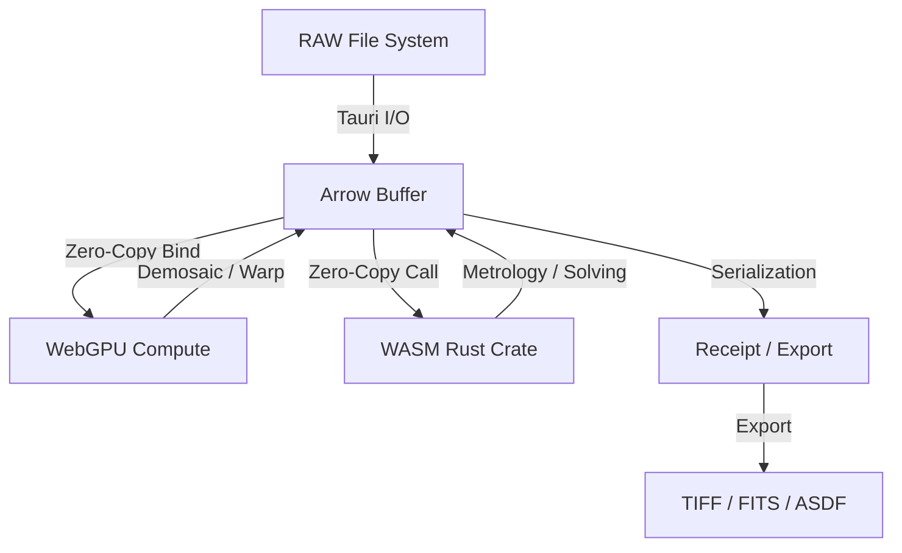

<!-- CANONICAL · update at milestones / when the built system changes -->
# SkyCruncher: System Architecture

**Revision: 2026-07 (consolidated).**

This document describes the built system as it stands. Earlier revisions layered
changes as a series of dated delta/errata appendices on top of a versioned base;
those appendices have been folded into the relevant sections so the body reads as
the current architecture rather than a base plus patches. History that used to live
in those appendices now lives in the git log.

Pointers to the live, mechanically maintained sources:

- **Regression numbers**: [`docs/GATES.md`](../GATES.md) is the single source of truth
  (tsc/vitest/API-smoke counts and the pinned reference solves). Do not hand-copy
  numbers from here — cite GATES.md.
- **Forward plan**: [`docs/ROADMAP.md`](../ROADMAP.md) (ideas) and
  [`docs/NEXT_MOVES.md`](../NEXT_MOVES.md) (executable specs).
- **Stage-by-stage pipeline walk**: [`docs/01-canonical/processing_flow.md`](processing_flow.md).
- **System paper**: [`docs/WHITEPAPER.md`](../WHITEPAPER.md).

Where a claim could not be verified against code, it is stated as design intent or
omitted. Unmeasured quantities are labelled "not measured"; approximations are
labelled approximate.

---

# PART 0: OVERVIEW & TECHNOLOGY STACK

## §0.1 Positioning

SkyCruncher is a scientific pre-processor and optical workbench for astrophotography.
It sits between lightweight alignment/stacking tools (e.g. Sequator) and full
laboratory environments (e.g. PixInsight): the goal is interactive, evidence-backed
plate solving and measurement for landscape and deep-sky RAW frames, with the same
mathematical treatment used in deep-sky metrology but fast enough to stay
interactive. Interactive throughput on 24–60 MP RAW frames is a design target, not a
guaranteed bound.

## §0.2 Technology stack

SkyCruncher uses a hybrid compute stack to move large astronomical frames through the
pipeline without repeated serialization.

| Tier | Technology | Role | Rationale |
| :--- | :--- | :--- | :--- |
| **Ingestion / UI** | Tauri + React | OS-level I/O and reactive interface | Native file-system access, WebGPU-accelerated canvas. |
| **Data backbone** | Apache Arrow | Zero-copy memory management | JS, Rust, and GPU share one buffer without copies. |
| **Parallelism** | WebGPU (WGSL) | Per-pixel compute shaders | Offloads O(N) pixel tasks (demosaic, warp) to the GPU. |
| **Metrology** | Rust (native crate) for blind plate solving; Rust/WASM for PSF and photometry math | O(N³) geometry and plate solving | Blind plate solving runs in a native Rust solver core (`crates/`), consumed by the desktop app; the browser/WASM quad-hashing solver is the legacy lane. PSF fitting and photometry math are Rust compiled to WASM, dual-target (browser + CLI), with no garbage collection on the hot path. |

## §0.3 Architecture overview

The pipeline is a tiered flow where data moves across memory boundaries without I/O
overhead.



## §0.4 Data provenance manifest (finite state machine)

**Forensic Question:** *How do we guarantee that every reported number is backed by a
traceable chain of transformations rather than a placeholder?*

The pipeline tracks the life cycle of every measurement through 17 provenance
domains. Each domain is a monotonic maturity ladder; a measurement can only advance,
and its current rung is recorded. This is the mechanism behind the honest-or-absent
rule: an unmeasured quantity sits at its lowest rung and is reported as such.

### I. Data, stars and coordinates

| Category | States (increasing maturity) |
| :--- | :--- |
| **1. Memory residency** | `JS Heap` → `Arrow Shared Buffer` → `WebGPU VRAM` → `Rust/WASM Memory` |
| **2. Photography data** | `RAW` → `Bayer Array` → `JPEG` → `Compressed JPEG` → `DNG` → `FITS` → `TIFF` |
| **3. Coordinate system** | `Sensor Pixels` → `Pixel Array` → `WCS` → `RA/Dec` → `Radians` → `Degrees` → `Feet` → `AUs` |
| **4. Star representation** | `Undetected` → `Centroid` → `Gaussian Blur` → `PSF` → `Array` |
| **11. Star count** | `Undetected` → `First Pass` → `Second Pass` → `Deep Sky Pass` |

### II. Environment, hardware and localization

| Category | States (increasing maturity) |
| :--- | :--- |
| **5. Hardware profile** | `Agnostic (Blind)` → `EXIF-Inferred` → `User-Overridden` → `Fully Calibrated (Database Matched)` |
| **6. Temporal state** | `EXIF Local` → `UTC Correlated` → `User Corrected` → `Julian Date Validated` |
| **7. Segmentation** | `Unsegmented` → `Horizon Masked` → `Sky Isolated` → `Fore/Aft Independent` |
| **8. Terrestrial location** | `Seed GPS` → `User Input` → `Validated` → `DEM/DTM Mapped` |
| **9. Planetary detection** | `Undetected` → `Hypothesis` → `Confirmed` → `Located` |
| **10. Astronomical location** | `Blind` → `Planet Targeted` → `Initial Quad Matched` → `Finalized` |

### III. Calibration and correction

| Category | States (increasing maturity) |
| :--- | :--- |
| **12. Verification** | `Bayer Data Detection` → `Circularity Confirmation` → `Color Confirmed (BP−RP)` → `Terrestrial Discard` → `Pixel Error Discard` → `Satellite/Plane Discard` → `Anomaly Confirmation` |
| **13. Signal state** | `Raw Signal` → `Gradient Modeled` → `Light Pollution Subtracted` → `Background Neutralized` |
| **14. Location correction** | `Undetected` → `Bounded` → `Initial Flattening` → `Custom Flattening` → `TPS` |
| **15. Shape correction** | `Undetected` → `Coma Corrected` → `Sidereal Corrected` → `Pointified` |
| **16. Color correction** | `Undetected` → `Color Defined (BP−RP)` → `Filter Corrected` → `Ephemeris and Atmospheric Corrected` → `Planckian Locus Verified` |
| **17. Distortion correction** | `Uncorrected` → `Stars Only` → `Entire Capture Correction` |

The color domains (12, 16) are keyed to Gaia DR3 BP−RP, not a Johnson index; the
"BV"-named enum values in code (Appendix, §0.4.2) are legacy labels that carry BP−RP.

### §0.4.1 Master provenance mapping

The following tables summarize the terminal state of each domain after each module.

#### A. Data, stars and coordinates
| Module | 1. Memory | 2. Data Source | 3. Coordinates | 4. Star Rep | 11. Star Count |
| :--- | :--- | :--- | :--- | :--- | :--- |
| **M1** | `Arrow Buffer` | `EXIF-Inferred` | `Blind` | `Raw Signal` | `Uncorrected` |
| **M2** | `Arrow Buffer` | `Profile Indexed` | `Blind` | `Raw Signal` | `Uncorrected` |
| **M3** | `WebGPU VRAM` | `Profile Indexed` | `Blind` | `Raw Signal` | `Uncorrected` |
| **M4** | `WASM Memory` | `Bayer Array` | `Pixel Array` | `Centroid` | `Deep Sky Pass` |
| **M5** | `WASM Memory` | `Bayer Array` | `Radians` | `Centroid` | `Deep Sky Pass` |
| **M6** | `WASM Memory` | `Bayer Array` | `RA/Dec` | `Centroid` | `Deep Sky Pass` |
| **M7** | `WASM Memory` | `Bayer Array` | `RA/Dec` | `Centroid` | `Deep Sky Pass` |
| **M8** | `WASM Memory` | `Bayer Array` | `RA/Dec` | `PSF` | `Deep Sky Pass` |
| **M9** | `JS Heap` | `FITS/TIFF` | `Degrees/AUs` | `Array` | `Deep Sky Pass` |

#### B. Hardware, environment and localization
| Module | 5. Hardware | 6. Temporal | 7. Segmentation | 8. Terr. Loc | 9. Planet | 10. Astro Loc |
| :--- | :--- | :--- | :--- | :--- | :--- | :--- |
| **M0/1** | `EXIF-Inferred` | `EXIF Local` | `Unsegmented` | `Seed GPS` | `Undetected` | `Blind` |
| **M2** | `Calibrated` | `UTC Correl.` | `Unsegmented` | `Seed GPS` | `Undetected` | `Blind` |
| **M3** | `Calibrated` | `UTC Correl.` | `Horizon Mask` | `Seed GPS` | `Hypothesis` | `Blind` |
| **M4** | `Calibrated` | `UTC Correl.` | `Sky Isolated` | `Seed GPS` | `Hypothesis` | `Blind` |
| **M5** | `Calibrated` | `JD Validated` | `Sky Isolated` | `Validated` | `Confirmed` | `Blind` |
| **M6** | `Calibrated` | `JD Validated` | `Sky Isolated` | `Validated` | `Located` | `Quad Matched` |
| **M7** | `Calibrated` | `JD Validated` | `Fore/Aft Ind` | `DEM Mapped` | `Located` | `Finalized` |
| **M8** | `Calibrated` | `JD Validated` | `Fore/Aft Ind` | `DEM Mapped` | `Located` | `Finalized` |
| **M9** | `Calibrated` | `JD Validated` | `Fore/Aft Ind` | `DEM Mapped` | `Located` | `Finalized` |

#### C. Calibration and correction
| Module | 12. Verify | 13. Signal | 14. Loc Corr | 15. Shape Corr | 16. Color Corr | 17. Dist. Corr |
| :--- | :--- | :--- | :--- | :--- | :--- | :--- |
| **M0/1** | `Bayer Detect` | `Raw Signal` | `Undetected` | `Undetected` | `Undetected` | `Uncorrected` |
| **M2** | `Bayer Detect` | `Raw Signal` | `Bounded` | `Undetected` | `Undetected` | `Uncorrected` |
| **M3** | `Bayer Detect` | `Raw Signal` | `Bounded` | `Undetected` | `Undetected` | `Uncorrected` |
| **M4** | `Circ. Confirm` | `Raw Signal` | `Bounded` | `Undetected` | `Color Defined` | `Uncorrected` |
| **M5** | `Circ. Confirm` | `Grad. Model` | `Initial Flat` | `Undetected` | `Color Defined` | `Uncorrected` |
| **M6** | `Satellite Disc`| `Grad. Model` | `Initial Flat` | `Coma Corr` | `Color Defined` | `Stars Only` |
| **M7** | `Satellite Disc`| `LP Subtract` | `Custom Flat` | `Sidereal Corr`| `Filter Corr` | `Stars Only` |
| **M8** | `Color Confirm` | `BG Neutral` | `TPS` | `Pointified` | `Planckian Ver`| `Stars Only` |
| **M9** | `Anomaly Conf` | `BG Neutral` | `TPS` | `Pointified` | `Planckian Ver`| `Capture Corr` |

### §0.4.2 Provenance enums

These enums back the provenance manifest.

```typescript
// I. Data, stars & coordinates
export enum MemoryResidency {
  JS_HEAP = "JS_HEAP",
  ARROW_BUFFER = "ARROW_BUFFER",
  WEBGPU_VRAM = "WEBGPU_VRAM",
  WASM_MEMORY = "WASM_MEMORY"
}

export enum PhotoDataSource {
  RAW = "RAW",
  BAYER_ARRAY = "BAYER_ARRAY",
  JPEG = "JPEG",
  COMPRESSED_JPEG = "COMPRESSED_JPEG",
  DNG = "DNG",
  FITS = "FITS",
  TIFF = "TIFF"
}

export enum NormalizationState {
  RAW_ADU = "RAW_ADU",
  BLACK_LEVEL_SUBTRACTED = "BLACK_LEVEL_SUBTRACTED",
  FLAT_FIELD_CORRECTED = "FLAT_FIELD_CORRECTED",
  NORMALIZED = "NORMALIZED"
}

export enum CoordinateSystem {
  SENSOR_PIXELS = "SENSOR_PIXELS",
  PIXEL_ARRAY = "PIXEL_ARRAY",
  WCS = "WCS",
  RA_DEC = "RA_DEC",
  RADIANS = "RADIANS",
  DEGREES = "DEGREES",
  FEET = "FEET",
  AUS = "AUS"
}

export enum StarRepresentation {
  UNDETECTED = "UNDETECTED",
  CENTROID = "CENTROID",
  GAUSSIAN_BLUR = "GAUSSIAN_BLUR",
  PSF = "PSF",
  ARRAY = "ARRAY"
}

export enum StarCount {
  UNDETECTED = "UNDETECTED",
  FIRST_PASS = "FIRST_PASS",
  SECOND_PASS = "SECOND_PASS",
  DEEP_SKY_PASS = "DEEP_SKY_PASS"
}

// II. Environment & hardware truth
export enum HardwareProfileState {
  AGNOSTIC = "AGNOSTIC",
  EXIF_INFERRED = "EXIF_INFERRED",
  USER_OVERRIDDEN = "USER_OVERRIDDEN",
  FULLY_CALIBRATED = "FULLY_CALIBRATED"
}

export enum TemporalState {
  EXIF_LOCAL = "EXIF_LOCAL",
  UTC_CORRELATED = "UTC_CORRELATED",
  USER_CORRECTED = "USER_CORRECTED",
  JULIAN_DATE_VALIDATED = "JULIAN_DATE_VALIDATED"
}

export enum SegmentationState {
  UNSEGMENTED = "UNSEGMENTED",
  HORIZON_MASKED = "HORIZON_MASKED",
  SKY_ISOLATED = "SKY_ISOLATED",
  FORE_AFT_INDEPENDENT = "FORE_AFT_INDEPENDENT"
}

export enum TerrestrialLocalization {
  SEED_GPS = "SEED_GPS",
  USER_INPUT = "USER_INPUT",
  VALIDATED = "VALIDATED",
  DEM_DTM_MAPPED = "DEM_DTM_MAPPED"
}

export enum PlanetaryDetection {
  UNDETECTED = "UNDETECTED",
  HYPOTHESIS = "HYPOTHESIS",
  CONFIRMED = "CONFIRMED",
  LOCATED = "LOCATED"
}

export enum AstronomicalLocalization {
  BLIND = "BLIND",
  PLANET_TARGETED = "PLANET_TARGETED",
  INITIAL_QUAD_MATCHED = "INITIAL_QUAD_MATCHED",
  FINALIZED = "FINALIZED"
}

export enum PhotometricSolution {
  UNCALIBRATED = "UNCALIBRATED",
  INSTRUMENTAL_MAGNITUDE = "INSTRUMENTAL_MAGNITUDE",
  CATALOG_MATCHED_GAIA_DR3 = "CATALOG_MATCHED_GAIA_DR3",
  ZERO_POINT_VALIDATED = "ZERO_POINT_VALIDATED"
}

// III. Calibration & correction state
// The "BV" names below are legacy labels; the value carried is Gaia DR3 BP−RP.
export enum StarVerification {
  BAYER_DETECT = "BAYER_DETECT",
  CIRCULARITY_CONFIRM = "CIRCULARITY_CONFIRM",
  BV_CONFIRMED = "BV_CONFIRMED",
  TERRESTRIAL_DISCARD = "TERRESTRIAL_DISCARD",
  PIXEL_ERROR_DISCARD = "PIXEL_ERROR_DISCARD",
  SATELLITE_PLANE_DISCARD = "SATELLITE_PLANE_DISCARD",
  ANOMALY_CONFIRMATION = "ANOMALY_CONFIRMATION"
}

export enum SignalState {
  RAW_SIGNAL = "RAW_SIGNAL",
  GRADIENT_MODELED = "GRADIENT_MODELED",
  LIGHT_POLLUTION_SUBTRACTED = "LIGHT_POLLUTION_SUBTRACTED",
  BACKGROUND_NEUTRALIZED = "BACKGROUND_NEUTRALIZED"
}

export enum StarLocationCorrection {
  UNDETECTED = "UNDETECTED",
  BOUNDED = "BOUNDED",
  INITIAL_FLATTENING = "INITIAL_FLATTENING",
  CUSTOM_FLATTENING = "CUSTOM_FLATTENING",
  TPS = "TPS"
}

export enum StarShapeCorrection {
  UNDETECTED = "UNDETECTED",
  COMA_CORRECTED = "COMA_CORRECTED",
  SIDEREAL_CORRECTED = "SIDEREAL_CORRECTED",
  POINTIFIED = "POINTIFIED"
}

export enum StarColorCorrection {
  UNDETECTED = "UNDETECTED",
  BV_DEFINED = "BV_DEFINED",           // legacy name; value is Gaia BP−RP
  FILTER_CORRECTED = "FILTER_CORRECTED",
  ATMOSPHERIC_CORRECTED = "ATMOSPHERIC_CORRECTED",
  PLANCKIAN_LOCUS_VERIFIED = "PLANCKIAN_LOCUS_VERIFIED"
}

export enum DistortionCorrection {
  UNCORRECTED = "UNCORRECTED",
  STARS_ONLY = "STARS_ONLY",
  ENTIRE_CAPTURE_CORRECTION = "ENTIRE_CAPTURE_CORRECTION"
}

export enum ResamplingKernel {
  NONE = "NONE",
  BILINEAR_PREVIEW = "BILINEAR_PREVIEW",
  LANCZOS_3_HIGH_FIDELITY = "LANCZOS_3_HIGH_FIDELITY",
  FLUX_PRESERVING = "FLUX_PRESERVING"
}
```

---

# PART I: PHYSICS AND MATH FOUNDATIONS

**Forensic Question:** *What fixed standards of time, space and color does every stage
compute against?*

Before any code executes, the pipeline defines the reference frames it operates in.
These are the standards of time, coordinates and color used by every transaction.

## §1.1 Time reference

All scientific calculations use continuous Julian time, not local wall-clock time.

*   **Unix timestamp ($t_{unix}$)**: milliseconds since `1970-01-01T00:00:00Z`. UI only.
*   **Julian Date ($JD$)**: continuous count of days since noon, `January 1, 4713 BC`.
    $$JD = \frac{t_{unix}}{86400000} + 2440587.5$$
*   **J2000 reference epoch ($J_{2000}$)**: the reference epoch for precession and
    the alt/az/zenith ephemeris. This is a *time/precession* reference, distinct from
    the catalog frame epoch (see §1.2).
    $$J_{2000} = 2451545.0 \text{ (Jan 1, 2000, 12:00 TT)}$$
*   **Julian centuries ($T$)**: integration step for precession/nutation.
    $$T = \frac{JD - 2451545.0}{36525.0}$$
*   **GMST (Greenwich Mean Sidereal Time)**: IAU 1982 formula, degrees.
    $$\theta_{GMST} = 280.46061837 + 360.98564736629 \cdot (JD - 2451545.0) + 0.000387933 \cdot T^2 - \frac{T^3}{38710000}$$

The plate solve itself is time-independent: RA/Dec hints and catalog geometry need no
clock. A bad or unset clock corrupts only the ephemeris annotations (planet
identification, alt/az, air mass), and the pipeline flags an untrusted timestamp
loudly rather than silently substituting the wall clock.

## §1.2 Coordinate systems

The pipeline operates across four spatial manifolds and manages safe transitions
between them.

1.  **Sensor manifold ($x, y$)**
    *   Domain: $[0, 0]$ to $[Width, Height]$.
    *   Unit: pixels (origin top-left).
    *   Basis: hardware-dependent, distorted by optics.

2.  **Tangent plane / standard coordinates ($\xi, \eta$)**
    *   Domain: approximately $[-1, 1]$.
    *   Unit: degrees (standard FITS/WCS convention).
    *   Projection: gnomonic (TAN), tangent at $(RA_0, Dec_0)$.

3.  **Equatorial manifold ($\alpha, \delta$)**
    *   Domain: $\alpha \in [0, 24^h)$, $\delta \in [-90^\circ, +90^\circ]$.
    *   Unit: hours (RA), degrees (Dec).
    *   Frame: ICRS. Catalog positions are Gaia DR3 at reference epoch **J2016.0**.

4.  **Horizontal manifold ($A, h$)**
    *   Domain: $A \in [0^\circ, 360^\circ)$ (North=0, East=90), $h \in [-90^\circ, +90^\circ]$.
    *   Unit: degrees.
    *   Basis: topocentric (observer-location dependent).

### Catalog frame and epoch

Catalog positions come from Gaia DR3 in the ICRS reference frame at epoch J2016.0
(not J2000). Proper-motion handling is split by lane:

- The legacy native starplates lane applies a first-order flat proper-motion
  propagation from the Gaia epoch to the observation Julian Date.
- The native Rust solver core and the g15u confirmation lane use positions at
  J2016.0 without per-observation proper-motion propagation. This is a small
  (sub-arcsecond per decade) known gap, not a bug.

Internally RA is carried in **hours**; degrees appear only at the FITS/wire boundary.
The starplates catalog data lane is an exception and is in degrees end to end. The
$\times 15 / \div 15$ conversion happens only at the catalog adapter seam.

### World Coordinate System (WCS)

The WCS matrix transforms sensor pixels to equatorial coordinates via the CD matrix.

$$
\begin{bmatrix} CD_{1,1} & CD_{1,2} \\ CD_{2,1} & CD_{2,2} \end{bmatrix} = s \begin{bmatrix} \cos(\theta) & -\sin(\theta) \\ -\sin(\theta) \cdot p & -\cos(\theta) \cdot p \end{bmatrix}
$$

where $s$ is scale in deg/px, $\theta$ is rotation, and $p$ is parity ($\pm 1$).
Parity is det(CD) in image-space (y-down) convention; the sign is a convention, not a
physical assertion.

## §1.3 Color spaces

### sRGB ↔ XYZ (CIE 1931)

Standard D65 transformation used for physical light-scattering models.

**Linearization:**
$$C_{linear} = \begin{cases} \frac{C_{srgb}}{12.92} & C_{srgb} \leq 0.04045 \\ \left(\frac{C_{srgb} + 0.055}{1.055}\right)^{2.4} & C_{srgb} > 0.04045 \end{cases}$$

**Matrix transform:**
$$\begin{bmatrix} X \\ Y \\ Z \end{bmatrix} = \begin{bmatrix} 0.4124 & 0.3576 & 0.1805 \\ 0.2126 & 0.7152 & 0.0722 \\ 0.0193 & 0.1192 & 0.9505 \end{bmatrix} \begin{bmatrix} R \\ G \\ B \end{bmatrix}$$

### Planckian locus (blackbody chromaticity)

Used for spectral photometric color calibration (SPCC). The locus is approximated via
segmented polynomials in the CIE 1931 chromaticity diagram $(x, y)$.

Range $1667K \leq T \leq 4000K$:
$$x = -0.2661 \left(\tfrac{10^3}{T}\right)^3 - 0.2344 \left(\tfrac{10^3}{T}\right)^2 + 0.8777 \left(\tfrac{10^3}{T}\right) + 0.1799$$

Range $4000K < T \leq 25000K$:
$$x = -3.0258 \left(\tfrac{10^3}{T}\right)^3 + 2.1070 \left(\tfrac{10^3}{T}\right)^2 + 0.2226 \left(\tfrac{10^3}{T}\right) + 0.2404$$

### Color manifolds

1.  **Bayer raw ($RGGB_{raw}$)**: 12/14/16-bit integer, mosaic topology, photon
    counts (ADU), device-specific.
2.  **Linear sRGB ($RGB_{lin}$)**: 32-bit float, 3-channel plane, radiometric energy,
    gamma 1.0.
3.  **CIE XYZ ($XYZ_{1931}$)**: 32-bit float, human-perceptual absolute color; used
    for zenith normalization (Rayleigh coefficients applied here).
4.  **Catalog color axis (Gaia BP−RP)**: the astrometric-catalog color index used for
    stellar classification is Gaia DR3 BP−RP. The Ballesteros (2012) temperature
    relation is literature-defined for Johnson $B-V$; the pipeline reuses it on BP−RP
    via a documented approximate proxy factor (see Appendix H and Module 8). No
    Johnson $B-V$ is measured or stored.
5.  **Quad Bayer raw ($QRGGB_{raw}$)**: 4× binning sensors (2×2 blocks of identical
    color pixels), HDR capture via staggered exposure or SNR-optimized binning.
6.  **Oklab**: perceptually uniform space used for UI gradients and heatmaps
    (render layer only; not part of the science path).

Gnomonic tangent-plane inversion (used throughout Modules 5–7):
$$
\begin{aligned}
\tan(\alpha - \alpha_0) &= \frac{\xi}{\cos(\delta_0) - \eta \sin(\delta_0)} \\
\tan(\delta) &= \frac{(\sin(\delta_0) + \eta \cos(\delta_0)) \cos(\alpha - \alpha_0)}{\cos(\delta_0) - \eta \sin(\delta_0)}
\end{aligned}
$$

---

# PART II: THE PIPELINE

The pipeline is a multi-tier, zero-copy flow. It is organized into ten modules plus an
optional multi-frame stacking module (`m11_stack`, gated by `VITE_STACK_ENABLED`,
default off and byte-identical when off — multi-frame dither/drizzle at the batch
seam).

There is a single orchestrator: the stateful wizard `orchestrator_session.ts`. The
former automatic-path orchestrator (`orchestrator.ts`, `runPipeline`) has been deleted
along with its Refine/Hint UI, spectroscopy adapter, hardware-profile adapter, and the
`useMainPipeline` hook. Shared stage logic lives in `src/engine/pipeline/stages/*`,
consumed identically by the wizard and by the headless Node driver.

## Execution order

The stages run in this order; each answers one question:

1. **Module 1 — RAW decode & metadata:** what device captured this, and what are the
   photon counts?
2. **Module 2 — Hardware profiling:** what optics are we looking through?
3. **Module 3 — Demosaic & linearization:** reconstruct color from the Bayer mosaic.
4. **Module 4 — Signal detection:** where are the stars, and what is noise?
5. **Module 5 — Coordinate flattening:** where would the stars be through a perfect lens?
6. **Module 6 — Plate solving:** where was the camera pointed?
7. **Module 7 — Astrometric refinement:** how does this specific lens warp the frame?
8. **Module 8 — Photometry:** how much energy did the stars emit?
9. **Module 9 — Serialization & export:** store the result in standard containers.
10. **Module 10 — PSF characterization (post-solve):** measure the point-spread field.

---

## Module 1: RAW decoding and metadata extraction

**Forensic Question:** *"What device captured this, and what are the photon counts?"*
**Compute tier:** JS/TS + Rust/WASM.
**Primary source:** `m1_ingestion/metadata_reaper.ts`, `m1_ingestion/rawler_decoder.ts`,
`m1_ingestion/fits_decoder.ts`.

Module 1 extracts the physical parameters of the observation (EXIF/FITS headers) and
isolates the raw, un-interpolated photon counts from the sensor (Bayer CFA), so that
downstream modules work with linear scientific data rather than a camera JPEG.

**Provenance transition:**
> **Memory [1]:** `JS Heap` → `Arrow Shared Buffer`
> **Data source [2]:** `RAW`
> **Hardware [5]:** `Agnostic` → `EXIF-Inferred`
> **Temporal [6]:** `EXIF Local`

Ingestion is dual-path, routed by magic bytes, never by file extension:

- **DSLR/mirrorless RAW** (CR2/NEF/ARW/…): the two-arm decode step below.
- **FITS** (`SIMPLE` card): a pure-TypeScript `fits_decoder.ts`. FITS header cards map
  into `HardMetadata`: `CREATOR`/`INSTRUME` → camera model; `FOCALLEN` → focal length
  (trusted, not overwritten by later metrology); `XPIXSZ` → pixel pitch; `GAIN` → ZWO
  gain setting (not ISO); `DATE-OBS` → UTC timestamp; `SITELAT`/`SITELONG` → observer
  location (`gps_source:'FITS'`); `RA` (deg ÷ 15) → RA hint in hours; `DEC` → Dec hint;
  `BIAS` → black level; `BAYERPAT` → CFA pattern driving the parameterized demosaic.

### Steps

1. **EXIF/header forensic capture.** Extracts immutable physical fields and diagnostic
   metadata: camera/lens models, ISO, aperture $N$, exposure time $t$, timestamp and
   GPS. A zero-vector GPS `(0.0, 0.0)` (a common camera default) is flagged
   `GPS_SOURCE: DEFAULT` rather than trusted. A missing location null-propagates: the
   coordinates stay `null`, `gps_source` is `DEFAULT`, and site-dependent ephemeris
   annotations are suppressed rather than computed against a fake site. There is no
   hard-coded default observer.

2. **Two decode arms behind one seam.** RAW files are decoded without interpolation
   (demosaic), white balance, or gamma, to preserve photometry. The arm is selected by
   `isRawlerDecoderEnabled()`; downstream modules see one identical `Uint16Array`
   contract either way:
   - **Default arm — rawler (Rust → WASM):** `decodeRawlerForPipeline(buffer)`, backed
     by the `wasm_decode` crate (`src/engine/wasm_decode/pkg`, gitignored, built with
     `wasm-pack build --target web`). `isRawlerDecoderEnabled()` defaults true.
   - **Cold path — LibRaw WASM:** selected with `VITE_DECODER_RAWLER=0`. Retained as a
     reference arm; same no-interpolation / 16-bit / no-auto-bright discipline.
   - Both arms: return the native Bayer mosaic (no demosaic), 16-bit output (full
     dynamic range), and no histogram stretch (photometry preserved).
   - The two arms are pinned against separate reference solves — see GATES.md.

3. **Active-area validation.** Cameras include masked dark-reference pixels at the
   sensor edges. Using the active-area `meta.width/height` (rather than
   `raw_width/height`) prevents a diagonal shear and solve-time misalignment. The
   stride is computed in elements:
   $$Stride_{elements} = \frac{Pitch_{bytes}}{2}$$

4. **Arrow encapsulation.** The resulting `Uint16Array` is wrapped zero-copy into an
   Arrow shared buffer (see §0.2) for the rest of the pipeline.

FITS input has two accepted shapes, both BITPIX=16 / BZERO=32768 big-endian and
magic-byte gated: a NAXIS=2 single-plane CFA sub-frame (GRBG from `BAYERPAT`, routed
through the parameterized demosaic) and a NAXIS=3 planar RGB cube (already demosaiced
stacked output — the demosaic is bypassed entirely and the data passes through as
interleaved float).

Stack-time semantics: the decoder reads `DATE-END` (the integration midpoint when
present) and captures `STACKCNT`/`NSTACK` and `LIVETIME`/`TOTALEXP`. A multi-frame
stack that carries only `DATE-OBS` records an ambiguity warning rather than a guessed
correction.

---

## Module 2: Hardware profiling

**Forensic Question:** *"What optics are we looking through?"*
**Compute tier:** JS/TS.
**Primary source:** `m2_hardware/LensfunIngestor.ts`, `m2_hardware/hardware_profiler.ts`,
`m2_hardware/sensor_db.ts`.

Module 2 looks up the optical characteristics of the specific camera/lens combination.
It uses the Lensfun database for baseline distortion coefficients and analyzes the star
field for evidence of applied filters or hardware modifications.

**Provenance transition:**
> **Hardware [5]:** `EXIF-Inferred` → `User-Overridden` → `Fully Calibrated`
> **Temporal [6]:** `EXIF Local` → `UTC Correlated`

### Steps

1. **Lensfun ingestion.** Fetches XML profiles from the Lensfun repository for major
   brands. Alias resolution maps third-party glass (Samyang ↔ Rokinon ↔ Bower) to the
   correct profile.

2. **Optical-train fingerprint.** A persistent key for the hardware stack:
   $$\text{fingerprint} = \operatorname{SHA256}(\text{camera} \mathbin\Vert \text{lens} \mathbin\Vert \text{filter})$$
   Per-rig calibrated profiles are stored in the Optical Workbench store (see below),
   keyed by model.

3. **Focal-length inference (physics vs metadata).** EXIF focal length is often rounded
   or wrong for older lenses; the physics-estimated focal length uses the plate
   solution scale:
   $$FL_{mm} = \frac{206265 \cdot (Pitch_{\mu m} / 1000)}{Scale_{"/px}}$$

4. **Spectral and spatial forensics.** Star color distributions (Gaia BP−RP) and PSF
   shapes are analyzed to infer hardware modifications:

| Detection | Indicator | Rationale |
| :--- | :--- | :--- |
| **Astro-mod** | $R_{bias} > 1.8$ | IR/UV-cut filter removal enhances $H\alpha$ sensitivity. |
| **Narrowband** | $G_{bias} < 0.5$ | Extreme isolation of red/teal lines. |
| **Diffusion** | $FWHM_{bright} > 5 \cdot FWHM_{faint}$ | Diffusion filters bloat highlights while preserving faint stars. |
| **GND filter** | $BG_{top} < 0.4 \cdot BG_{bottom}$ | A sudden vertical background drop suggests a graduated ND filter. |

### Sensor database and metrology skip

`SensorProfile` carries a `gain_curve` (ZWO gain setting → e⁻/ADU LUT) and an
`adu_bit_shift` (12-bit ADC in a 16-bit container). Known telescopes reach the
`Fully Calibrated` hardware state without Lensfun (profiles include IMX585 / IMX462 /
IMX662 STARVIS-family sensors; gain/QE curves for these are flagged approximate,
roughly 20–30% uncertain, pending per-device charts). Geometry stays pure header math
($206265 \cdot XPIXSZ/1000/FOCALLEN$, binning-correct automatically). Agnostic metrology
is skipped when header optics are trusted (`isFits && focal_length > 0`), so the plate
scale does not overwrite a trusted `FOCALLEN`.

### Optical Workbench store

Per-rig optical deposits are stored (model-only keying) behind a four-rung trust ladder:
rung 0 = Lensfun/book nominal (0 frames), rung 1 = derived from this copy (1 frame),
higher rungs = pooled pixel-level fits. Application of derived per-rig profiles is
gated off by default; the nominal book coefficients are an approximate prior only.
Reconciling the sign/parameter conventions between a nominal book profile and measured
per-copy fits is an open calibration question, and per-copy refinement (an LM/SIP
refit — Module 7) is deferred. Spec of record:
[`docs/OPTICAL_WORKBENCH_SCHEMA.md`](../OPTICAL_WORKBENCH_SCHEMA.md).

---

## Module 3: GPU pre-processing (demosaic and linearization)

**Forensic Question:** *"Can we reconstruct the color image from the Bayer mosaic?"*
**Compute tier:** WebGPU (primary) / JS CPU (fallback).
**Primary source:** `WebGPUContext.ts`, `DemosaicEngine.ts`, `demosaic.ts`,
`demosaic_bayer.wgsl`, `demosaic_bayer_param.wgsl`.

Module 3 turns the single-channel Bayer mosaic into an interleaved RGB image. This is
the first massively parallel stage; offloading it to the GPU keeps demosaic of a 24 MP
frame well under the multi-second CPU cost.

**Provenance transition:**
> **Memory [1]:** `Arrow Shared Buffer` → `WebGPU VRAM`
> **Data source [2]:** `RAW` → `Bayer Array`
> **Coordinates [3]:** `Sensor Pixels` → `Pixel Array`

### Steps

1. **GPU context initialization.** The WebGPU context initializes as a singleton with a
   high-performance power preference. If `navigator.gpu` is unavailable (older hardware
   or insecure context) the engine falls back to the CPU demosaic engine.

2. **Parallel bilinear demosaic (WebGPU).** A WGSL compute shader performs bilinear
   interpolation across the RGGB grid (workgroup $16 \times 16$; data flow
   `Uint16` CFA → `u32` packed buffer → `Float32` RGB storage buffer):
   - At a red pixel $(i,j)$:
     $$R = p_{i,j}, \quad G = \frac{p_{i-1,j} + p_{i+1,j} + p_{i,j-1} + p_{i,j+1}}{4}, \quad B = \frac{p_{i-1,j-1} + p_{i-1,j+1} + p_{i+1,j-1} + p_{i+1,j+1}}{4}$$
   - At a blue pixel $(i,j)$:
     $$B = p_{i,j}, \quad G = \frac{p_{i-1,j} + p_{i+1,j} + p_{i,j-1} + p_{i,j+1}}{4}, \quad R = \frac{p_{i-1,j-1} + p_{i-1,j+1} + p_{i+1,j-1} + p_{i+1,j+1}}{4}$$
   The parameterized shader `demosaic_bayer_param.wgsl` takes the CFA offset, black and
   white levels, and white balance as uniforms (driven by `BAYERPAT` plus the sensor
   profile), so those constants are not hard-coded on the browser path.

3. **CPU fallback.** An identical bilinear algorithm in TypeScript
   (`DemosaicEngine.demosaicBilinear()`) for environments where WebGPU is blocked.

4. **Luminance binning (SNR enhancement).** For metrology (Module 4) the engine
   collapses $2 \times 2$ CFA quads into one high-SNR luminance pixel, eliminating
   pixel-sensitivity striping:
   $$L_{norm} = \frac{\sum_{k=1}^4 (p_k - BL)}{4 \cdot (WL - BL)}$$
   where $BL$ is the black level and $WL$ the white (saturation) level.

---

## Module 4: Signal detection (morphological extraction)

**Forensic Question:** *"Where are the stars, and what is noise?"*
**Compute tier:** Rust/WASM (extraction) + JS/TS (logic).
**Primary source:** `m4_signal_detect/signal_processor.ts`,
`m4_signal_detect/horizon_envelope.ts`, `lib.rs` (`extract_blobs`).

Module 4 converts the luminance map into a categorized list of signal points. It uses a
multi-pass masking strategy to handle a varying noise floor and optical distortion
across the frame.

**Provenance transition:**
> **Star rep [4]:** `Undetected` → `Centroid`
> **Star count [11]:** `Undetected` → `First Pass` → `Deep Sky Pass`
> **Signal [13]:** `Raw Signal`
> **Verification [12]:** `Bayer Data Detection` → `Circularity Confirmation`

### Steps

1. **3×3 Gaussian pre-filter.** A light noise-suppression kernel over the binned
   luminance map, suppressing binning-lattice artifacts and enabling sub-pixel
   centroiding:
   $$K = \frac{1}{16}\begin{bmatrix} 1 & 2 & 1 \\ 2 & 4 & 2 \\ 1 & 2 & 1 \end{bmatrix}$$

2. **First pass (high-confidence detection).** A focal-length-adjusted threshold picks
   the brightest, most obvious sources:
   $$T = \mu + \sigma_{FL} \cdot \sigma$$
   The boost $\sigma_{FL}$ scales logarithmically from $1.0\times$ (50 mm) to $1.8\times$
   (1000 mm) to account for atmospheric bloat at longer focal lengths.

3. **WASM blob extraction (`extract_blobs`).** The binned buffer goes to Rust/WASM for
   flood-fill extraction (4-way connected-component labeling with a persistent
   `VISITED_CACHE` to avoid per-frame allocations). For every blob it computes:
   - Flux-weighted centroid $c_x = \frac{\sum x_i f_i}{\sum f_i}, \; c_y = \frac{\sum y_i f_i}{\sum f_i}$
   - Circularity (ratio of pixel-covariance eigenvalues)
   - SNR (source-extractor approximation)

4. **Morphological filtering.** Each candidate is classified as a star, an anomaly, or
   noise:
   - Reject if $\text{fwhm} < 0.40$ (hot pixels) or $(\text{flux} < 0.05 \;\wedge\; \text{SNR} < 5)$ (read noise).
   - Flag as anomaly if $(\text{circularity} < 0.08 \;\wedge\; \text{fwhm} > 15)$ (satellite/plane streaks) or $\text{fwhm} > 250$ (nebular clouds).
   - Spectral check: for candidates with color data, `isOnPlanckianLocus()` rejects
     magenta/cyan noise spikes or green LEDs.

5. **Dynamic sky mask.** Using only high-confidence first-pass stars (circularity
   $> 0.65$, SNR $> 35$), the engine traces the star-field ridgeline into a
   `sky_polygon` (`carveVoids()`), so a deep-scan runs only inside the sky region and
   terrestrial foreground does not generate thousands of false quads.

6. **Deep scan.** A final extraction at a lower threshold ($\mu + 2.0\sigma$) captures
   faint targets. Deep candidates within 4 px of a first-pass star are discarded to
   avoid double-counting.

7. **Coordinate restoration.** Centroids are scaled from the binned science space back
   to native sensor space and cached as `rawX, rawY`.

### Horizon culling status

The only foreground/horizon culler is `analyzeWithMasking`, which gates topography
culling on a measured horizon vector. Detection is evidence-gated: with no measured
horizon, no ground is assumed (full-frame background sampling, culls skipped) — correct
for tracked telescopes with no landscape. A neural boundary subsystem (MobileSAM /
ONNX) that formerly produced that horizon vector has been deleted; the pipeline is
deterministic-math-only. A deterministic horizon tracer exists
(`computeHorizonEnvelope`, covered by tests) but is currently wired only to the UI
overlay, not to the culler. Feeding the detection envelope into the culler is a planned
bridge and is not yet wired; until it lands, foreground-saturated ultra-wide frames
with no anchor are an honest failure rather than a regression.

---

## Module 5: Coordinate flattening (Brown-Conrady inverse)

**Forensic Question:** *"Where would these stars be if the lens were perfect?"*
**Compute tier:** Rust/WASM.
**Primary source:** `GenericFlattener.ts`, `lib.rs` (`flatten_coordinates`),
`m5_coordinate_flatten/differential_refraction_corrector.ts`.

Module 5 removes optical distortion from the detected star list, transforming curved
sensor space into a rectilinear standard-coordinate plane where stars follow linear
geometry. This is a sparse-point coordinate transform, not an image resample (two-ledger
law: the native pixel coordinates are kept for photometry).

**Provenance transition:**
> **Location correction [14]:** `Undetected` → `Bounded` → `Initial Flattening`
> **Coordinates [3]:** `Pixel Array` → `Radians`

### Steps

1. **Newton-Raphson distortion inversion.** The Brown-Conrady model is forward
   ($ideal \rightarrow distorted$); to recover the ideal position the engine inverts it
   by Newton-Raphson in WASM:
   - Radial model: $R_d = R_u(1 + k_1 R_u^2 + k_2 R_u^4 + k_3 R_u^6)$
   - Function: $f(R_u) = R_u(1 + k_1 R_u^2 + k_2 R_u^4 + k_3 R_u^6) - R_d$
   - Derivative: $f'(R_u) = 1 + 3k_1 R_u^2 + 5k_2 R_u^4 + 7k_3 R_u^6$
   - Update: $R_u \leftarrow R_u - \dfrac{f(R_u)}{f'(R_u)}$
   - Convergence: typically within 10 iterations at a $10^{-7}$ threshold.

2. **Tangential component.** After radial convergence, the tangential terms
   ($p_1, p_2$) handle lens-element decentering:
   $$\Delta x_t = 2p_1 x_d y_d + p_2(r_u^2 + 2x_d^2)$$
   $$\Delta y_t = p_1(r_u^2 + 2y_d^2) + 2p_2 x_d y_d$$

3. **Atmospheric refraction (predictor only).** The atmosphere acts as a gradient lens,
   shifting stars toward the zenith. `DifferentialRefractionCorrector` computes an
   approximate Bennett (1982) term:
   $$R_{arcmin} = 1.02 \cdot \cot\left(h_a + \frac{10.3}{h_a + 5.11}\right)$$
   It has a live call site in the post-solve stage `stages/psf_attribution.ts` (gated on
   a trusted timestamp and present GPS) and emits a reported, approximate field-level
   differential-refraction block. It is a predictor only: the value is reported, never
   fed back into coordinate flattening or the solve. The effect is negligible for
   narrow fields (e.g. a ~2° telescope frame).

---

## Module 6: Plate solving (pattern recognition)

**Forensic Question:** *"Where was the camera pointed in the universe?"*
**Compute tier:** native Rust (desktop reference solver); Rust/WASM + JS/TS (legacy
browser lane).
**Primary source:** `crates/solver-core`, `crates/solver-contracts`,
`crates/solver-cli`; desktop seam `src-tauri/src/greenfield_solve.rs` +
`src/engine/pipeline/stages/greenfield_seam.ts`; legacy lane
`m6_plate_solve/solver_entry.ts`, `solve_plate_wasm`; confirmation lane
`m6_plate_solve/deep_verify.ts`, `m6_plate_solve/forced_confirm.ts`.

Module 6 determines the absolute orientation of the sensor by matching observed star
patterns against a catalog, then fits a WCS. There are two solver lanes:

- **Reference solver (desktop):** a native Rust solver core (`crates/`) is the live
  solver on desktop, invoked through a Tauri seam behind the flag
  `VITE_SOLVER_GREENFIELD` (default on for the desktop app). It takes detections in and
  returns a verified WCS out.
- **Legacy lane (browser):** the TypeScript/WASM blind quad-hashing solver
  (`solver_entry.ts`, `solve_plate_wasm`) remains the browser/demo lane and is retained
  as a cold path, pinned byte-identical. A directed anchored-sweep sibling
  (`ridge_directed`) is dormant (a CD-convention sign fix and anchor plumbing are
  outstanding) and is filtered out of the active chain.

**Provenance transition:**
> **Astro location [10]:** `Blind` → `Initial Quad Matched` → `Finalized`
> **Location correction [14]:** `Initial Flattening` → `Custom Flattening`
> **Distortion [17]:** `Uncorrected` → `Stars Only`

### Quad descriptor (invariant hashing)

For every group of four stars, an invariant descriptor is formed:

- **Legacy lane:** stars $A, B$ (the most distant pair) map to $(0,0)$ and $(1,1)$; the
  remaining stars $C, D$ transform into that basis, and the four coordinates
  $[x_C, y_C, x_D, y_D]$ form the hash key. This is a whole-frame basis.
- **Reference solver:** each quad is coded in its own local gnomonic-tangent frame
  rather than a single whole-frame basis. On a wide (≈86°) field the whole-frame scheme
  reaches only a partial code-match ceiling against the local-frame codes, which is why
  the local-frame coding is used in the native core.

### Matching and acceptance

- **Legacy lane:** a WASM consensus matcher walks the hash buckets to find consensus
  clusters that agree on a common $(RA, Dec, Rot, Scale)$ transform, walking both the
  direct and mirrored bin sets so negative-parity (bottom-up FITS) frames can match. It
  starts with a tight tolerance ($0.01$) and expands to $0.05$ only if no cluster is
  found.
- **Reference solver:** a single verify-step verifier with log-odds acceptance,
  abort-on-accept, seed exclusion, and a descending band-order search over the g15u
  index (with wall-clock solve budgets). Acceptance is verify-first: a candidate pose is
  accepted only when the forced-photometry verification passes, never on cluster count
  alone.

The search is seeded by a **hint cascade** (`m6_plate_solve/hint_resolver.ts`):
explicit config hints > FITS-header position (a few-degree radius) > soft hints >
zenith fallback. A hinted solve is not a lesser solve — acceptance never consults the
hint; `solve_provenance` records `solved_via ∈ {blind | assisted:user |
assisted:metadata | assisted:tool}` from the hint rung. The strategy chain is
focal-length keyed (planar-first for short focal lengths).

Verification thresholds are tunable (`verify_min_anchor_matches`,
`verify_min_confidence`, `verify_dense_field_cutoff` in `DynamicPipelineConfig`);
narrow fields (< 6° diagonal) relax to 4 anchors at a 0.5 achievable-match confidence.
Confidence denominators count only detections that *could* match (matches divided by the
smaller of detections and catalog stars present in the region), so a deep stack detecting
past the catalog limit is not penalized.

### WCS matrix fit

Once a pose is accepted, a $2 \times 2$ CD matrix is fit by least squares between the
matched pixel pairs $(x,y)$ and sky pairs $(\xi, \eta)$. The reference solver performs
its WCS fit natively; the legacy lane uses `SkyTransform.fitWCS()`.

### Deep verification and forced-photometry confirmation

Two post-solve stages add evidence without touching the solve (they write separate
provenance fields, so the solve stays byte-identical). Forced photometry uses two
ledgers: the position lane projects catalog $(ra_{hours}, dec_{degrees})$ through a
gnomonic TAN about `crval` and $CD^{-1}$ to a predicted pixel; the pixel lane measures
matched-aperture flux at that predicted position on the detection grid, with a
local sigma-clipped annulus background. A structured-background guard hard-vetoes
terrain, foliage and nebular filaments. Every such measurement is tagged
`CATALOG_FORCED` (aperture flux at catalog-predicted positions), never laundered into a
blind discovery.

- **`deep_verify.ts`** escalates sub-threshold sweep peaks: it projects deep-catalog
  stars through the candidate WCS, forced-measures at predicted positions, calibrates
  the null on-frame at deterministic scrambled positions, and compares acceptance counts
  as a binomial excess. Truth gains strongly; junk collapses.
- **`forced_confirm.ts`** promotes `CATALOG_FORCED` candidates to
  `CATALOG_FORCED_CONFIRMED` on a separate `solution.deep_confirmed` field. A candidate
  is confirmable only if it also passes at least one active discriminator (frame-PSF
  shape consistency from Module 10, or a per-star local scrambled null) plus a
  neighbor-contamination and structured-background veto.

The **set-level confirmation authority** is a Benjamini-Yekutieli false-discovery-rate
step-up gate (BY, $q = 0.05$), with a minimum-count set rule. Per-star confirmation runs
over the real candidates and over frame-wide scrambled null positions with the same
predicate and seed lineage; if the real confirmed set is statistically indistinguishable
from its own null population the whole set collapses to zero confirmed. An earlier
fixed set-excess-$z$ threshold (`SOLVER_CONFIRM_SET_EXCESS_Z`) is frozen and reported but
no longer decides. Both stages run inside the wizard step-5 path and are fail-soft (any
error warns and leaves the solve unaffected). The `deep_confirmed` product is an additive
provenance product; it is validated but should be treated as a maturing science product,
not yet a downstream-authoritative one.

---

## Module 7: Astrometric refinement (precision calibration)

**Forensic Question:** *"How does the specific lens slightly warp the stars?"*
**Compute tier:** TypeScript/JS (linear algebra), with a thin-plate-spline producer.
**Primary source:** `m7_astrometry/ResidualAnalyzer.ts`, `m7_astrometry/tps_fitter.ts`.

Module 7 goes beyond the linear WCS of Module 6 to model residual optical distortion
across the whole frame, using the Simple Imaging Polynomial (SIP) convention and,
where it earns its keep, a thin-plate spline (TPS).

**Provenance transition:**
> **Location correction [14]:** `Custom Flattening` → `TPS`
> **Verification [12]:** `Satellite/Plane Discard`

### Residual analysis

For every matched star:
- Projected linear position: $\begin{pmatrix} x_{lin} \\ y_{lin} \end{pmatrix} = CD^{-1} \begin{pmatrix} \xi \\ \eta \end{pmatrix} + \begin{pmatrix} x_0 \\ y_0 \end{pmatrix}$
- Residual vector: $(dx, dy) = (x_{detected} - x_{lin}, \; y_{detected} - y_{lin})$
- RMS: $RMS = \sqrt{\dfrac{\sum (dx^2 + dy^2) \cdot \text{scale}^2}{N}}$

### SIP polynomial fit

If systematic distortion is present ($RMS > 1.2"$), an $N$th-order polynomial
(typically 3rd order) is fit to the residuals:
$$u = x - x_0, \quad v = y - y_0$$
$$f(u,v) = \sum_{p+q=2}^N A_{pq} u^p v^q, \qquad g(u,v) = \sum_{p+q=2}^N B_{pq} u^p v^q$$

The coefficients are found by solving the normal equations via Gaussian elimination
with partial pivoting (build the covariance matrix of the polynomial terms, pivot for
stability, back-substitute). They are stored in a FITS-compliant `SIPCoefficients`
structure. The engine stores $dx = \text{observed} - \text{ideal}$; the FITS convention
wants $\text{ideal} - \text{observed}$, so the sign is negated only at the export
boundary (Module 9), never in internal storage.

### Thin-plate spline

A regularized TPS producer fits when SIP-like conditions hold (RMS $> 1.2"$ and enough
matches), behind an out-of-sample emission gate: k-fold out-of-sample cross-validation,
GCV λ selection, a convex-hull coverage check, and a physics ceiling. The TPS is emitted
only when the gate accepts (otherwise the receipt records `tps: null`); refusals are
enumerated (coverage / singular / out-of-sample overfit / worse-than-linear / physics
ceiling). On a narrow, already-flat telescope frame the spline is refused because the
in-sample tightening does not generalize; on a wide barrel-distorted frame it can tighten
residuals substantially. The fitted TPS is carried into the ASDF/GWCS export as a
tabular transform (Module 9).

---

## Module 8: Photometric calibration (signal analysis)

**Forensic Question:** *"How much energy did these stars actually emit?"*
**Compute tier:** Rust/WASM (fitting) + TS/JS (physics).
**Primary source:** `photometry.rs`, `m8_photometry/StarPhotometrist.ts`,
`m8_photometry/spcc_calibrator.ts`, `m8_photometry/AtmosphericManager.ts`.

Module 8 turns raw pixel values (ADU) into calibrated magnitudes and colors. It models
the detector's electrical response, the star's morphology, and the atmospheric filter.

**Provenance transition:**
> **Star rep [4]:** `Centroid` → `PSF`
> **Signal [13]:** `Background Neutralized`
> **Verification [12]:** `Color Confirmed`
> **Color correction [16]:** `Planckian Locus Verified`

### Background and morphology

- **Background floor:** sigma-clipped median and MAD ($1.4826 \cdot \text{MAD}$).
- **Barycentric centroiding:** flux-weighted center of mass $(x_c, y_c)$.
- **Moment analysis** yields:
  - FWHM: $2.355 \cdot \sqrt{\text{MajorAxisVariance}}$
  - Ellipticity: $\sigma_{minor} / \sigma_{major}$
  - Orientation: $0.5 \cdot \arctan2(2M_{xy}, \; M_{xx} - M_{yy})$

### Levenberg-Marquardt fit (WASM)

High-SNR stars are fit with an elliptical 2D Gaussian:
$$f(x,y) = A \cdot \exp\left(-[a(x-x_c)^2 + b(x-x_c)(y-y_c) + c(y-y_c)^2]\right)$$
The Rust solver performs non-linear least squares with analytical Jacobians for all six
parameters ($A, x_c, y_c, \sigma_x, \sigma_y, \theta$); the damping factor $\lambda$ is
adjusted dynamically to converge within ~20 iterations.

### Atmospheric restitution

Observed flux is restored to its at-zenith state with the Kasten & Young (1989) air-mass
model:
$$X = \frac{1}{\sin(h) + 0.50572(h + 6.07995)^{-1.6364}}$$
Rayleigh extinction models per-channel loss $\Delta m = \tau_{channel} \cdot X$, and the
zenith multiplier is $10^{0.4 \Delta m}$.

### Instrumental magnitude and color calibration

The instrumental magnitude is:
1. ADU → electrons: $Flux_{e^-} = \text{ADU} \cdot \text{gain}$ (via the sensor
   `gain_curve` LUT and `adu_bit_shift`).
2. Scale by exposure time.
3. $m = -2.5 \cdot \log_{10}(Flux / t_{exp})$.

For stacked inputs the effective gain scales with the stack count, so SNR is approximate.

Color calibration runs on Gaia DR3 BP−RP (bp_rp) — the atlas's only color axis; no
Johnson $B-V$ is measured or stored. Spectral photometric color calibration (SPCC) is
the primary path and runs on the FITS lane (it is currently gated `isFits` for
regression safety; the math is not FITS-specific, and it is off for CR2). Its steps:
1. Per-channel aperture photometry.
2. A sigma-clipped regression of instrumental color
   $-2.5\log_{10}(F_b/F_r)$ against catalog BP−RP:
   $$\text{BP\!-\!RP}_{cat} = m \cdot \text{color}_{inst} + b$$
3. A zero-point taken as the clipped median of $G - m_{inst}$.

A hard-coded sRGB→BP−RP empirical curve is retained only as a fallback when SPCC cannot
run. The `color_index_BV` field name in the catalog structures is a legacy label that
carries BP−RP, not a Johnson index.

> Known open item: for Gaia rows, the stored `magnitude_V` currently carries the Gaia G
> magnitude, a convention risk of roughly $\pm 0.2$–$0.5$ mag; this is tracked and not
> yet resolved.

---

## Module 9: Serialization and export

**Forensic Question:** *"How do we store the result in standard containers for reuse?"*
**Compute tier:** WebGPU (display reconstruction) + TS/JS (packaging).
**Primary source:** `stages/package.ts`, `export/fits_writer.ts`, `export/asdf_writer.ts`,
`export/sip_convention.ts`, `reconstruct.wgsl`.

Module 9 is the terminus. It emits the machine-readable receipt, the standards-format
science files, and a display-only reconstructed image.

**Provenance transition:**
> **Memory [1]:** `WASM Memory` → `JS Heap`
> **Data source [2]:** `Bayer Array` → `FITS/TIFF`
> **Location correction [14]:** `TPS`
> **Distortion [17]:** `Stars Only` → `Entire Capture Correction`

### The receipt

The primary product is a JSON receipt. Its schema version lives in one place — cite
`RECEIPT_SCHEMA_VERSION` in `src/engine/pipeline/stages/schema_versions.ts` (current
value in the 2.x series; do not hard-copy a bare number), and bump it only on a schema
change. The receipt returned by the headless Node driver is IEEE bit-identical to the
browser wizard's export; that equality is a standing gate. Beyond the core WCS/SIP,
hardware fingerprint and star list, the receipt carries additive, honest-or-absent
blocks (each `null` when absent, none of them fed back into the solve): SPCC fidelity
and render white-balance gains, the derived `confirm_status` verdict, `solve_provenance`
(`solved_via`), `source_provenance`, `optics_hints`, the gated `tps`, `psf_field`
(Module 10), `deep_confirmed` (Module 6), and observer-supplied `user_annotations`
(free-text testimony, never parsed into the solve).

The internal `AstroPacket` container is demoted to an internal result model / API
receipt rather than a user-facing deliverable; the user-facing science layer is
standards formats.

### Standards-format writers

All export writers share one sign-convention module so none can re-derive it wrong:

1. **FITS writer** (`export/fits_writer.ts`): astropy-conformant, NaN-preserving, emits
   WCS + SIP headers via the export-boundary SIP negation. Standard boundary keywords
   (`EQUINOX = 2000.0`, `RADESYS = 'ICRS'`) are written at the FITS boundary per
   convention; these are FITS-file keywords and are independent of the Gaia catalog
   epoch (§1.2).
2. **ASDF / GWCS writer** (`export/asdf_writer.ts`, a shared TypeScript serializer):
   carries the fitted TPS as a GWCS tabular lookup transform. Python STScI-asdf
   round-trip is conformant; a subset reader round-trips the tool's own exports.
3. **SIP convention bridge** (`export/sip_convention.ts`): the pure coefficient negation
   ($A_{FITS} = -A_{internal}$) used by both the FITS and ASDF writers. Engine-internal
   SIP storage is unchanged.

### Provenance signing (C2PA)

A C2PA provenance path is designed and exists as a development-certificate incubator: a
receipt maps to a manifest (an `org.skycruncher.receipt` assertion plus
Measured/Verified/Approximate epistemic assertions), signing and verifying works at
development-certificate trust with a receipt-hash match, and an image-tamper negative
control fails as expected. It is **not currently functional as production provenance**:
C2PA is not wired into the shipping export path, C2PA embeds in JPEG/PNG/TIFF (not
FITS/ASDF, which get a sidecar manifest), and a production certificate chain is future
work.

### Display reconstruction

A separate, display-only reconstructed image is generated by `reconstruct.wgsl`, which
reverses optical distortion in a single pass:
$$r = \sqrt{x_n^2 + y_n^2}$$
$$L(r) = 1 + k_1 r^2 + k_2 r^4 + k_3 r^6$$
$$dx = x_n L(r) + [2p_1 x_n y_n + p_2(r^2 + 2x_n^2)]$$
It samples the debayered source with a hardware bilinear sampler for sub-pixel
smoothness. This is a render-plane product: it is display-only and does not feed the
coordinate or pixel ledgers.

### Export endpoints

1. **Display:** a high-bit-depth TIFF or JPEG with baked-in distortion correction and
   white balance.
2. **Science:** the JSON receipt, the FITS file (WCS + SIP), and the ASDF file (with the
   TPS mapping embedded as a GWCS tabular transform). TIFF and other bundle exports are
   shown as honest coming-soon sockets where not yet built.

---

## Module 10: PSF characterization (post-solve)

**Forensic Question:** *"What is the point-spread function, and how does it vary across the frame?"*
**Compute tier:** Rust/WASM (Levenberg-Marquardt) + TS/JS.
**Primary source:** `stages/psf_characterize.ts`, `m10_psf/psf_field.ts`,
`m10_psf/rl_deconv.ts`.

Module 10 is an automatic post-solve stage that measures the spatially-varying PSF at
the solved star positions. It is a PIXEL-ledger stage: it reads only luminance and never
touches the WCS, `matched_stars`, or confidence, so it cannot alter the solve.

- **Spatially-varying PSF field.** Per-star 2D-Gaussian Levenberg-Marquardt fits (via
  the compiled Rust primitive `refine_stars_lm`, modeling $A \cdot \exp(-\text{quadratic})$
  with no pedestal — each stamp is local-background-subtracted first, a per-pixel scalar
  op, not a resample) at the solved matched-star positions on the native (or 2×-binned)
  grid, producing a 3×3 FWHM / ellipticity / orientation coma map.
- **Honest degradation.** The fitter is injectable and headless-safe: with no compiled
  fitter it falls back to a moment-based measurement and labels the report method — it
  never fabricates a Gaussian fit it did not run. No solution, no science buffer, or
  incoherent dimensions returns `null` (the receipt records `psf_field: null`, never a
  fabricated map).
- **Richardson-Lucy deconvolution** (`m10_psf/rl_deconv.ts`): a default-off diagnostic.
  It is a bounded-window RL deconvolver with damped updates, a ratio clamp, and a
  saturated-core freeze to suppress ringing; nebulosity-protected, output labeled
  approximate. It never alters the displayed image — it exists but is off by default and
  is a diagnostic product, not part of the science path.

The PSF field is consumed by the forced-photometry confirmation shape discriminator
(Module 6) and is emitted as an additive `psf_field` receipt block.

---

## Data distribution and the community database

**Forensic Question:** *Where does the star data come from, and where do measurements go?*

The app is thin; the data is remote. Star catalogs, quad indexes, and application
releases live in CDN-backed object storage and stream down on demand, so the installer
stays small and datasets version independently of the software.

Downstream (into the app):

- **Star atlas sectors** (Gaia-pure at shipped depth, plus a Tycho-2/Hipparcos
  bright-star supplement) and the **quad index bands** used by the solver are published
  as versioned datasets. The desktop app fetches them in-app on first run — streamed
  download with per-file SHA-256 verification into the application data directory, with
  a tier fallback of downloaded → embedded → absent (an absent tier is reported
  honestly, never silently substituted).
- **Application releases**: the auto-updater polls a `latest.json` manifest (version,
  signed installer URL, minisign signature) from the same storage; updates verify the
  signature before install.

Upstream (out of the app — the community database): an **opt-in** contribution channel
for solve receipts and star measurements, in development at test tier. Receipts are
scrubbed locally before anything leaves the machine (GPS coarsened to a one-degree
grid, altitude dropped, file-provenance and free-text fields stripped — image pixels
never leave), then posted to a validation endpoint that is the only writer to the
store; uploads land in a quarantine intake area and are promoted into the served
dataset only after offline validation. Contributed measurements are content-addressed
(deduplicated by digest), and each accepted record carries its receipt schema version.
The full contract lives in `docs/02-specs/DATA_DISTRIBUTION_PLAN.md`.

---

# PART III: ROADMAP

**Forensic Question:** *What is designed but not yet built, and what is deliberately deferred?*

This section records planned and in-progress directions. Items here are not claims about
the current build.

### Native photon reconstruction — landed

Native un-demosaiced 16-bit Bayer extraction directly from sensor streams has shipped
(the rawler Rust→WASM decode arm is the default; see Module 1). Derived plate scale
aligns naturally with hardware seeds (unity factor).

### Topography and horizon masks

Align the astrometric void mask with digital-elevation-model tiles: ray-march from the
observer $(Lat, Lon, Alt)$ along WCS vectors against terrain data, project peak names
and elevations onto the frame, and detect linear terrestrial features (horizons, power
lines) to segment foreground. Terrain-fetch and horizon-prediction infrastructure exist
in the tools lane; the detection-envelope-to-culler bridge (Module 4) is the enabling
step.

### Environmental forensics (light-pollution spectrometry)

Sample median RGB from empty-sky regions and distinguish light-pollution signatures
(sodium vs broadband LED vs mercury vapor) by R:G:B ratio, and estimate aerosol optical
depth from forward scattering around bright stars. An atmospheric/photometric program is
under measured construction; its honest refusals on single-frame data are the current
state.

### Provenance signing (C2PA)

Embed the plate solution and hardware profile as signed C2PA assertions on exported
renders. A development-certificate incubator exists (Module 9); a production certificate
chain and wiring into the shipping export path are future work.

### Aggregate light-pollution mapping

A longer-term direction: synchronize observation manifests across nodes and intersect
light-dome vectors from multiple observers to build an aggregate light-pollution map.
Speculative; not built.

### Universal sensor geometry

Database-driven per-frame black/white levels from RAW maker-notes and per-sensor e/ADU
gain data for dynamic SNR thresholding.

---

# PART IV: DATA DICTIONARY

### 4.1 Input formats

| Format | Signature | Endianness | Support |
| :--- | :--- | :--- | :--- |
| **Canon CR2** | `0x49 49 2A 00` | LE | Full |
| **Nikon NEF** | `0x4D 4D 00 2A` | BE | Full |
| **Sony ARW** | `0x05 00 00 00` | LE | Full |
| **FITS** (`.fit`/`.fits`) | `SIMPLE` | BE | Full |
| **TIFF** | `0x49 49 2A 00` | LE | Full |

Inputs are routed by magic bytes, never by file extension. Two SeeStar-class FITS shapes
are accepted (both BITPIX=16 / BZERO=32768 big-endian): a NAXIS=2 single-plane CFA
sub-frame (GRBG from `BAYERPAT`, routed through the parameterized demosaic) and a
NAXIS=3 planar RGB cube (already demosaiced; demosaic bypassed). Float32 FITS
(BITPIX=−32) is supported.

### 4.2 Unit standards

*   **Flux:** normalized ADU ($0.0$–$1.0$).
*   **Angle:** degrees (decimal) at the wire boundary; RA in hours internally.
*   **Time:** Julian Date (days).
*   **Temperature:** Kelvin.
*   **Wavelength:** nanometers.

### 4.3 Error and status codes

*   `ERR_NO_STARS`: source extraction failed (< 4 stars).
*   `ERR_SCALE_MISMATCH`: metrology vs metadata conflict (> 10%).
*   `ERR_CLOUDY`: < 30% transparency detected.

Missing location does not raise an error: it null-propagates (`gps_source: 'DEFAULT'`,
coordinates `null`) and site-dependent ephemeris annotations are suppressed.

---

# PART V: USER INTERACTION FLOW

**Forensic Question:** *How does a user drive a frame from drop to export?*

### 5.1 Wizard flow

1.  **Drop:** user drags a RAW/FITS file into the app.
2.  **Format check:** the file is routed by its magic bytes (file signature).
3.  **Geolocate:** location is read from EXIF GPS or the FITS `SITELAT`/`SITELONG`
    cards. A frame with no location null-propagates; there is no default observer, and
    location-dependent annotations are suppressed rather than computed against a fake
    site.
4.  **Solve:** blind (or hinted) plate solve.
5.  **Visualize:** annotation overlay drawn on the image.
6.  **Export:** download the receipt / science files, or share.

The seven visual wizard steps map onto the session methods as follows (visual step 2 is
a pure metadata form calling no session method; from step 3 on, visual step N maps to
session method N−1):

| Visual step | Title | Session method |
| :--- | :--- | :--- |
| 1 | Load & inspect | `step1_Load` (+ `step2_Extract` kick-off) |
| 2 | Observation details | — (metadata form) |
| 3 | Star detection | `step2_Extract` |
| 4 | Scale & ephemeris | `step3_Metrology` (header scale lock skips blind metrology) |
| 5 | Plate solve | `step4_Solve` |
| 6 | Optical calibration | `step5_Calibrate` |
| 7 | Export | `step6_Integrate` |

Step copy is centralized in `src/engine/ui/wizard_steps.ts`; FSM gates
(metadata / signal / computed JD) live in `usePipelineFSM`.

### 5.2 Decision points

*   **Wrong location:** the user can override GPS if EXIF is wrong.
*   **Wrong lens:** the user can select the correct profile if autodetection fails.
*   **Thresholding:** the user can adjust star sensitivity ($2.0\sigma$–$5.0\sigma$).

### 5.3 Process visualization

A per-run event bus persists one JSONL record per run (deduplicated by frame content
hash), covering all solve branches and stage identifiers, without touching the receipt.
On top of it sit an interactive solve-flowchart widget (an SVG DAG of the solve, colored
by runtime — WASM / TypeScript / Rust / WebGPU — with per-edge measured statistics and a
"not measured" state for unmeasured edges) and a replay dashboard (split-pane, time-scrub,
run-picker) over the recorded runs. A widget dock is mounted as the post-solve home
(opt-out flag retained). Data collection and display are decoupled: the pipeline always
collects; display is a separate, selectable decision.

---

# APPENDIX A: DATA STRUCTURE REFERENCE (TYPESCRIPT)

These interfaces are the data contract of the system.

### A.1 Core pipeline job
```typescript
/** The state object passed through the pipeline. */
export interface ProcessingJob {
    id: string;                 // UUID v4
    buffer: ArrayBuffer;        // raw evidence buffer
    options: {
        force_gps?: { lat: number; lon: number };
        force_lens_profile?: string;
        star_threshold_sigma?: number; // default 3.0
        use_experimental_solver?: boolean;
    };
    ingest_time: number;        // ingestion start
}
```

### A.2 Hardware metadata (`HardMetadata`)
```typescript
/** Extracted from EXIF/FITS headers; the physical device state at capture. */
export interface HardMetadata {
    camera_model: string;
    lens_model: string;
    focal_length: number;
    aperture: number;
    iso_gain: number;
    exposure_time: number;
    timestamp: string;          // ISO-8601
    gps_lat: number | null;
    gps_lon: number | null;
    pixel_pitch_um?: number;
    width?: number;             // active sensor width
    height?: number;            // active sensor height
    ra_hint?: number;           // hours
    dec_hint?: number;          // degrees
}
```

### A.3 Solved state (`PlateSolution`)
```typescript
/** The astrometric solution; output of Module 6. */
export interface PlateSolution {
    ra_hours: number;
    dec_degrees: number;
    rotation_deg: number;
    pixel_scale: number;        // arcsec/px
    parity: -1 | 1;
    confidence: number;
    num_matches: number;
    wcs: {
        crpix: [number, number];
        crval: [number, number]; // [RA_deg, Dec_deg]
        cd: [[number, number], [number, number]];
    };
    sip?: SIPCoefficients;      // optional distortion params
}
```

`deep_confirmed`, `bc_rematch`, `psf_field`, and `tps` are additive fields written by the
post-solve stages; they are separate from `matched_stars` and `confidence` by design and
are `null` when absent.

### A.4 Per-star measurement (`StarPhotometry`)
```typescript
/** Per-star measurement data. */
export interface StarPhotometry {
    x: number;                  // centroid X (px)
    y: number;                  // centroid Y (px)
    flux: number;               // integrated flux (ADU)
    peak: number;               // peak pixel (ADU)
    fwhm: number;
    mag_inst: number;           // instrumental magnitude
    color_index: number;        // Gaia BP−RP (legacy field name)
    teff_est: number;           // estimated surface temperature (K)
    catalog_match?: {
        id: string;             // TYC / HIP / Gaia ID
        mag_v: number;
        b_v: number;            // legacy field name; carries BP−RP
        separation_arcsec: number;
    };
}
```

---

# APPENDIX B: MATHEMATICAL REFERENCE

### B.1 Color transformation matrices

sRGB → CIE XYZ (D65), used during ingestion to linearize color:
$$
\begin{bmatrix} X \\ Y \\ Z \end{bmatrix} =
\begin{bmatrix}
0.4124 & 0.3576 & 0.1805 \\
0.2126 & 0.7152 & 0.0722 \\
0.0193 & 0.1192 & 0.9505
\end{bmatrix}
\begin{bmatrix} R_{lin} \\ G_{lin} \\ B_{lin} \end{bmatrix}
$$

CIE XYZ → sRGB (D65), used during rendering:
$$
\begin{bmatrix} R_{lin} \\ G_{lin} \\ B_{lin} \end{bmatrix} =
\begin{bmatrix}
3.2406 & -1.5372 & -0.4986 \\
-0.9689 & 1.8758 & 0.0415 \\
0.0557 & -0.2040 & 1.0570
\end{bmatrix}
\begin{bmatrix} X \\ Y \\ Z \end{bmatrix}
$$

### B.2 Astrometric projections

Standard coordinates $(\xi, \eta)$ — the gnomonic projection maps the celestial sphere
to a flat tangent plane. Given star coordinates $(\alpha, \delta)$, plate center
$(\alpha_0, \delta_0)$, all angles in radians:
$$
\begin{aligned}
A &= \cos(\delta) \cos(\alpha - \alpha_0) \\
F &= \frac{180}{\pi} \\
\xi &= F \cdot \frac{\cos(\delta) \sin(\alpha - \alpha_0)}{\sin(\delta_0) \sin(\delta) + A \cos(\delta_0)} \\
\eta &= F \cdot \frac{\cos(\delta_0) \sin(\delta) - A \sin(\delta_0)}{\sin(\delta_0) \sin(\delta) + A \cos(\delta_0)}
\end{aligned}
$$

Pixel to sky (inverse WCS) — to find the RA/Dec of a pixel $(x,y)$:

1.  Intermediate coordinates:
    $$
    \begin{bmatrix} \xi \\ \eta \end{bmatrix} =
    \begin{bmatrix} CD_{1,1} & CD_{1,2} \\ CD_{2,1} & CD_{2,2} \end{bmatrix}
    \begin{bmatrix} x - CRPIX_1 \\ y - CRPIX_2 \end{bmatrix}
    $$
2.  Deprojection:
    $$
    \begin{aligned}
    \rho &= \sqrt{\xi^2 + \eta^2} \\
    c &= \tan^{-1}(\rho) \\
    \delta &= \sin^{-1}\!\left(\cos(c)\sin(\delta_0) + \frac{\eta \sin(c)\cos(\delta_0)}{\rho}\right) \\
    \alpha &= \alpha_0 + \tan^{-1}\!\left(\frac{\xi \sin(c)}{\rho \cos(\delta_0) \cos(c) - \eta \sin(\delta_0) \sin(c)}\right)
    \end{aligned}
    $$

---

# APPENDIX C: CONFIGURATION REFERENCE

### C.1 Physics constants
| Constant | Value | Unit | Description |
| :--- | :--- | :--- | :--- |
| `J2000` | 2451545.0 | days | Precession/time reference epoch |
| `C` | 299792.458 | km/s | Speed of light |
| `H` | 6.626e-34 | J·s | Planck constant |
| `K` | 1.380e-23 | J/K | Boltzmann constant |
| `SIGMA` | 5.670e-8 | W/m²/K⁴ | Stefan-Boltzmann |

### C.2 Pipeline thresholds
| Parameter | Default | Range | Description |
| :--- | :--- | :--- | :--- |
| `STAR_DETECTION_SIGMA` | 3.0 | 1.0–5.0 | Noise-floor multiplier |
| `MAX_SOLVE_ATTEMPTS` | 3 | 1–10 | Retry limit for blind solve |
| `QUAD_tolerance` | 0.02 | 0.001–0.1 | Hash match tolerance |
| `SOLVER_MIN_MATCHES` | 4 | — | Minimum verified anchor matches |
| `verify_min_anchor_matches` | 5 (4 for FOV < 6°) | 4+ | WCS verification anchor floor (`DynamicPipelineConfig`) |
| `verify_min_confidence` | 0.60 (0.5 for FOV < 6°) | 0–1 | WCS verification confidence floor |

### C.3 Roadmap feature flags
| Flag | Status | Description |
| :--- | :--- | :--- |
| `VITE_SOLVER_GREENFIELD` | Default-on (desktop) | Use the native Rust solver core |
| `VITE_DECODER_RAWLER` | Default-on | rawler decode arm (set `=0` for the LibRaw cold path) |
| `VITE_STACK_ENABLED` | Landed (default-off) | Multi-frame dither/drizzle stacking (`m11_stack`); byte-identical off |
| `ENABLE_P2P_SYNC` | Planned | Aggregate-mapping node sync |
| `ENABLE_C2PA_SIGNING` | Planned | Provenance signing (dev-cert incubator only today) |

---

# APPENDIX D: ALGORITHMIC REFERENCE (PSEUDO-CODE)

Normative logic for key algorithms.

### D.1 Source extraction (WASM blob logic)
**File:** `lib.rs` / `extract_blobs`
```rust
// Flood-fill with 1st and 2nd moments
while let Some((cx, cy)) = q.pop() {
    let val = lum[idx] as f64;
    let net_flux = (val - bg).max(0.0);
    sum_flux += net_flux;
    sum_x += (cx as f64) * net_flux;
    sum_y += (cy as f64) * net_flux;
    sum_x2 += (cx * cx) as f64 * net_flux;
    sum_xy += (cx * cy) as f64 * net_flux;
}
center_x = sum_x / sum_flux;
theta = 0.5 * (2.0 * var_xy).atan2(var_x - var_y);
```

### D.2 Quad hashing (legacy lane)
**File:** `lib.rs` / `solve_blind`
- Canonical code: transform four stars into a $(0,0 \dots 1,1)$ unit square based on the
  longest diagonal.
- Hash bins: bin size $0.05$ creates a 4-D lookup table for $O(1)$ candidate retrieval.

### D.3 Distortion inversion (Newton-Raphson)
**File:** `lib.rs` / `flatten_coordinates` — find the undistorted radius $r_u$ from the
distorted radius $r_d$:
$$f(r_u) = r_u(1 + k_1 r_u^2 + k_2 r_u^4 + k_3 r_u^6) - r_d = 0$$
$$r_{u, n+1} = r_{u, n} - \frac{f(r_{u, n})}{f'(r_{u, n})}$$

---

# APPENDIX E: SENSOR DATABASE REFERENCE

| Manufacturer | Model | Pitch (µm) | White level | QE peak |
| :--- | :--- | :--- | :--- | :--- |
| **Canon** | EOS R5 | 4.39 | 16383 | 61% |
| **Nikon** | Z7 II | 4.35 | 16383 | 64% |
| **Sony** | A7R IV | 3.76 | 16383 | 72% |
| **ASI** | 2600MC | 3.76 | 65535 | 80% |

---

# APPENDIX F: WASM API REFERENCE (RUST)

The `wasm_compute` module provides near-native performance for O(N³) geometric loops.

| Function | Input | Output | Purpose |
| :--- | :--- | :--- | :--- |
| `extract_blobs` | `f32[]` (luminance) | `f64[]` (stars) | Flood-fill + moments |
| `flatten_coordinates` | `f64[]` (pixels) | `f64[]` (ideal) | Newton-Raphson radial inversion |
| `solve_blind` / `solve_guided` | `f64[]` (quads) | `f64[]` (matches) | 4-D canonical hash matching (legacy lane) |
| `refine_stars_lm` | `f32[]` (stamps) | `f64[]` (Gaussians) | Levenberg-Marquardt 2D optimization |

Blind plate solving on the desktop reference lane runs in the native `crates/` Rust
solver core, not through this WASM entry point.

---

# APPENDIX G: WEBGPU SHADER REFERENCE

| Shader | Pass | Technique | Threads |
| :--- | :--- | :--- | :--- |
| `demosaic_bayer.wgsl` | Ingest | Bilinear | $16 \times 16$ |
| `demosaic_bayer_param.wgsl` | Ingest | Parameterized bilinear | $16 \times 16$ |
| `reconstruct.wgsl` | Export | Bilinear + Brown-Conrady | $16 \times 16$ |

---

# APPENDIX H: MATHEMATICAL FORMALIZATION (LaTeX)

Normative mathematical reference, transcribed from the production Rust/WASM and
TypeScript implementations.

### H.1 Temporal logic

**Julian Date ($JD$ from Unix $t_{ms}$)**
$$JD = \frac{t_{ms}}{86400000} + 2440587.5$$
- Inputs: Unix timestamp in milliseconds.
- Outputs: Julian Date (float).
- Converts a computer timestamp into a continuous day count since the Julian epoch,
  giving a linear time reference for planetary positions and precession without
  calendar/leap-second complexity.

**Julian centuries ($T$) since J2000.0**
$$T = \frac{JD - 2451545.0}{36525.0}$$
- Offset from the J2000 reference epoch in units of 36,525 days; the integration step
  used by the IAU precession formulas.

**IAU GMST (degrees)**
$$\theta_{GMST} = 280.46061837 + 360.98564736629 \cdot (JD - 2451545.0) + 0.000387933 \cdot T^2 - \frac{T^3}{38710000}$$
- The Earth's rotation relative to the fixed stars; aligns observer coordinates with the
  celestial sphere.

### H.2 Coordinate transformations

**Equatorial $(\alpha, \delta)$ to horizontal $(h, A)$**
Given latitude $\phi$ and local sidereal time $LST$:
$$H = LST - \alpha = (\theta_{GMST} + \lambda) - \alpha$$
$$\sin(h) = \sin(\phi)\sin(\delta) + \cos(\phi)\cos(\delta)\cos(H)$$
$$\tan(A) = \frac{\sin(H)}{\cos(H)\sin(\phi) - \tan(\delta)\cos(\phi)}$$
- Transforms celestial coordinates into local horizon coordinates. Used by the
  visibility check that verifies whether a star's recorded position and time actually
  place it above the observer's horizon during the exposure.

**Precession (Lieske / equinox of date)**
$$\Delta \alpha = (m + n \sin(\alpha) \tan(\delta)) \Delta T$$
$$\Delta \delta = (n \cos(\alpha)) \Delta T$$
- Shifts star positions from the reference epoch to the epoch of date; matters on
  long-focal-length lenses where catalog drift is measurable.

### H.3 Geometric optics and distortion

**Brown-Conrady radial distortion $(r_d)$**
$$r_d = r_u(1 + k_1 r_u^2 + k_2 r_u^4 + k_3 r_u^6)$$
- Models barrel/pincushion bending; the first step toward inverting it.

**Newton-Raphson focal inversion (solving for $r_u$)**
$$r_{u, n+1} = r_{u, n} - \frac{r_u(1 + \sum k_i r_u^{2i}) - r_d}{1 + \sum (2i+1)k_i r_u^{2i}}$$
- Iterative root finder from distorted to undistorted radius (the forward model has no
  simple algebraic inverse).

**Tangential decentering**
$$\Delta x = 2p_1 xy + p_2(r^2 + 2x^2)$$
$$\Delta y = p_1(r^2 + 2y^2) + 2p_2 xy$$
- Models errors from lens elements not perfectly centered on the sensor.

### H.4 Geometric invariants

**Triangle similarity hashes** — for sorted sides $L \ge M \ge S$:
$$\sigma_1 = \frac{M}{L}, \quad \sigma_2 = \frac{S}{L}$$
- Scale-invariant ratios that let the solver search without knowing the focal length.

**Quad canonical mapping (4-star descriptor)** — stars $A, B$ (longest diagonal) map to
$[0,0]$ and $[1,1]$; intermediate stars $C, D$ at $(x, y)$ form the 4-D hash:
$$\mathbf{H} = [x_C, y_C, x_D, y_D]$$
- The $O(1)$ fingerprint for a sky patch (legacy lane; the reference solver codes each
  quad in a local gnomonic frame, Module 6).

### H.5 Astrometry and residual analysis

**WCS CD-matrix (pixel to tangent plane)**
$$\begin{bmatrix} \xi \\ \eta \end{bmatrix} = \begin{bmatrix} CD_{1,1} & CD_{1,2} \\ CD_{2,1} & CD_{2,2} \end{bmatrix} \begin{bmatrix} x - x_0 \\ y - y_0 \end{bmatrix}$$
- Linear pixel-to-sky-angle map inclusive of rotation and scale; the standard
  astronomical data interface.

**SIP polynomial fit (non-linear residuals)**
$$f(x, y) = \sum_{p+q=2}^{\text{order}} A_{p,q} (x-x_0)^p (y-y_0)^q$$
- A higher-order polynomial cleaning up residual geometric error the linear CD matrix
  cannot capture.

**Normal equations (least-squares solver)**
$$\mathbf{X}^T \mathbf{X} \, \boldsymbol{\beta} = \mathbf{X}^T \mathbf{y}$$
- Minimizes the sum of squared residuals for a globally optimal fit robust to a few bad
  detections.

### H.6 Photometry and signal

**Moment statistics (WASM `extract_blobs`)**
$$M_{p,q} = \sum_{x,y} x^p y^q I(x,y), \qquad (\bar{x}, \bar{y}) = \left(\frac{M_{10}}{M_{00}}, \frac{M_{01}}{M_{00}}\right)$$
- Flux-weighted center of mass; sub-pixel centroid using the whole blob rather than the
  brightest pixel.

**Levenberg-Marquardt update $\delta$**
$$[\mathbf{J}^T \mathbf{J} + \lambda \, \text{diag}(\mathbf{J}^T \mathbf{J})] \, \delta = \mathbf{J}^T (\mathbf{y} - f(\boldsymbol{\beta}))$$
- Optimizer that fits the 2D-Gaussian PSF, recovering flux even for faint or slightly
  defocused stars.

**Kasten-Young air mass ($X$)**
$$X = \frac{1}{\sin(h) + 0.50572(h + 6.07995)^{-1.6364}}$$
- Atmosphere traversed as a function of altitude; a low star passes through more air and
  is dimmed and reddened.

**Rayleigh optical depth ($\tau$)**
$$\tau(\lambda) = 0.008569 \, \lambda^{-4} (1 + 0.0113 \, \lambda^{-2} + 0.00013 \, \lambda^{-4})$$
- Wavelength-dependent molecular scattering; the basis for reversing atmospheric
  reddening to recover true-space color.

### H.7 Chromaticity

**Planckian locus (McCamy)** — CCT from CIE $x, y$:
$$n = \frac{x - 0.3320}{0.1858 - y}, \qquad CCT = -449n^3 + 3525n^2 - 6823.3n + 5524.33$$
- Maps a color's chromaticity to the blackbody temperature that would produce it,
  cross-referencing measured color against catalog temperatures.

**BP−RP temperature proxy** — the Ballesteros (2012) effective-temperature relation is
literature-defined for Johnson $B-V$. The pipeline applies it to Gaia BP−RP via a
documented approximate proxy factor ($\text{proxy } B\!-\!V \approx 0.85 \cdot
\text{BP\!-\!RP}$); this is an approximation, not a stored Johnson index.

---

# END OF DOCUMENT
