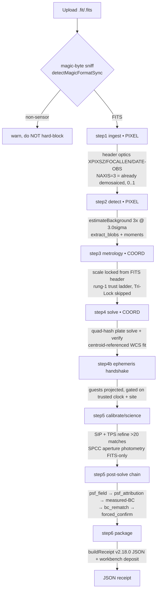
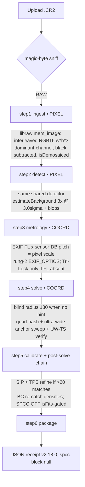

<!-- CANONICAL · update when a pipeline stage changes · maintainer: ahogan -->
# SkyCruncher — Processing Flow

_Last revised 2026-07-22. Reflects the greenfield Rust solver cutover (desktop default), FDR/BY
confirm authority, the Gaia-pure catalog, and receipt schema 2.18.0._

Ground-truth walk of the pipeline **as it ships today**, split into the two real input
flows: **SeeStar/FITS** and **DSLR/CR2**. Rebuilt against the code from an earlier draft that
described an aspirational auto-path design (archived: `docs/archive/PROCESSING_FLOW_AUDIT.md`,
`docs/archive/processing_flow_v2026-02-26.md` — both local-archive copies, not present in a fresh
clone). Regression numbers live in **[`docs/GATES.md`](../GATES.md)**.

> **The single most important fact:** there is exactly **one** orchestrator. The shipped,
> e2e-guarded flow for **both** SeeStar and CR2 is the wizard — `OrchestratorSession`
> (`src/engine/pipeline/orchestrator_session.ts`) driving the shared stages in
> `src/engine/pipeline/stages/*` (post-C1). The earlier **auto path** (`orchestrator.ts`,
> `runPipeline`) — the linear 10-module chain the archived draft described — has been deleted
> (@5f76bdd, net −2333 lines), taking with it the Refine/Hint UI subsystem, a hardcoded fake
> `aerosol_optical_depth=0.1` value in `m8_photometry/spectroscopy_adapter.ts`,
> `hardware_profile_adapter.ts`, `useMainPipeline.ts`, and the auto-path CR2 e2e test. The
> nominal-FL scale-backfill bug tied to that path was removed with it. No `[auto-only]` tags
> remain; everything below is the live, single flow.

> **Second key fact (greenfield cutover, merged to main @9292cbe4).**
> Behind that one wizard there are now **two solver cores**. The desktop default solve is
> the greenfield Rust `solver-core`, driven natively through the seam
> (`src/engine/pipeline/stages/greenfield_seam.ts`) — double-gated: `VITE_SOLVER_GREENFIELD`
> default-ON (disabled only by explicit `=0`, since @207c4f26) **and** `isTauriRuntime()`. The
> browser build is always legacy (the `isTauriRuntime()` gate keeps the `@tauri-apps/api/core`
> invoke out of the web chunk) and the headless/Node API lane is legacy too. The seam maps the
> greenfield decision onto the legacy `PlateSolution` shape field-for-field
> (`greenfield_seam.ts:162-233`, `solved_via:'greenfield_rust'`), so the entire step-5 post-solve
> chain (psf_field → attribution → measured-BC → bc_rematch → forced_confirm) runs on the mapped
> greenfield solution on desktop — it is not a legacy-only chain. Where a stage below carries a
> "cold path after cutover" annotation, that scoping means the legacy browser/headless lane's
> pinned regression numbers, not a claim the stage is skipped on the greenfield arm.
>
> **Known caveat (fix pending).** The seam hydrates each match's `catalog.gaia_id` as the bare
> catalog row index (`greenfield_seam.ts:204`, `String(h.star_row)`) — a namespace disjoint from
> the legacy `Gaia_`/`HYG_` prefixes — so `bc_rematch`'s ID-based already-matched exclusion is a
> structural no-op on greenfield solutions. On narrow, well-corrected fields (the M66 demo case)
> the wrong-sign guard fails → `KEPT_ORIGINAL` → the solution stays clean; but on wide/distorted
> desktop fields where the rematch guards pass, already-matched stars can re-enter as "recovered"
> candidates and the applied `matched_stars`/`num_stars` can double-count. The intended fix is
> coordinate-level dedupe in the TS pass (namespace-agnostic, no Rust change needed). Until it
> lands, treat greenfield-desktop `bc_rematch`/`num_stars` on wide rigs — and the receipt's
> non-guard-gated `recovered_confirmed` count — as suspect. There is also no automated test
> coverage of the greenfield-solve → post-solve-chain composition today (the API/headless lane
> and the browser e2e pair both run the legacy solver; the greenfield gate pins the Rust core
> only) — a manual walkthrough is the only check on that path, and it has previously caught a
> real seam bug (a NaN value passed over the desktop IPC bridge on the first webview invocation).

## Two ledgers (every stage declares which it touches)

This table shows, stage by stage, which of the two ledgers each part of the pipeline touches — the
separation is what keeps geometric measurements (where stars are) from ever being silently altered
by pixel-level processing (how the image looks).

The central architecture law (`CLAUDE.md` LAW-1, [`docs/WHITEPAPER.md`](../WHITEPAPER.md) §1.1): **coordinate math is
strictly separated from pixel ops.** Each shared stage's header names its ledger:

| Stage (`stages/*`) | Ledger | Role |
|---|---|---|
| `ingest` | pixel | decode → luminance/science buffers |
| `metrology` | coordinate | scale/rotation trust ladder |
| `detect` | pixel | background estimate + blob extraction |
| `solve` / `solve_context` / `calibrate` | coordinate | plate solve → WCS → SIP + TPS refine |
| `science` | pixel | SPCC aperture photometry (FITS) |
| `psf_characterize` | pixel | **post-solve** per-star PSF field (FWHM/ellipticity/coma) at solved positions on the native grid |
| `psf_attribution` | pixel (reads coordinate) | **post-solve** decomposes the measured PSF field into physical systematics (drift / diffraction / seeing / diff-refraction / coma) + residual; **mutates nothing** |
| `bc_rematch` (via `m2_hardware`) | coordinate | **post-solve PRIMARY** measured-Brown-Conrady rematch: densify `matched_stars`, re-run SIP on the densified set (never-worse gated). **Runs on BOTH cores' output** — the greenfield seam populates `matched_stars` field-for-field, so this stage executes on desktop greenfield solves too (not legacy-only). **Known caveat (fix pending):** the seam's `gaia_id` is a bare row index, which defeats the ID-based already-matched exclusion → possible double-count on wide desktop fields (see the greenfield callout above). |
| `forced_confirm` | pixel (reads coordinate) | **post-solve** promote `CATALOG_FORCED` → `CATALOG_FORCED_CONFIRMED` (writes only `solution.deep_confirmed`) |
| `package` (+ `workbench_deposit`) | neither | serialize the JSON receipt (fitted WCS only); side-channel per-rig deposit |

The wizard's six session methods (`step1..step6`) map onto these stages:
**ingest → detect → metrology → solve (+ ephemeris handshake) → calibrate/science → [post-solve chain] → package.**
The post-solve chain all lives inside `step5`, runs after the solve, and is additive and fail-soft:
`psf_field → psf_attribution → measured-BC → bc_rematch → forced_confirm`
(`orchestrator_session.ts:1050,1072,1103,1138,1178`). Every one of these degrades to a null/absent
receipt block on failure and touches only additive fields — never the WCS, `matched_stars`, or the
confidence value the byte-identical regression test checks (with one deliberate exception:
`bc_rematch` may densify `matched_stars`, and only under a strict never-worse plus wrong-sign
guard that keeps SeeStar bit-identical; see below). Session path only.

> Module note (slot m5): `m5_coordinate_flatten/` is the live m5 module — a coordinate-ledger
> support library, **not** a wizard step. Stages consume it: `detect` (`GenericFlattener`),
> `solve` (zenith hint via `computeRaDecFromAltAz`), `psf_attribution`
> (`DifferentialRefractionCorrector`, APPROXIMATE, reported-only). The former `m5_boundary/`
> MobileSAM slot has been deleted from the codebase.

## Confirmation authority and catalog data plane

This section covers how the pipeline decides that a forced-photometry match is confirmed, and
which star catalog it reads to do that.

**Set-level confirmation authority: FDR/BY, not a fixed z-gate (receipt 2.18.0).** The set-level
`forced_confirm` decision is the Benjamini-Yekutieli step-up procedure at q=0.05 over per-star
empirical right-tail p-values against the frame's own scrambled-null SNR pool (dependence-robust,
Phipson-Smyth +1 correction), plus two additional rules: a **k≥2 set rule** — the set confirms
only when `n_confirmed_fdr >= 2` (`setFdrMinAdmissions`; a lone rank-1 admission refuses honestly,
with the near-miss still visible in the receipt) — and **adaptive null resolution** — the null SNR
pool automatically extends with measure-only draws until the p-floor sits below the rank-1
admission threshold (this closes a false-refusal failure mode on small star sets; the extended
pool's prefix is byte-identical to the old pool, and a new `confirm_status` value,
`CONFIRM_UNDERPOWERED`, keeps "could not decide" from being reported as "refused").
`SOLVER_CONFIRM_SET_EXCESS_Z=15` (`setExcessZ`) is retired from deciding anything — it is frozen
and still reported as a statistic, never tuned. The 5-of-5 wrong-WCS null collapse (a deliberately
wrong WCS must produce zero confirmations) is re-proven under the k≥2 rule.

**Catalog and data plane: HYG fully retired.** The shipped sector store (`public/atlas/sectors`)
is Gaia-pure at legacy depth: the same Gaia rows the shipped atlas has always carried, minus HYG,
plus a 52,020-row Tycho-2/Hipparcos supplement for the bright decade Gaia saturates (shipped
density was deliberately preserved after a full-depth, 36.9-million-row version was found to break
legacy verification statistics; the earlier Gaia+HYG hybrid dataset is retained but no longer
live). HYG is read on no path anywhere in the pipeline — the DEGREES/HOURS per-row units trap that
came with mixed Gaia/HYG rows no longer exists. This store feeds the legacy solve, `bc_rematch`,
and the harvest/confirm catalog fetch. The confirm lane additionally reads the g15u `stars.arrow`
catalog by default (`VITE_CATALOG_G15U` default-ON, desktop and headless; 6.49 million rows,
`ra_deg`/`dec_deg`/`g_mag`/`source_id`, Gaia-only — no BP/RP in this catalog, so color is NOT
MEASURED from it; this is honest, not a blocker). The greenfield Rust solver core consumes the
g15u quad index natively.

Two known caveats. First, the 52,020 bright-supplement rows currently classify as Gaia-format in
`star_catalog_adapter.ts`, which mislabels them `band:'GaiaG'` with `HYG_`-prefixed IDs even
though they came from Tycho-2/Hipparcos, and their `mag_system` tag is read nowhere — a
band/provenance defect on the brightest anchors, not yet corrected. Second, on ultra-wide frames
(field radius > 16°) `bc_rematch` reads whatever sectors are already resident in memory rather
than paging the g15u catalog, so its edge-recovery catalog is only partially loaded on exactly the
rigs it exists to serve.

---

## Flow A — SeeStar / FITS (stacked NAXIS=3 RGB)

This is the path a SeeStar capture, or any stacked FITS file, takes through the wizard end to end.

Shipped path: `OrchestratorSession.step1..step6` on a stacked FITS (`sourceFormat === 'FITS'`,
already-demosaiced RGB). This is the byte-identical pinned regression ([`docs/GATES.md`](../GATES.md)).

| Step | What actually happens (file:line) | Honesty note |
|---|---|---|
| **Gate** | Magic-byte sniff; wizard **warns** on non-sensor files, does not hard-block (`orchestrator_session.ts:314,335`). | The old doc's `ERR_ZERO_GPS` GPS hard-gate **does not exist** anywhere in code — GPS is optional (enables zenith hint + ephemeris only). |
| **step1 ingest** [pixel] | FITS decode via `metadata_reaper.ts` + `fits_decoder.ts`; NAXIS=3 returns interleaved Float32 RGB, `isDemosaiced:true`, already normalized 0..1 (`metadata_reaper.ts:571-577`); consumed through `ingest.ts` + `BayerStorageService` cache. | **No demosaic** for stacked FITS (the WebGPU kernel is bilinear and skipped). Bayer-phase step is dormant here. |
| **step2 detect** [pixel] | Luminance `0.2126R+0.7152G+0.0722B`; `StatisticsProvider.estimateBackground(iterations=3, sigma_clip=3.0)` (`StatisticsProvider.ts:20-51`); `extractBlobs` + 1st/2nd-moment centroids (`signal_processor.ts`). | **3×/3.0σ is confirmed accurate.** Aggressive second-pass culling is behind `ENABLE_AGGRESSIVE_CULLING=false`. |
| **step3 metrology** [coord] | FITS header pixel scale = rung-1 of the shared trust ladder; blind Tri-Lock is skipped when a header scale exists (`stages/metrology.ts:73-106`). | Tri-Lock (`MetrologyService.solveScale`) fires **only** as a last resort; the SeeStar e2e asserts it does *not* run. **Cold path after cutover**: `MetrologyService.solveScale` is a legacy fallback rung inside the retired control loop — the greenfield Rust solver core does not carry this mechanism forward as-is; it uses a different control-loop design entirely. |
| **step4 solve** [coord] | Quad-hash solver: quads from brightest stars → rotation/scale-invariant hash → ≥2 matches → affine WCS → verify (`solver_entry.ts`). **Cold path after cutover**: this batch generate→cluster→judge quad-hash order is the retired legacy mechanism; the greenfield Rust solver core runs an astrometry.net-style incremental control loop instead. WCS is fit about data **centroids** then de-projected to recover true `crval` (offset-free — `SkyTransform.fitWCS`). | Header RA/Dec is the **object**, not the frame center; the recentred `crval` is the reported center. This holds for the greenfield core too, not just the legacy engine — the greenfield WCS is likewise reported at the frame-center pixel. One convention difference: the greenfield receipt's `crval` is in degrees, not the legacy hours internal convention (see the unit-trap note in `src/engine/pipeline/stages/greenfield_seam.ts`). |
| **step4b ephemeris** | `performEphemerisHandshake` projects solar-system guests into pixel space, gated on trusted clock + real site (`orchestrator_session.ts:766,795`, `metrology.ts:125-138`). | Time-trust forensics disable this on an unset/bogus clock — no phantom planetary anchors. |
| **step5 calibrate/science** | `applyAstrometricRefinement` (`stages/calibrate.ts:48`) runs the M7 residual RMS + **SIP** fit (`ResidualAnalyzer.performSIPFit`, >20 matches) **and its non-polynomial companion TPS** (`fitTpsGated`, `tps_fitter.ts`; same SIP-style fire gate `matches>20`, `SOLVER_TPS_LAMBDA=1e-3`, now additionally OUT-OF-SAMPLE gated — CV+GCV+hull+physics-ceiling — so an overfit spline is REFUSED with `tps:null` + a `tps_gate` verdict even when the fire gate passes). Then **SPCC** aperture photometry + color/zero-point regression (`science.ts`, `orchestrator_session.ts:992-1010`). | **SPCC is wired for FITS.** SeeStar is well-corrected → SIP/TPS typically do not fire; the pinned solve numbers are unchanged. A render-loop closure (`RENDER_APPLY_SIP`, `:957`) that warps the preview through the fitted SIP is **DEFAULT OFF** (no-op for SeeStar, which carries no SIP). |
| **step5 psf_field** [pixel] *(post-solve)* | `runPsfCharacterization` (`stages/psf_characterize.ts` → `m10_psf/psf_field.ts`): per-star 2D-Gaussian LM (wasm `refine_stars_lm`, local-bg-subtracted stamps) at the SOLVED matched-star positions → spatially-varying FWHM/ellipticity/orientation coma map (`orchestrator_session.ts:1050`). | PIXEL ledger, native/2×-binned grid, never resampled first. Additive `psf_field` block; **null on absence**. Degrades HONESTLY to moment measures when no compiled fitter. Runs for BOTH consumers (wizard + headless). |
| **step5 psf_attribution** [pixel] *(post-solve)* | `runPsfAttribution` (`stages/psf_attribution.ts`): READS the measured `psf_field` and decomposes it into physically-calculable systematics — sidereal drift / diffraction / seeing / differential refraction / coma — plus a residual (`orchestrator_session.ts:1072`). | Physics **informs + guides, never overrides**: mutates NOTHING (not `psfField`, not the solve). Purely additive to the receipt; never fatal. |
| **step5 measured Brown-Conrady** [coord] | `measureBrownConradyFromSolution` fits **this capture's own** radial distortion (k1/k2) from the solver-verified matched pairs → receipt `lens_distortion_measured` (labeled MEASURED) (`orchestrator_session.ts:1103`). | Always-on observation (since @20ffed8): reads `matched_stars` + `wcs`, mutates nothing — the pinned regression stays byte-identical whether it runs or not. Runs on both cores' output: it reads `matched_stars`, which the greenfield seam populates field-for-field, so the observation fires on desktop greenfield solves too (the legacy-receipt-shaped field is produced by the seam mapper, not only the legacy TS/WASM solver). Reports `not_measured` when coverage is too thin. |
| **step5 bc_rematch** [coord] *(PRIMARY, default-ON)* | `runBcRematchPass` (`m2_hardware/lens_distortion_rematch_pass.ts`, promoted default-ON @cbc55b4): when the measured BC passed its coverage gates, BC-correct the FULL detection set's matching coords, **re-match against the catalog to recover edge stars**, **re-run the M7 SIP refinement on the densified set**, cull under the SAME acceptance the originals cleared, and forced-photometry existence-check the survivors. Writes `solution.bc_rematch` (`orchestrator_session.ts:1138-1148`). | Guarded by a never-worse structural gate (applies the densified solution only if it has strictly more matches and no worse post-chain RMS) plus a wrong-sign guard that is essential to correctness — a well-corrected narrow FITS recovers nothing and keeps the original, so the SeeStar solve stays bit-identical. Fail-soft. This bit-identical claim is scoped to the legacy TS/WASM engine's pinned numbers, now moved to a legacy/cold-path section (see `README.md`/`GATES.md`); the greenfield Rust solver core's own reference solves are pinned separately in the project's reference-solve records (tracked outside this repository). |
| **step5 forced_confirm** [pixel] *(post-solve)* | `runPostSolveConfirmation` (`m6_plate_solve/forced_confirm.ts`): promotes `CATALOG_FORCED` candidates (aperture flux at catalog-predicted positions, ~2σ single-hyp) to `CATALOG_FORCED_CONFIRMED` via per-star tests (frame-PSF shape / local scrambled null / neighbor veto / structured-bg guard) AND the **set-level authority = FDR/BY step-up at q=0.05 + k≥2 rule + adaptive null resolution** (`orchestrator_session.ts:1178`; see "Confirmation authority" above). The candidate/confirm catalog reads **g15u `stars.arrow`** by default (`VITE_CATALOG_G15U`, desktop + headless). `SOLVER_CONFIRM_SET_EXCESS_Z=15` is retired from deciding — frozen, still reported. | Writes only `solution.deep_confirmed` — solve stays byte-identical. Consumes the measured `psf_field` for the shape test (runs after it). Undersampled cameras (e.g. the 5D3) get shape `NOT_MEASURED`. The FDR decision is measured-robust (the 5-of-5 wrong-WCS null collapse holds), but confirm counts are not yet a fully trusted science product: the family the FDR procedure runs over is accepted-only and includes WCS fit anchors, a known honesty gap not yet closed. |
| **step6 package** [neither] | `buildReceipt` **v2.18.0** JSON (`stages/package.ts`, `schema_versions.ts:280` `RECEIPT_SCHEMA_VERSION` — the const is canonical, this copy is dated 2026-07-22), downloaded as a Blob with a Float32Array-stripping replacer (`save_packet.ts`). A **workbench deposit** side-channel (`stages/workbench_deposit.ts`, DEFAULT-ON, never-fatal) extracts a compact per-rig record from the FINISHED receipt with **zero receipt mutation** (`orchestrator_session.ts:1336`). | The receipt carries, among later additive blocks, the two honest-or-absent blocks introduced at 2.4.0: per-matched-star 2D residual vectors (`dx_px`/`dy_px`, `dRA/dDec_arcsec`) and a `solution.photometry` block (per-star instrumental mags + catalog band tag); 2.5–2.9 added optics_hints, source_provenance, the TPS out-of-sample gate, and SPCC fidelity+gains; 2.10–2.12 added confirm_status, solve_provenance/solved_via, and user_annotations testimony; **2.13 pipeline_provenance (decoder_arm + atlas_id), 2.14 rawler_calibration/user_target_hint/nebulosity_layer, 2.15 the LAW-1 fourth-layer star-data correction cells (all flag-OFF/inert), 2.16 the `compute_routes` GPU-observability block, 2.17 the FDR/BY confirm authority (`deep_confirmed.fdr` + `confirm_status.{gate_authority,n_confirmed_fdr,fdr_q}`), and 2.18 adaptive-null resolution (`fdr.{p_floor,admission_threshold_r1,underpowered}`, `per_star.r_norm`, `CONFIRM_UNDERPOWERED`) + the k≥2 set rule** — every one additive, both pinned reference solves byte-identical across the span. See export sockets below. |
| **(optional) M10 deconv** | Nebulosity-protected windowed Richardson-Lucy (`m10_psf/rl_deconv.ts`, DEFAULT OFF) + user-requested native-grid PSF diagnostics. | Explicitly **outside** the automatic chain; PIXEL ledger; native grid, never resampled first; RL output labeled APPROXIMATE. |

---

## Flow B — DSLR / CR2 (rawler default; libraw mem_image = cold path)

This is the path a Canon CR2 raw file takes through the wizard — the more complex flow, since a
DSLR's uncorrected lens distortion and unreliable EXIF data have to be worked around rather than
trusted.

Shipped path: `OrchestratorSession.step1..step6` on a CR2. The decoder cutover made rawler the
default decode arm (`isRawlerDecoderEnabled` default-TRUE; `wasm_decode` package; LAW-7
`rawler_cfa` layout entry @11681ce). Under the greenfield Rust solver core (the post-cutover
default), this same bundled CR2 frame — pin id `beach` / `beach_capability` in the project's
pinned reference-solve records — pins as: production tier `BudgetExhausted` (an honest refusal,
wall time 126024 ms), capability tier SOLVED — scale 61.95771716644049 arcsec/px, parity 1, band
11, **137 matched**, RA 263.8431412818405°/Dec −33.60557956035626°, wall time 85669 ms.
Legacy/cold-path pin (retained, never deleted): the pre-cutover TS/WASM solver pinned this frame
at 79 matched, `confirm_status` CONFIRMED at 35.6σ ([`docs/GATES.md`](../GATES.md) legacy/cold-path
section).
The libraw `dcraw_make_mem_image` arm is the retained cold path (`VITE_DECODER_RAWLER=0`, never
deleted by design) and keeps the pre-cutover byte-identical pin (55 matched) — a legacy/cold-path
number: it pairs the libraw decode arm with the retired TS/WASM solver. Under the greenfield Rust
solver core, a libraw-decode-plus-greenfield-solver pin has not been measured (the greenfield
reference-solve corpus captured only the rawler-decoded frame). Blind (no GPS, possibly unset
clock) and still solves — a pinned reference solve ([`docs/GATES.md`](../GATES.md)). Runs
byte-identical in Node since @8b57464 (Worker polyfill in `tools/api/headless_driver.ts`; the
earlier "headless is FITS-only" limitation no longer applies). Frontier context:
`docs/archive/CR2_SOLVER_FINDINGS.md`, [`docs/NEXT_MOVES.md`](../NEXT_MOVES.md) §2/§6.

> The mermaid + table below walk the **libraw mem_image contract** (cold path, and still the
> documented trap set); the rawler default arm shares every stage from step2 on — the decode
> seam is the only fork (m1, flag-gated @11681ce).

| Step | What actually happens (file:line) | Honesty note / trap |
|---|---|---|
| **step1 ingest** [pixel] | `extractRawSensorData` → libraw `dcraw_make_mem_image`: **interleaved RGB16, w·h·3, black-subtracted & scaled inside libraw**, wrapped in Arrow (`metadata_reaper.ts:443-482,537-548`); `isDemosaiced:true`. | mem_image is **dominant-channel RGB16 (~4-7% cross-leak), NOT one-hot, NOT CFA**; 5202-vs-5196 stride trap. **No WebGPU demosaic** runs (already RGB). |
| **step2 detect** [pixel] | Same shared detector as SeeStar; `isNativeBayer` false → standard luminance detection, not 2×2 binning (`detect.ts:99-149`). | Identical 3×/3.0σ background + `extractBlobs`. A CFA-luminance parity fix exists behind `VITE_CFA_LUMA_PARITY_FIX` but is **solve-harmful flag-ON as-is** (detections 2227→21,636; thresholds were implicitly calibrated against the checkerboard artifact — promotion BLOCKED pending paired threshold recal). |
| **step3 metrology** [coord] | Optics from **EXIF focal length × sensor-DB pitch** = rung-2 `EXIF_OPTICS` (`metrology.ts:57-84`, `optics_resolver.ts`); Tri-Lock only if EXIF FL absent. | Bundled CR2 carries a **lying 50 mm EXIF** (real lens 14 mm) — override lives in the trust ladder. 'Unknown Lens' is a truthy placeholder (regex-guarded). |
| **step4 solve** [coord] | Quad-hash solver plus an ultra-wide anchor rotation sweep and UW-TS verifier (`solver_entry.ts`; UW levers in `constants/pipeline_config.ts`). Blind `{radius_deg:180}` when no hint (`solve.ts:96`, `source:'BLIND'`); the noise ceiling $\sqrt{2\ln M} \approx 3.81\sigma$ (with $M \approx 1440$ sweep orientations: 720 angles times 2 parities; see the 0.5°-step both-parity sweep loop at `solver_entry.ts:1123-1127` and the "1440-orientation score distribution" note at `pipeline_config.ts:143`) justifies the 4.5σ gate. This brute-force 720-orientation-sweep mechanism, and the noise-ceiling math derived from it, is retired on the greenfield path — the greenfield Rust solver core uses an astrometry.net-style incremental control loop instead. | Time-trust forensics keep an untrusted clock from injecting a bogus zenith hint or phantom planet anchors — central to why a no-GPS CR2 solves cleanly. Pinned: `blindOutcome=solved` — 79 matched (rawler default) / 55 matched (libraw cold path); `docs/GATES.md`. |
| **step5 calibrate** | Shared `applyAstrometricRefinement` SIP fit (>20 matches; CR2's ~55 qualify) **+ TPS companion** (`fitTpsGated`). CR2 is where distortion fits actually fire: densified TPS took CR2 rms **2131″→109.8″** (~8× tighter than SIP-3) — a legacy/cold-path number: this whole post-solve TPS-densification stage runs on the retired TS/WASM engine's matched-star set (the pre-cutover ~55-matched CR2 solve); the greenfield Rust solver core does not run this stage, and a TPS-densification figure for its own reference solves (e.g. the `beach` pin's 137 matches) is NOT MEASURED. M66's in-sample **12.06″→1.47″** is now OUT-OF-SAMPLE REFUSED (`tps:null`) — the interpolating spline's OOS rms (~35″) does not generalize, so the CV/GCV/hull/physics gate rejects it (receipt carries a `tps_gate(refused)` verdict instead). | **SPCC does NOT run for CR2** — `useSpcc = isFits && …`; the `spcc` receipt block is null. |
| **step5 post-solve chain** [pixel + coord] *(post-solve)* | Same shared chain as Flow A: `psf_field → psf_attribution → measured-BC → bc_rematch → forced_confirm` (`orchestrator_session.ts:1050-1190`). | The pinned CR2 match count measures the step-5 blind solve (79 on the rawler default since the decoder-cutover rebaseline; 55 on the libraw cold path); BC densification lands **downstream** in `solution.bc_rematch`, not in the pinned count. An undersampled DSLR (5D3) yields shape `NOT_MEASURED` in `forced_confirm` (honest-or-absent). |
| **step6 package** [neither] | JSON receipt v2.18.0, same as SeeStar; `spcc` block null. | Same export sockets. |

---

## Export surfaces (step-6-adjacent, not all in the browser download)

Beyond the JSON receipt itself, the pipeline can hand a solved frame to other astronomy tools in
their native formats. This section lists what actually writes files today versus what is still
planned.

The wizard step-6 product is the **JSON receipt v2.18.0**. Additional serializers now exist as
built writers (no longer roadmap), sharing one sign-convention module so no writer can re-derive
it wrong:

- **FITS writer** (`export/fits_writer.ts`, I1–I5): astropy-conformant, NaN-preserving, emits WCS + SIP headers.
- **ASDF / GWCS writer** (`export/asdf_writer.ts`): carries the fitted TPS as a GWCS tabular lookup transform. Python STScI-asdf round-trip is **CONFORMANT** (1.7e-10″); a subset reader (`tools/asdf/asdf_reader.mjs`) round-trips our own exports.
- **SIP convention bridge** (`export/sip_convention.ts`): the engine stores `dx = observed − ideal`; the FITS SIP standard wants `ideal − observed`. This module owns the **pure coefficient negation** used by BOTH FITS and ASDF writers (astropy round-trip residuals improved 6.21″→3.77″ after the fix). **Engine-internal storage is UNCHANGED** — the negation is export-only.
- **C2PA** (`tools/c2pa`): receipt→manifest incubator, **DEV-CERT only** — not production provenance yet.

TIFF/other bundle exports remain roadmap (shown as honest coming-soon sockets).

---

## What changed vs the old (Feb-2026) doc

The archived version (`docs/archive/processing_flow_v2026-02-26.md`) was an **auto-path,
aspirational** spec. Its solver core (quad-hash M6), SIP fit (M7), and 3×/3σ background clip
(M4) are accurate; but its ingest gate (`ERR_ZERO_GPS`), demosaic ("Malvar-He-Cutler"),
photometry ("LM 2D Gaussian / Jacobian"), and export ("C2PA → FITS/TIFF bundle") were stale,
never built, or (for FITS/ASDF) only later realized as the export writers above — and the whole
topology described the auto orchestrator. **That auto orchestrator (`orchestrator.ts`) is now
DELETED**; both SeeStar and CR2 ship on the single wizard. The sharpest real SeeStar-vs-DSLR
divergences today:

1. **SPCC** — wired for FITS, **off for CR2** (`science.ts` `isFits` gate).
2. **Distortion handling** — SeeStar is pre-corrected so SIP/TPS/BC-rematch effectively no-op (the pinned regression stays bit-identical); CR2's 14 mm barrel is where SIP + TPS + the PRIMARY BC-rematch densification actually fire. Ultra-wide CR2 still has a genuine **pre-solve** flattening gap (the 14 mm distortion is not flattened *before* the solver; recovery is post-solve via the anchor sweep + BC-rematch + SIP/TPS refit).

Full evidence table (file:line per row): `docs/archive/PROCESSING_FLOW_AUDIT.md` (local archive,
no longer on disk — the file:line citations inline above are the surviving evidence).

## Related
- [GATES.md](../GATES.md) — the pinned regression numbers this walk cites for both flows
- [WHITEPAPER.md](../WHITEPAPER.md) — states the two-ledger law this document applies stage by stage
- [NEXT_MOVES.md](../NEXT_MOVES.md) — solver levers and the CR2 false-positive case referenced for Flow B
- [archive/CR2_SOLVER_FINDINGS.md](../archive/CR2_SOLVER_FINDINGS.md) — frontier context cited for the DSLR/CR2 flow
